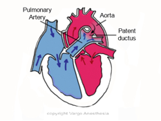

Patent Ductus Arteriosus Review    body {font-family: 'Open Sans', sans-serif;}

### Patent Ductus Arteriosus Review

The Ductus Arteriosus is a communication between the main pulmonary artery and the posterior descending thoracic aorta. Its function during utero is to shunt 90% of the blood flow away from the high pulmonary resistance and nonexpanded lungs into the descending aorta.  
Ductus arteriosus becomes a heart defect when it remains patent (Patent Ductus Arteriosus) after birth.  

****

  
The PDA begins to close within 10-15 hours of birth as a result of the increased arterial oxygen pressure and vasoactive factors.  
In healthy infants, the ductus in physiologically closed by the second day of life.  
Permanent anatomic closure of the ductus occurs typically within the first three weeks of life.  
However, it may reopen in response to hypoxia.  
  
**Left to Right Shunt (acyanotic)**  
Typically, a PDA is a Left to Right shunt with hypoperfusion of the lower extremities.  
  
Left to right shunts are characterized by the mixing of blood from the systemic to the pulmonary circulation.  
If the ductus remains open, a shunt between the aorta and pulmonary artery (PA) will remain open.  
The direction of shunted blood between the aorta and pulmonary artery depends on the pressure gradient between the two.  
Under normal conditions, the aortic pressure is much higher than the pulmonary artery pressure (PAP).  
Oxygenated systemic blood (left) will shunt (right) and mix with the nonoxygenated blood in the two pulmonary arteries on the way to the lungs. (see image above)  
  
As a consequence, the pulmonary circulation carries not only the blood that entered the right atrium and ventricle through the superior and inferior vena cava but also the additional oxygenated blood from the aorta through the PDA.  
Blood volume and pressure in the pulmonary circulation become abnormally high.  
If the shunt is significant, there is progressive damage to the pulmonary vasculature and gradual development of irreversible pulmonary hypertension.  
The pressure in the pulmonary circuit may ultimately exceed the systemic pressure, causing a reversal of blood flow from the right side of the circulation to the left (Left to Right shunt).  
  
_The reversal of blood flow can eventually result in Eisenmenger Syndrome; subsequently, a PDA must be repaired._  
  
**More left to right shunts not discussed**  
Ventricular septal defect (VSD)  
Atrial septal defect (ASD)  
Atrioventricular defect (AVSD)  
  
**VSD and PDA:** The direction and magnitude of the shunt depend on the size of the communication and pressure gradient.  
In ASD and AVSD, the magnitude of the shunt depends mainly on relative ventricular compliance (elasticity).  
  
**Closure of PDA at birth**  
Cessation of placental circulation after birth.  
SVR increases  
PVR decreases by 75%  
  
Pulmonary blood flow increases 450% with the onset of respirations.  
  
**How is PAP reduced after birth**  
From a starting prenatal PAP of 70/45mmHg, it decreases to 50/30mmHg at 24 hours after birth.  
A few days later it drops to 30/12mmHg.  
  
Vasoactive substances, including bradykinin, prostaglandins and endothelium-derived relaxing factor contribute to pulmonary vasodilation.  
Oxygen and ventilation contribute to increases in the release of these substances.  
  
**More facts:**  
PDA is a prevalent heart defect, accounting for 5 to 10% of all congenital heart defects.   
Research indicates that 8 - 9 in every 1,000 children are affected.  
90% of cases occur as isolated defects; while 10% of patients have other congenital heart defects.  
PDA is two to three times more common in females than males.  
PDA can be a result of an autosomal recessive genetic disorder.  
  
**Higher risks for PDA:**  
Preterm infants  
Infants born at a high altitude.  
Infants whose mothers had a rubella infection during pregnancy.   
Maternal prostaglandin administration  
Trisomies (Down, Patau, or Edwards syndrome)  
  
**Small PDA:**  Asymptomatic with normal findings on physical examination.   
  
**Significant PDA clinical manifestations and symptoms**  
Loud continuous murmur (“machinery” murmur)   
Murmur is heard best in the left infraclavicular region.  
Dyspnea with exertion (crying, eating, or activity) Labored or tachypneic at rest.  
Cyanosis, especially after eating, crying, or activity.  
Failure to thrive  
Poor feeding and poor weight gain.  
Frequent colds and problems with the lungs.  
Laterally displaced apical impulse.   
Bounding peripheral pulses, wide pulse pressure (pulsus celer et altus)  
  
**Diagnosis**  
**Echocardiography (confirmatory):** Shows left cardiac enlargement (in larger PDAs)  
**Doppler:** May assess the degree of shunt and PAP.  
**Color Doppler:**  Demonstrates left to right shunt (blood flow from the aorta into the pulmonary artery).  
**ECG:** Normal in small PDA; May show a left axis deviation due to LVH in large PDA.  
**Chest X-ray:** Reveals prominent pulmonary artery and aortic knob along upper left heart border; increased pulmonary markings.   
  
**Treatment**  
Initial Observation  
**Pharmacologic closure (in premature infants):** Infusion of indomethacin can induce the closure of the ductus.   
**Infants > 5 kg:**  Percutaneous catheter occlusion or surgical ligation.   
  

Patent Ductus Arteriosus  
Encyclopedia of Children’s Health (accessed 02/2020)  
http://www.healthofchildren.com/P/Patent-Ductus-Arteriosus.html  
  
Patent Ductus Arteriosus  
AMBOSS Medical Notes (accessed 02/2020)  
https://next.amboss.com/us/article/4403jT#Z8f082bb5e397f97b9f62337c71bebf15  
  
T Moss and Adams' heart disease in infants, children, and adolescents: including the fetus and young adult 7th ed, Lippincott Williams and Wilkins, Philadelphia 2007  
Allen HD, Driscoll DJ, Shaddy RE, Feltes T.  
  
The changes in the circulation after birth. Their importance in congenital heart disease.  
Circulation 1970; 41:343.  
Rudolph A