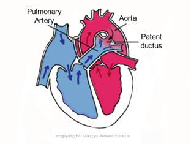

Patent Ductus Arteriosus (PDA) Review   

## Patent Ductus Arteriosus (PDA) Review

The Ductus Arteriosus is a communication between the main pulmonary artery and the posterior descending thoracic aorta. Its function during utero is to shunt most of the blood away from the highly resistant pulmonary arteries and lungs to the aorta.

Ductus Arteriosus becomes a heart defect when it remains patent (Patent Ductus Arteriosus) by not naturally closing at birth.

The PDA begins to close within 10-15 hours of birth as a result of the increased arterial oxygen pressure and vasoactive factors. The ductus is physiologically closed by the second day of life in normal infants. Permanent anatomic closure of the ductus normally occurs within the first 3 weeks of life.

However, it can reopen in response to hypoxia.

**Left to Right Shunt (acyanotic)  
**Normally, a PDA is a Left to Right shunt.  
  
A left to right shunt is when there is a mixing of blood from the systemic to the pulmonary circulation.If the ductus remains open, this means a shunt between the aorta and pulmonary artery (PA) will remain open. The direction of shunted blood between the aorta and pulmonary artery depends on the pressure gradient between the two. Under normal conditions, we know that the aortic pressure is much greater than the pulmonary artery pressure (PAP), Therefore oxygenated systemic blood (left) will shunt (right) and mix with the nonoxygenated blood in the two pulmonary arteries on the way to the lungs (see above).  
  
As a consequence, the pulmonary circulation carries not only the blood that legitimately enters the right atrium and ventricle through the superior and inferior vena cava, but also the additional aortic blood entering through the PDA. Blood volume and pressure in the pulmonary circulation become abnormally high. If the shunt is significant, there is progressive damage to the pulmonary vasculature and gradual development of irreversible pulmonary hypertension. The pressure in the pulmonary circuit may ultimately exceed the systemic pressure with reversal of blood flow from the right side of the circulation to the left (Eisenmenger syndrome). This is why a PDA must be repaired.

**Other left to right shunts not discussed**  
Ventricular septal defect (VSD)  
Atrial septal defect (ASD)  
Atrioventricular defect (AVSD)

In VSD and PDA, the direction and magnitude of the shunt depends on the size of the communication and pressure gradient.

In ASD and AVSD, the magnitude of the shunt depends largely on relative ventricular compliance (elasticity).  
  
The hemodynamics of PDA are similar to those of Ventricular Septal Defect in that the amount of left to right shunt is determined by size of the defect and vascular resistance.

**Steps to Closure of PDA at birth:**  
Cessation of placental circulation occurs after birth, resulting in increased Systemic Vascular Resistance (SVR). Pulmonary Vascular Resistance (PVR) decreases by 75%. Subsequently, pulmonary blood flow will increase by 450% with the onset of respirations.

**Pulmonary Artery Pressure (PAP) Changes  
**From a starting prenatal PAP of 70/45mmHg, it decreases to 50/30mmHg at 24 hours after birth. A few days later it drops further to 30/12mmHg.  
  
Vasoactive substances, including bradykinin, prostaglandins and endothelium derived relaxing factor contribute to pulmonary vasodilation. Oxygen and ventilation contribute to increases in the release of these substances.

Record FG, McKeown T. Observations relating to the aetiology of patent ductus arteriosus. Br Heart J. 1953; 15: 376–386

Gittenberger-De Groot AC, Van Ertbruggen I, Moulaert AJ, Harinck E. The ductus arteriosus in the preterm infant: histologic and clinical observations. J Pediatr. 1980; 96: 88–93.

Cassels DE. The Ductus Arteriosus. Springfield, Ill: Charles C. Thomas; 1973.

http://www.healthofchildren.com/P/Patent-Ductus-Arteriosus.html

**Preoperative evaluation**  
_During pre-operative assessment it is necessary to look carefully for evidence of problems such as respiratory infections and congestive heart failure. Anesthetizing a child with a respiratory infection may lead to a higher incidence of complications if intubation is required or the airway is manipulated. Laryngospasm or bronchospasm may occur as a response to glottic or subglottic mucosal stimulation. Upper respiratory tract infections cause a striking increase in bronchial reactivity that appears to persist for 3 to 4 weeks after infection._  
  
_As a minimum, blood gas measurements, hematocrit, blood chemical and glucose analysis should be performed to ensure that the infant is adequately prepared for surgery._  
  
_Anesthetic management: Non-surgical closure of the PDA is possible in selected patients. Administration of indomethacin will produce functional closure of the Ductus in 50-70 % of infants._  
  
_Catheter closure of PDA has been performed since 1977 in developed countries and, since the 1990s, it has also been a common procedure in our country limited only by economic considerations (the cost and availability of the devices). This non-surgical closure of the defect eliminates the need for a thoracotomy and prolonged hospital stay and can be performed under sedation in a catheter laboratory._  
  
_The anesthetic technique for surgical repair is variable but in severely ill patients the administration of fentanyl and a non-depolarizing muscle relaxant provides adequate analgesia and surgical operating conditions. Ventilation is maintained with a mixture of air and oxygen. This combination is well tolerated even by critically ill infants with congestive heart failure._  
  
_We use on induction dose of fentanyl of 5-10 micrograms/kg and 30-50 micrograms/kg in total for maintenance. In hemodynamically stable children, this technique usually allows extubation at the end of procedure. Ketamine, isoflurane and midazolam are useful drugs that can be use to supplement the anesthetic._  
  
_Most patients have undergone fluid restriction and diuretic treatment whilst being prepared for surgery and may require volume replacement before induction. We use Ringer lactate 10 ml/kg for this purpose. Pre-operative hydration is accomplished with Ringer lactate at 5 ml/kg/hour._  
  
_The surgical approach to the PDA is usually through a left postero-lateral thoracotomy. Intercostal nerve blocks at the end of the procedure are effective in controlling post-operative pain and can be done by the surgeon under direct vision before the chest is closed._  
  
_Ductus ligation is usually accompanied by an increase in diastolic pressure and variable and transient effects on systemic pressure. Surgical complications are rare but include damage to the recurrent laryngeal nerve and inadvertent ligation of either the aorta or the left pulmonary artery, both of which may be similar in size to the ductus in the neonate. Postoperatively the child requires a chest tube for 24 hours and may stay in the hospital for 3-5 days._

  
Cardiovascular malformations are the most common type of congenital malformation (6-8/1000) and responsible for more deaths in the first year of life than any other birth defects. A sixth of the affected children have a duct dependent circulation, with a persistent ductus arteriosus being necessary for survival.

Over the past few years, great efforts have been made to screen these duct- dependent congenital heart diseases (CHD) in the newborn. As ductal-dependent CHD (congenital heart defect) may not be apparent at the time of early discharge examination, post-ductal arterial pulse oximetry screening during the first 24 hours of life has been put forth as the most useful strategy to prevent circulatory collapse or death.

Pre-ductal pulse oxygen sensor (POS): the sensor applied to the right hand,

Post-ductal pulse oxygen sensor (POS): the sensor is applied to the foot to rule out CHD

Obtaining pulse oxygen saturation from one foot (post- ductal) and/or the right hand (pre-ductal)

The left hand, however, has always been ignored, as it was unclear if the ductus arteriosus influences left-hand arterial perfusion. By means of pulse oximetry measurements, the purpose of the present study was to clarify if values of the left hand can be differentiated from the pre-ductal (right hand) and post-ductal (foot) values.

As post-ductal (foot) pulse oximetry screening has become the standard of care at our institution,

**Right Hand - Foot**

Other results fully correspond to those of previous stud- ies. Our overall post-ductal POS levels were 0.8% lower compared to the pre-ductal POS levels \[12,13\]. In fact, the subgroup consisting of babies recorded within the first 15 minutes of life had post-ductal values that were 2.4% lower. An elevated pulmonary artery pressure during the first minutes of life is the main cause for this difference.

Arterial pulse oximetry is a powerful tool to screen for life threatening CHD. Within the wide range of pre- and post-ductal oxygen saturation, the present study clearly demonstrates that even during the first hours of life, characterized by the process of adaptation, the right and left hand do not significantly differ. We therefore conclude that with the exception of some children with complex or duct dependent CHD and some children with persistent pulmonary hypertension, POS on both hands can be considered equally pre-ductal.

If your baby has a PDA but an otherwise normal heart, the PDA may shrink and go away. However, some children need treatment to close their PDAs.

Some children who have PDAs are given medicine to keep the ductus arteriosus open. For example, this may be done if a child is born with another heart defect that decreases blood flow to the lungs or the rest of the body.

Keeping the PDA open helps maintain blood flow and oxygen levels until doctors can do surgery to correct the other heart defect.

**Outlook**

PDA is a fairly common congenital heart defect in the United States. Although the condition can affect full-term infants, it's more common in premature infants.

On average, PDA occurs in about 8 out of every 1,000 premature babies, compared with 2 out of every 1,000 full-term babies. Premature babies also are more vulnerable to the effects of PDA.

PDA is twice as common in girls as it is in boys.

Doctors treat the condition with medicines, catheter-based procedures, and surgery. Most children who have PDAs live healthy, normal lives after treatment.

http://emedicine.medscape.com/article/904895-overview

Patent ductus arteriosus (PDA) is a persistent communication between the descending thoracic aorta and the pulmonary artery that results from failure of normal physiologic closure of the fetal ductus (see the image below). In most individuals, the ductus arteriosus is located on the left side; however, if a right aortic arch is present, the ductus arteriosus may be located on the right or left side. The ductus arteriosus is very rarely bilateral.

In normal fetal circulation, the unexpanded lungs receive only 5-8% of the blood entering the pulmonary artery. The ductus arteriosus serves as the predominant route of circulation passing through the right ventricle and pulmonary artery. Approximately 55-60% of the systemic circulation passes from right to left through the ductus.

In the fetus, the oxygen tension is relatively low because the pulmonary system is nonfunctional. This, coupled with high levels of circulating prostaglandins, acts to keep the ductus open. The high levels of prostaglandins result from the little amount of pulmonary circulation and the high levels of production in the placenta.

At birth, the placenta is removed, eliminating a major source of prostaglandin production, and the lungs expand, activating the organ in which most prostaglandins are metabolized. In addition, with the onset of normal respiration, oxygen tension in the blood markedly increases. Pulmonary vascular resistance decreases with this activity. These events result in contraction of the smooth muscle within the wall of the ductus, which results in its closure.

A preferential shift of blood flow occurs; the blood moves away from the ductus and directly from the right ventricle into the lungs. Until functional closure is complete and pulmonary vascular resistance is lower than systemic vascular resistance, some residual left-to-right flow occurs from the aorta through the ductus and into the pulmonary arteries.

In normal-birth-weight and full-term neonates, the ductus arteriosus closes within 3 days after birth. However, the ductus arteriosus is patent for more than 3 days after birth in 80% of preterm neonates weighing less than 750 g, and its persistent patency is associated with increased morbidity and mortality. Furthermore, in the presence of a significant left-to-right ductal shunt in low-birth-weight neonates, a decreased peripheral perfusion and oxygen delivery occurs.

Although PDA is frequently diagnosed in infants, it may not be discovered until childhood or even adulthood. In isolated PDA, signs and symptoms are consistent with left-to-right shunting. The shunt volume is determined by the size of the open communication and the pulmonary vascular resistance. PDA may exist with other cardiac anomalies, which must be considered at the time of diagnosis. In many cases, the diagnosis and treatment of a PDA is critical for survival in neonates with severe obstructive lesions to either the right or left side of the heart.

Surgery is the mainstay of treatment for PDA.\[1\] Two forms of surgical therapy are performed: the traditional surgical approach, which entails a thoracotomy (or alternatively, thoracoscopy), and catheter closure.

The future of PDA repair lies in further development of more sophisticated catheter methodologies to facilitate closure. Currently, the Rashkind device and the Gianturco coils are most promising. As catheters shrink, the procedure may become appropriate in infants, and the traditional surgical approach may be used in premature patients and those in whom catheter approach is not possible.

The future of pharmacologic therapy in the closure of a PDA remains undetermined. The medical approach depends on a better understanding of the factors that precipitate closure of the ductus and of ductal histology.

**Indications**

In infancy, congestive heart failure is an indication for closure of the PDA. If medical therapy is ineffective, urgent intervention to close the structure should be undertaken. Repair may be delayed in the patient who is asymptomatic or well controlled on medical therapy. All PDAs should be closed because of the risk of bacterial endocarditis associated with the open structure. Over time, the increased pulmonary blood flow precipitates pulmonary vascular obstructive disease, which is ultimately fatal.

If an infant has failed to thrive or has overt congestive heart failure, the ductus should be interrupted, regardless of age and size. If the patient is asymptomatic, elective ligation and division can be carried out at approximately age 4 years when the risks of intubation are decreased and the child is more capable of understanding the procedure and process. Some authorities recommend closure any time after age 12 months or when the patient becomes symptomatic.

**Contraindications**

Relatively few contraindications to closure of a PDA are recognized. The primary contraindication to repair is severe pulmonary vascular disease. If transient intraoperative occlusion of the PDA does not decrease elevated pulmonary arterial pressures with a subsequent increase in aortic pressure, then the closure must be undertaken carefully and may be contraindicated. Closure of the ductus does not reverse preexisting pulmonary vascular disease.

A subset of associated cardiac anomalies—so-called ductal-dependent lesions—depend on flow through the PDA to maintain systemic blood flow. Premature closure of the ductus without concurrent repair of the following defects is contraindicated and may be fatal:

• Pulmonary artery hypoplasia

• Pulmonary atresia

• Tricuspid atresia

• Transposition of the great arteries

• Aortic valve atresia

• Mitral valve atresia with hypoplastic left ventricle

• Severe coarctation of the aorta

In these patients, all attempts should be made to preserve ductal flow until a more permanent palliative shunt can be constructed or definitive repair can be undertaken.

Contraindications to catheter closure currently involve the size of the patient. Very small premature infants still require surgical closure. Contraindications to surgical closure include concurrent uncontrolled sepsis and an inability of the patient to tolerate general anesthesia.

**Outcomes**

The prognosis is generally considered excellent in patients in whom the PDA is the only problem. The mortality from surgical closure is less than 0.5%. No deaths have been reported from catheter closure; however, patients undergoing this procedure are part of a select group and have a generally good prognosis otherwise.

If additional cardiac anomalies are present, the risk increases. A high risk is reported in the presence of associated lesions, increased pulmonary vascular resistance, or when the ductus is calcified or aneurysmal.

In premature infants who have other sequelae of prematurity, these sequelae tend to dictate prognosis of PDA. Studies have shown that preterm babies with a gestational age of 30 weeks or younger had a 72% rate of spontaneous closure of PDA. In addition, 28% of children with PDA who were conservatively treated (with prophylactic ibuprofen) reported a 94% closure rate. This rate compared well with rates reported in literature following medical treatment (80-92%). Surgical mortality in premature infants ranges from 20% to 41%.

In the adult patient, prognosis is more dependent on the condition of the pulmonary vasculature and the status of the myocardium if congestive cardiomyopathy was present before ductal closure. Patients with minimal or reactive pulmonary hypertension and limited myocardial changes may have a normal life expectancy.

**Preprocedural Evaluation**

Whichever mode of surgical therapy is used (ie, operative or catheter-based), the appropriate preoperative diagnostic testing is obtained to define other coexisting congenital heart lesions. If the catheter-based method is contemplated, the child is hydrated before the procedure to minimize the potential for dye-induced renal insufficiency. If the traditional surgical approach is used, appropriate preoperative laboratory studies are obtained to assess bleeding tendencies, concurrent infections, or pneumonia in the child.

**Radiography**

Radiographic findings vary with the size of the ductus and the amount of left-to-right shunting. The earliest findings usually include a prominent main pulmonary artery. With a moderate-sized PDA, the heart shadow is slightly enlarged. A double density of the left atrium may be noticeable. Prominent pulmonary vascular markings or pulmonary edema may be a finding in patients with a large amount of ductal flow.

In patients with a large PDA, findings include marked cardiomegaly with predominant left atrial and left ventricular enlargement, marked enlargement of the main pulmonary artery, and accentuated peripheral pulmonary vascular markings; a prominent ascending aorta; increased pulmonary venous markings, interstitial edema, and pulmonary edema when left ventricular failure intervenes; and possible PDA calcification in adults.

In patients with a moderate-sized PDA, findings include moderate cardiomegaly with prominence of the left ventricle and signs of left atrial enlargement; a prominent main pulmonary artery and increased pulmonary vascular markings in the peripheral lung fields; a prominent ascending aorta; and possible PDA calcification in adults.

In patients with a small PDA, findings are usually normal; possibly, there will be a slight prominence of the main and peripheral pulmonary arteries.

Studies have shown that chest radiographs have limited predictive value in determining which infants will benefit from ligation.

**Echocardiography**

The aortic end of the PDA can be depicted clearly with 2-dimensional echocardiography. This end is localized first, and the ductus is then tracked back to the pulmonary artery. Precisely documenting the size, shape, and course of the ductus is difficult. High-velocity jets of turbulent flow in the pulmonary artery can be reliably detected with color-flow Doppler imaging. This technique is sensitive in detecting even the smallest PDAs. Echocardiography provides important diagnostic information regarding associated congenital cardiovascular malformations.

**Electrocardiography**

In patients with a large PDA, electrocardiographic (ECG) findings include left ventricular hypertrophy and left atrial enlargement. When pulmonary hypertension dominates, combined ventricular hypertrophy is noted. When pulmonary vascular disease dominates, there may be evidence only of right ventricular hypertrophy. Patients with a moderate-sized PDA usually have left ventricular hypertrophy; those with a small PDA typically have normal ECG findings.

**Cardiac catheterization and angiography**

The diagnosis of PDA is almost always based on careful clinical evaluation, including physical examination, chest radiography, echocardiography, and ECG. Right and left heart catheterization may be indicated if other congenital heart lesions are revealed using these methods or if the clinical presentation is unusual.

During the right heart catheterization, the measured oxygen saturation is increased in the pulmonary artery. The shunt and the pulmonary vascular resistance can be calculated to determine the size of the ductus and the presence of pulmonary vascular pathology.

Selective angiography is the definitive tool for determining the presence and size of the ductus. Angiography is also used to define the intracardiac anatomy when other defects are suspected. Color-flow Doppler mapping is more sensitive than cardiac catheterization in detecting a small PDA.

**Histology**

The walls of the ductus contain intima, media, and adventitia. The medial layer is composed of longitudinal smooth muscle in the inner layer and circumferentially arranged smooth muscle in the outer layers. This is in contrast to true arterial structures, which contain a media primarily composed of circumferential elastic fibers. These layers of smooth muscle contain concentric loose lamina of elastic tissue and a network of tiny thin-walled vessels. The intimal layer is irregularly thickened and contains a considerable amount of mucoid material.

**Monitoring and Follow-up**

Regardless of the method of closure used, patients return for follow-up echocardiography 2-3 weeks after the procedure to assess the closure of the structure. If the traditional surgical approach is used, the patient is also checked for the presence of pulmonary complications (eg, atelectasis, pleural effusion) and for the healing status of the wound.

**Catheter Closure**

For catheter closure of the ductus, the patient is prepared and taken to the cardiac catheterization laboratory. The occlusion device is delivered to the ductus through a special 8-French delivery catheter via the arterial or venous route. The device is positioned in the ductus, and the closure mechanism delivered.

Congenital cardiac diseases like isolated patent ductus arteriosus (PDA) and, atrial septal defect (left to right shunts) may lead to an increase in pressure of end tidal carbon dioxide (PEtCO 2 ) and partial pressure of carbon dioxide in arterial blood (PaCO 2 ). However, this occurs only if the pulmonary blood flow (PBF) is high enough to cause alveolar congestion and transudation into the alveolar spaces, compromising gas exchange. In infants and children with a left to right cardiac shunt, (a-Et) PCO 2 gradient is not significantly different from children with normal circulation. Several studies have demonstrated the usefulness of EtCO 2 pressures in assessing pulmonary blood flow in a variety of scenarios. \[1\],\[2\]

We hereby report a case of an 8 month old female child, weighing 3.75 kg, diagnosed with PDA and bicuspid aortic valve. The patient was taken for ligation of PDA under general anesthesia. Anesthesia was induced with sevoflurane (8%) and fentanyl (5 micg/kg) and muscle relaxation was achieved with rocuronium (1 mg/kg). The trachea was intubated with a 4 mm internal diameter uncuffed endotracheal tube. The child was ventilated with pressure control mode of ventilation using air oxygen 50-50%, with the inspiratory pressure set at 25 cm H 2 O and ventilatory rate at 35 breaths per minute; generating a tidal volume of 30 ml. Anesthesia was maintained with fentanyl, midazolam and vecuronium bromide.

After intubation, initially, the PEtCO 2 was 53 mmHg, as expected. The patient was positioned in right lateral position for surgery. Following positioning, at the time of thoracotomy, the PEtCO 2 suddenly rose to 82 mmHg and the oxygen saturation of hemoglobin decreased to 93% (on 50% FiO 2 ). All probable causes of increased PEtCO 2 , like endobronchial intubation, leak in ventilatory circuit, bronchospasm, obstruction of endotracheal tube and rise in temperature, were ruled out. Intraoperatively, the surgeon discovered a tense left pulmonary artery (LPA), which is an unusual finding during this surgery. During dissection of PDA, suddenly, the PEtCO 2 dropped from 82 mmHg to 41 mmHg even when the PDA was patent and flowing. On close inspection of the surgical field, it appeared that the surgeon has retracted the LPA and it was being compressed. The reduced blood flow through the LPA caused a fall in PEtCO 2 but the LPA could only be released after the ligation of PDA. Following ligation of PDA, the PEtCO 2 was still high, at 63 mmHg, which, in normal circumstances, drops to 35-40 mmHg after the PBF is normalized following PDA ligation. When the patient was turned to supine position, the PEtCO 2 was still 56 mmHg. A provisional diagnosis of compromised ventilation of lung due to atelectasis was hypothesized and lung recruitment maneuvers were undertaken. A chest X-ray in the intensive care unit showed upper lobe collapse of the right lung.

In the present case, the main cause of hypoventilation of the dependent right lung was compression of a compliant pediatric thorax by rolls and drapes used for positioning of the patient. A large roll of the entire width of the thorax must have caused the compression of the dependent lung due to suboptimal positioning. \[3\] This premise was further confirmed by the intraoperative finding of a tense LPA, as most of the pulmonary blood was being shunted through the LPA because of hypoxic vasoconstriction occurring in the dependent collapsed upper lobe of the right lung. \[4\],\[5\] Moreover, when the LPA was occluded accidentally during dissection of the PDA, the blood flow to the functional part of the left lung dropped exponentially and so did the PEtCO 2 . If the right lung would have been functioning properly, the PEtCO 2 should have risen instead of falling, as the blood flow would have been diverted to the normally ventilated lung and the alveoli necessarily have eliminated the CO 2 efficiently. Furthermore, once the PDA was ligated, the PEtCO 2 should have decreased to normal values, but it remained in a higher range because of ventilatory compromise of the right lung.

Thus, congenital heart diseases with shunting of blood and lateral decubitus position along with pediatric physiology of respiratory mechanics all pose a great challenge to the working anesthesiologist. The interpretation of observed values should be carried out in the context of the clinical situation of the patient.

• _Lake CL. Pediatric Cardiac Anesthesia. 2nd Ed. Norwalk. Appletton & Lange. 1993: 363._  
• _Kaplan J. Cardiac Anesthesia. 4th Ed. Philadelphia. WB Saunders. 1999: 807._  
• _Stehling L. Commons problems in Pediatric Anesthesia. 2nd Ed. St. Louis. Mosby. 1992: 49._  
• _Mason LJ. Pitfalls and problems in Pediatric Anesthesia. IARS 2002 Review Course Lectures. Supplement to Anesthesia & Analgesia. March 2002: 73._  
• _Gal TJ. Reactive Airway Disease: Anesthetic perspectives. IARS 2002 Review Course Supplement to Anesthesia & Analgesia. March 2002: 47._  
_Robinson S, Gregory GA. Fentanyl air oxygen anesthesia for ligation of patent ductus arteriosus in preterm infants. Anesthesia & Analgesia 1981: 60, 331-34. Gregory A. G. Pediatric Anesthesia. 4th Ed. New York. Churchill-Livingstone 2002._