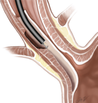

POEM (peroral endoscopic myotomy) procedure    body {font-family: 'Open Sans', sans-serif;}

### POEM (peroral endoscopic myotomy) procedure

POEM is a the endoscopic surgical equivalent of a Heller myotomy.  
POEM is a potentially ideal endoscopic therapy for spastic esophageal disorders because it allows myotomy not only of the lower esophageal sphincter but also of the esophageal body, where hypertensive contractions occur.  
  
An endoscopic procedure involving the division of the circumferential fibers of the lower esophageal sphincter (LES).  
When the procedure is intended to treat painful esophageal spasms, the lower esophagus is also involved.  
  
For achalasia, the myotomy is intended to occur at the level of the clasp fibers of the LES near the lesser curvature of the stomach.  
Myotomy in this position preserves the sling fibers at the greater curvature of the stomach and thereby preserves the angle of His and minimizes the chance of reflux after the POEM procedure.  
An argon beam plasma coagulator may be used to create the myotomy and provide hemostasis.

****

**  
Indications for POEM procedure**  
Achalasia is most common  
Nutcracker esophagus (hypertensive peristalsis)  
Jackhammer esophagus (hypercontractile esophagus)  
Esophagogastric junction outflow obstruction (EGJOO)  
  
_Many of these patients are elderly and frail._**  
  
Intraoperative concerns  
**Aspiration  
Iatrogenic CO 2 pneumoperitoneum with abdominal distension  
Increased ETCO 2 requiring more aggressive ventilation  
Elevated peak inspiratory pressures (PIP) causing a pneumothorax  
Systemic CO 2  uptake and tension capnoperitoneum, which may affect cardiorespiratory function.  
Transient myocardial ischemia  
Perforation of the esophagus requiring an emergency open procedure  
**Expect to see** increased pMax (maximum inspiratory pressure), ETCO 2 , MAP and HR  
**  
Contraindications of to the POEM procedure  
**Presence of severe erosive esophagitis.  
Significant coagulation disorders.  
Liver cirrhosis with portal hypertension.  
Prior therapy that may compromise the integrity of the esophageal mucosa or lead to submucosal fibrosis (e.g., radiation, endoscopic mucosal resection, or radiofrequency ablation).  
**  
Pre-op preparation  
**A liquid diet is normally given for two to five days prior to surgery, and the patient kept NPO overnight.  
Consider administering famotidine (Pepcid®) 2 hours prior to induction and Bicitra just prior to surgery.  
**  
Assess cardiac functional capacity**  
The Pneumoperitoneum with abdominal distension affects cardiorespiratory function.  
Exercise tolerance of 7 MET (metabolic equivalent of task) is the equivalent of climbing 1 flight of steps without stopping or becoming dyspneic.  
Exercise tolerance less than 7 MET indicates a preoperative cardiac evaluation and intraoperative use of an arterial line.  
  
Patients with achalasia are at high risk for aspiration during MAC or general anesthesia because they often have retained food particles in the esophagus.  
**Anesthesia** is general with ETT.  
**Nitrous oxide** is avoided  
Secure ETT to the right side of the patient’s mouth to prevent interference with the gastroscope.  
RSI with succinylcholine is recommended if not contraindicated.  
Consider elevating the head of the table 30 o for induction.  
Some authorities advocate an aggressive ramped position, using either a pre-formed foam ramp or a stack of pillows or blankets.  
  
**Muscle relaxation** is critically important for this procedure.  
  
**Mechanical ventilation:**  
**Goal** is to keep peak inspiratory pressure (PIP) below 30 cmH20 to prevent barotrauma.  
_PIP that increases above baseline may indicate abdominal distention._  
**Start with standard settings:** tv V T 6-8 ml/kg, rate 10-16 BPM, PEEP 3-8 cm H 2 O.  
Titrate minute ventilation increasing according to ETCO 2 ; hyperventilation may be required.  
Adjust ventilator to minimize PIP.  
Consider pressure controlled ventilation to avoid elevated high peak airway pressure (PIP).  
Consider smaller tidal volumes with increased rate to decrease ETCO2.  
  
**Duration:** 2-3 hours with experienced surgeon, 4-6 hours when surgeon is new to the procedure.  
**Monitoring:** Consider arterial line  
**Type and screen** is required.  
**IV access:** 2, in case of complications.  
**Nitrous oxide** is avoided  
Opioid requirement is minimal; this procedure is relatively non-stimulating.  
**Bed:** Often performed on the stretcher as with other endoscopic procedures.  
**Location:** Operating room  
**Position:** Head of bed elevated 30 degrees with arms tucked. Modified left lateral or supine position; an axillary roll is not required.  
**Hydration:** Keep normovolemic.  
**Foley** is usually required due to the duration of the procedure.**Abdominal exposure** is required to closely assess abdominal distension during pneumoperitoneum.  
**Warming blanket** s positioned at and below the hips.  
**EBL** is minimal  
**Dexmedetomidine (Precedex®)** is helpful for smooth awake extubation and decreased opioid requirement.  
The patient must be extubated awake and coughing minimized or avoided.  
**  
Possible complications:**  
Aspiration  
Pneumoperitoneum with abdominal distension requiring percutaneous abdominal needle decompression.  
Pneumothorax  
Myocardial ischemia  
Esophageal perforation requiring conversion to open procedure  
Transient cervical/upper thoracic subcutaneous emphysema  
**Mucosal tear:** Inadvertent mucosal tears (mucosotomy) during POEM require prompt closure because they represent  
full-thickness esophageal perforations after all other layers of the esophageal wall have been divided.  
**Bleeding** during submucosal tunneling is not uncommon.  
**Gastroesophageal reflux** is the most common late adverse event associated with POEM   
  
POEM has been used to treat jackhammer esophagus, diffuse esophageal spasm (DES), spastic achalasia, and nutcracker esophagus  
**  
More notes:  
**For percutaneous abdominal needle decompression, a 14G or 16G cannula is inserted under sterile conditions through the abdominal wall in the right upper quadrant at least 5 cm below the rib cage after ensuring that the lower edge of the liver could not be palpated in this area.  
A catheter can be left in situ for continuous venting.  
  
Risk of aspiration is highest during induction, emergence and extubation.  
  

Anesthetic considerations for patients with esophageal achalasia undergoing peroral endoscopic myotomy: a retrospective case series review.  
January 2017 Canadian Journal of Anaesthesia 64(5)  
Benjamin Löser, Yvonne Maria Werner, Mark A Punke, Martin Petzoldt…  
  
Anesthesia Management for Poem Procedure at the Advanced Endoscopy Unit  
ECronicon (accessed 06/2020)  
Maroje A Turk and Jose M Nieto  
https://www.ecronicon.com/ecan/pdf/ECAN-03-00048.pdf  
  
Anesthetic considerations for POEM Procedure  
Harvard.Edu Volume 3 Issue 2 November 2017 (accessed 06/2020)  
https://anesthesia.bidmc.harvard.edu/ADEL/documents/thoracic/POEM%20Procedure%20Nov%202016.pdf  
  
Anesthesia for peroral endoscopic myotomy: A retrospective case series.  
Journal of Anesthesiology, Clinical Pharmacology 32.3 (2016): 379-381.  
Nithin Jayan., _et al_ .  
  
Distal esophageal spasm treated by peroral endoscopic myotomy.  
Amercian Journal of Gastroenterology 2012; 107:1926.  
Louis H, Covas A, Coppens E, Devière J.  
  
_Jackhammer Esophagus Treated by a Peroral Endoscopic Myotomy_ .  
The Korean journal of gastroenterology. December 2014, 64(6):370-4  
Taehan Sohwagi Hakhoe