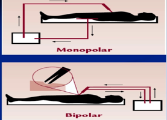

Pacemaker and Electrocautery     body {font-family: 'Open Sans', sans-serif;}

### Pacemaker and Electrocautery

People with all types of implanted devices do need to be aware that their device can be affected by electromagnetic interference (EMI).  
Electrocautery from a bovie electrocautery is an EMI device.

Current pacemakers have advanced noise-filtration techniques and are fairly resistant to common EMI sources. They rarely become dysfunctional during surgery.

Unfortunately sometimes the pacemaker detects the EMI from the bovie. The PPM sensors interpret the electric signals from the electrocautery as if there was an R wave. The pacemaker is inhibited, so it does not pace, which results in no HR and no BP if the patient was dependent on the pacemaker.

Let’s make this simple. When a pacemaker detects electrical activity from the heart, it is programmed to NOT PACE. Why should it pace the heart if the heart is beating from its own electrical conduction system at an adequate rate? However, when the heart stops or HR drops to a certain point, it will kick in at a preprogrammed rate. This is called “Inhibited.” Meaning it is inhibited to pace unless it HAS to for the patient.

**Major sources of interference that can inhibit a pacemaker are:**  
Electrocautery  
Radio-frequency ablation  
Radiation therapy  
Electrical nerves and muscle stimulators  
Dental instruments  
  
Clinical magnets can be used to temporarily switch pacemakers to an asynchronous pacing mode, thereby preventing pacing inhibition from EMI.

If the Pacemaker mode ends with “I” or “D” it is in the Inhibition mode. That means it will not pace (Inhibited to pace) if it senses an electrical impulse.  Pacer modes are almost regularly in the “Inhibition Mode.”

  
**Methods to decrease EMI to the pacemaker:**  
Surgeon can use a Harmonic device rather than a Bovie.  
The Harmonic uses heat, the Bovie uses an electric current.

Monopolar (unipolar) is preferred over bipolar.**  
Monopolar vs Bipolar  
Monopolar**  
The current passes through the patient to a return grounding pad and then back to the ESU generator to complete the circuit.  
  
**Bipolar**  
With bipolar, there is often the use a set of forceps.  
The electrical current passes from one side of the forcep, through the target tissue to the other side of the forcep, then back to the generator.  
The electrical current is restricted to the tissue between the forcep, and DOES NOT use a grounding pad.

****

**_It is important to make completely sure the OR staff does not stick the grounding pad anywhere near the pacemaker._**

**Grounding Pad Placement**  
The grounding pad should be as far away from the pacemaker as possible.  
This will keep the electric pathway between the bovie and the grounding pad away from the pacemaker. If the pacemaker is between the bovie and the grounding pad, you are asking for a trouble.  
The surgeon should use short bursts to avoid long periods of asystole.  
  
**Your EKG Monitor**  
Disable filtering of pacer spikes. Use a lead that shows pacer spikes to confirm that pacemaker is functioning appropriately.

Barash, Paul G. Clinical Anesthesia. Philadelphia, PA: Wolters Kluwer, 2009

Jacob, Sony, Sidakpal S. Panaich, Rahul Maheshwari, John W. Haddad, Benzy J. Padanilam, and Sinoj K. 

John. "Clinical Applications of Magnets on Cardiac Rhythm Management

Devices." Europace 13.9 (2011): 1222-230.

 Perioperative Management of AICD/PACER; The Student Doctor Network-cardiology.

Tidy, Colin. "Patient.Co.UK." Pacemakers and Pacing 22 (2010)

Trohman, R., M. Kim, and S. Pinski. "Cardiac Pacing: The State of the Art." The Lancet364.9446 (2004): 1701-719.

Wallace, Arthur. "Pacemakers for Anesthesiologists Made Incredibly Simple." (2008)