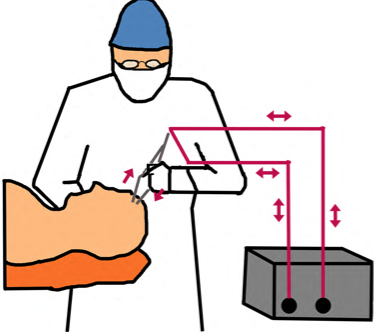
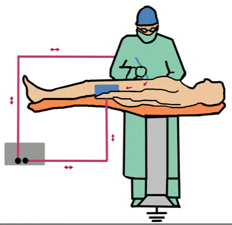

Pacemaker/Automated Implantable Cardioverter-Defibrillator (AICD) and Electrocautery Review    body {font-family: 'Open Sans', sans-serif;}

### Pacemaker/Automated Implantable Cardioverter-Defibrillator (AICD) and Electrocautery Review

AICD and pacemakers are implanted devices which can be affected by electromagnetic interference (EMI).  
An electrosurgical device (e.g., Bovie®) used for electrocautery generates EMI.

**Electromagnetic interference (EMI):**  
Any apparatus that emits radiofrequency waves (from around 20 kHz to around 300 GHz.) can generate EMI and therefore interfere with electrical implanted device-Pacemaker or AICD.  
The main source of intraoperative EMI is an electrocautery device (Bovie®) used by the surgeon.

**Use of a Bovie within 6 inches of a pacemaker while in synchronous mode:**  
EMI too close to a pacemaker in a pacemaker-dependent patient while in the “synchronous mode” could be disastrous.  
If the electrocautery is too close to the pulse generator of the pacemaker (within 6 inches), the pacemaker may detect the EMI from the Bovie and interpret the electric signals as if there were an R wave.  
The pacemaker is inhibited and stops pacing.  
A pacemaker-dependent patient consequently becomes bradycardic or asystolic.

A pacemaker can be prophylactically converted to “asynchronous” mode when needed either by placement of a magnet or interrogated and converted by the product representative or qualified clinician preoperatively.  
Refer to “Pacemaker and Magnet”

**Advanced noise-filtration techniques:**  
Current pacemakers have advanced noise-filtration techniques and are fairly resistant to common EMI sources.  
They rarely become dysfunctional during surgery.  
However, when in doubt, most anesthesia providers prefer to have the pacemaker converted to asynchronous mode when there is a risk.

**Pacemaker mode ending with “I” or “D”**  
If the Pacemaker mode ends with “I” or “D” it is in the inhibition mode.  
That means it will not pace (pacing is inhibited) if it senses an electrical impulse.  
Pacemakers are almost uniformly set in the inhibition mode.

**EMI and AICD:**  
An AICD may misinterpret the EMI as VT or SVT and deliver a shock.  
Placing a magnet on an AICD will suspend anti-tachyarrhythmia therapy.  
However, AICD from different manufacturers, programmed by different clinicians, may respond differently to placement of a magnet.  
Thus, it is advisable to consult the clinician or representative concerning the specific device in a specific patient.  
When the anti-tachyarrhythmia function is disabled, the AICD will NOT misinterpret the EMI as VT or SVT and deliver a shock.  
Refer to “AICD Protocols and Surgery”

**Monopolar vs bipolar electrosurgery in the presence of a pacemaker or AICD:**  
**Monopolar** cautery is more commonly used due to its effectiveness.  
**Monopolar** cautery should be AVOIDED in patients with a pacemaker or AICD when possible.  
EMI from a monopolar device is more prone to passing through the implanted device causing a short-circuit or misfire.

**Bipolar cautery is PREFERRED in the presence of a pacemaker or AICD.**

**There are two types of EMI with which anesthesia providers should be familiar.**  
**Monopolar cautery:** For dissection and coagulation, most frequently used.  
**Bipolar cautery:** Safer in the presence of implantable electrical devices; capable only of coagulation.

**Monopolar (unipolar) electrocautery:**  
The electric impulse travels from the electrosurgical handpiece to the grounding pad, then back to the generator.  
The grounding pad placed on the patient is a dispersive electrode.

 

**Recommendation for use of a monopolar cautery in the presence of a pacemaker or AICD:**  
When a surgeon is using monopolar cautery on a patient with a pacemaker or AICD, it is recommended to use pauses with several short bursts because this is much safer than continuous use.  
The arrhythmia detection algorithm programmed into most ICDs usually requires several continuous seconds of tachycardic detection before defibrillation is instituted.  
The cautery dispersion (grounding) pad should be placed on the patient in a way that the path of EMI does NOT cross the implanted pulse generator.

**Bipolar electrocautery:**  
Uses lower voltages; thus, less energy is required.  
Ideally used in situations where the two poles of the handpiece can be placed on opposite sides of a structure requiring cautery.

Electrosurgical current in the patient is restricted to the tissue between the arms of the forceps electrode.  
This gives better control over the area being targeted and helps prevent damage to other sensitive tissues.  
It should be used in patients with implanted devices to prevent electrical current passing through the device causing a malfunction.

**Major sources of interference that can inhibit a pacemaker are:**  
Electrocautery  
Radio frequency ablation  
Radiation therapy  
Electrical nerve and muscle stimulators.  
Dental instruments

**Methods to decrease EMI to the pacemaker or AICD:**  
Surgeon can use a harmonic device rather than a Bovie.  
The harmonic device uses heat; conventional electrosurgical instruments use an electric current.  
Use bipolar instead of monopolar electrosurgery units.

_**If a “grounding pad” (more accurately a dispersive electrode) is used, it should be placed as far away from the implanted device as possible. All OR staff should be made aware of this and proceed accordingly.**_

**Grounding pad placement:**  
This will keep the electric pathway between the Bovie and the “grounding pad” away from the implanted device.  
If the pacemaker or AICD is between the Bovie and the grounding pad, the consequences can be disastrous.

**EKG Monitor:**  
Filtering should be adjusted so that pacemaker spikes are not filtered and appear on the displayed waveform.

Use a lead that shows pacer spikes to confirm that the pacemaker is functioning appropriately.  
The presence of pacer spikes should be interpreted as evidence that the patient is pacemaker dependent.

  
Barash, Paul G. _Clinical Anesthesia._ Philadelphia, PA: Wolters Kluwer, 2009  
Jacob, Sony, Sidakpal S. Panaich, Rahul Maheshwari, John W. Haddad, Benzy J. Padanilam, and Sinoj K.  
John. "Clinical Applications of Magnets on Cardiac Rhythm Management Devices." _Europace_ 13.9 (2011): 1222-230.  
Perioperative Management of AICD/PACER; The Student Doctor Network-cardiology.  
Tidy, Colin. "Patient.Co.UK." _Pacemakers and Pacing_ 22 (2010)  
Trohman, R., M. Kim, and S. Pinski. "Cardiac Pacing: The State of the Art." _The Lancet_364.9446 (2004): 1701-719.  
Wallace, Arthur. "Pacemakers for Anesthesiologists Made Incredibly Simple." (2008)  
Perioperative management of patients with a pacemaker or implantable cardioverter-defibrillator  
UpToDate (accessed 06/2021)  
Peter M Schulman, MD  
Managing Cardiovascular Implantable Electronic Devices (CIEDs) During Perioperative Care  
Anesthesia Patient Safety Foundation (accessed 06/20210)  
Jacques P. Neelankavil, MD; Annemarie Thompson, MD; Aman Mahajan, MD, PhD