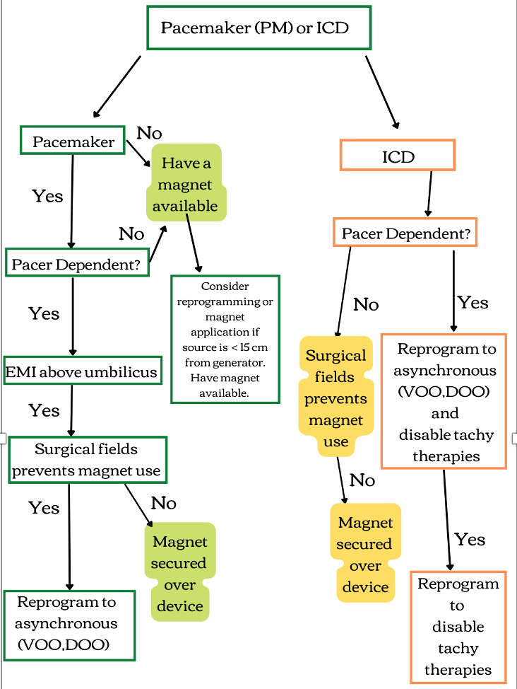

Cardiac Implantable Electronic Device (CIED) Algorithm    body {font-family: 'Open Sans', sans-serif; padding-left: 10px;}

### Cardiac Implantable Electronic Device (CIED) Algorithm

****

**Warning with central line insertions:  
**The guidewires used with central line insertions may cause mechanical interference near the CIED sensing electrodes resulting in ventricular oversensing, causing an inappropriate shock in a patient with an ICD or inhibition of a necessary pacing function.  
  
Also, atrial oversensing in a dual-chamber pacing mode may occur, leading to ventricular tracking and inappropriately rapid ventricular pacing.   
  
Actual physical contact between the guidewire and the right ventricular rate sensor has been reported to cause an electrical short with irreversible damage to the CIED generator.  
  
**Biotronik:** 800-547-0394  
**Boston Scientific (Guidant, Intermedics):** 800-227-3422  
**Medtronic:** 1-800-663-8766  
**St. Jude Medical/Abbott (Telectronics):** 800-722-3422  
**Sorin:** 800-352-6466  
  

Kaplan’s Essentials of Cardiac Anesthesia for Noncardiac Surgery 2019, pages 78-94  
Joe A. Kaplan, MD, Brett Cronin, MD, and Timothy Maus MD  
  
Perioperative management of patients with a pacemaker or implantable cardioverter-defibrillator  
UpToDate (accessed 10/2022)  
Peter M Schulman, MD  
The Heart Rhythm Society (HRS)/American Society of Anesthesiologists (ASA) Expert Consensus Statement on the perioperative management of patients with implantable defibrillators, pacemakers and arrhythmia monitors: facilities and patient management this document was developed as a joint project with the American Society of Anesthesiologists (ASA), and in collaboration with the American Heart Association (AHA), and the Society of Thoracic Surgeons (STS).  
Crossley GH, Poole JE, Rozner MA, Asirvatham SJ, Cheng A, Chung MK, Ferguson TB Jr, Gallagher JD, Gold MR, Hoyt RH,  
Heart Rhythm. 2011 Jul;8(7):1114-54.  
Irefin S, Kusumoto FM, Moorman LP, Thompson A  
  
Central venous access resulting in selective failure of ICD defibrillation capacity.  
Pacing Clinical Electrophysiology. 2001 Mar;24(3):394-5  
Varma N, Cunningham D, Falk R