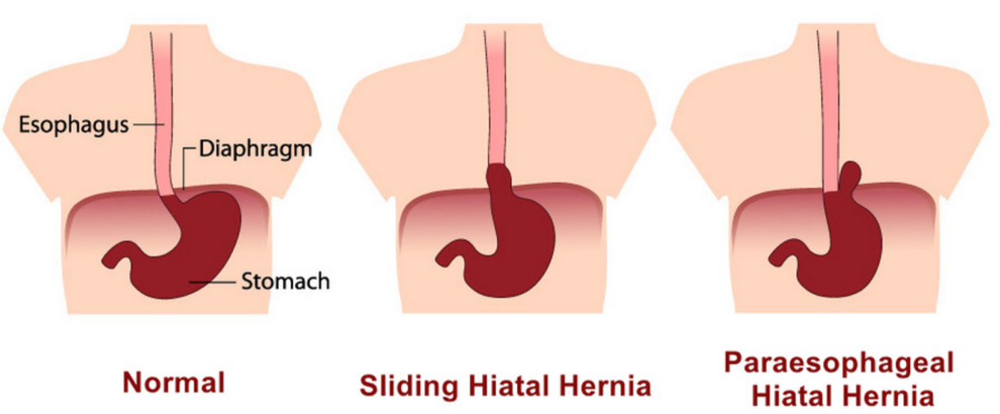

Paraesophageal Hernia (PEH) Repair and Anesthesia    body {font-family: 'Open Sans', sans-serif;}

### Paraesophageal Hernia (PEH) Repair and Anesthesia

The transabdominal or transthoracic approach can correct esophageal hiatal hernias.  
**Hiatal hernia:** When the stomach bulges into the chest through an opening in the diaphragm.

****

Today, most appear to be transabdominal and laparoscopic.  
Types of **esophagogastric fundoplasty** (hernia repairs) are discussed at the bottom of the page.  
The material below pertains to laparoscopic involving general anesthesia.  
The anesthesia is similar to when managing a Nissan fundoplication procedure.  
  
**Indication:  
**Paraesophageal hernia  
Hiatal HerniaGERD  
  
**The procedure:**  
The stomach is gradually moved back into the abdominal cavity.  
The diaphragm at the esophageal hiatus is closed to prevent the stomach from re-herniating.  
Sometimes, a special mesh is needed to close the diaphragm appropriately.  
Once the diaphragm has been closed, most patients undergo a fundoplication or a ‘wrap’ similar to a Nissan fundoplication procedure for GERD.  
  
The fundoplication is performed to help keep the stomach from herniating back into the chest cavity.  
  
**Anesthesia:** GETACan be ERAS**TAP blocks:** Becoming more common (not primary anesthesia)**RSI:** Depends on the severity of GERD (usually)  
  
Ask the surgeon or circulating RN if the surgeon prefers a bougie of OG tube.  
**OG tube:** Patients with severe GERD benefit from an OG tube.  
Some surgeons will prefer an OGT over a bougie.  
  
**Bougie Insertion:**  
Some surgeons prefer a bougie to be inserted down the esophagus.  
Make sure you lubricate it.  
The bougie is to distend the esophagus and aid the assessment of the fundoplication and hiatus.  
DO NOT force the bougie.  
If there is any resistance, inform the surgeon and let him insert it.  
CRNAs have been named in malpractice suits for the perforation of the esophagus with insertion.  
**Duration:** 1-2 hours  
**Anesthetic:** General/ETT. Consider RSI since these are severe GERD patients.  
**Muscle Relaxation:** Yes.  
**Position:** Modified lithotomy position, 1 or 2 arms out and reverse Trendelenburg.  
**IV Access:** 20G is acceptable  
**VTE prophylaxis:** Yes  
**EBL:** Minimal  
**Antiemetics:** You need to maximize these to prevent PONV or retching.  
_Retching and vomiting can damage the healing wrap postoperatively.  
The patient may need to return to surgery.  
That is why it is so vital to pretreat to prevent nausea._  
I know of one surgeon who demands a TIVA for his Nissen procedures.  
He feels the inhalation agent causes his patients to become nauseated and increases the risk of retching and returning to the operating room for repair.  
  
**Possible Complications:  
**PneumothoraxHemorrhage  
Perforated esophagus  
Difficulty swallowing because the stomach is wrapped too high on the esophagus or is wrapped too tightly.  
The esophagus slides out of the wrapped portion of the stomach, so the LES valve is no longer supported.  
Heartburn that returns  
Bloating and discomfort from gas buildup because the person cannot belch.  
Excess gas  
Risks of anesthesia  
Infection  
The fundoplication procedure cannot be reversed, and in some cases, it may not be possible to relieve the symptoms of these complications, even with a second surgery.**  
  
Review notes:  
**GEJ: Gastroesophageal junction  
**  
3 Types of paraesophageal hernias:**  
**Type II:** Results in migration of the stomach into the chest without GEJ.  
**Type III:** The GEJ migrates from the stomach into the chest cavity.  
**Type IV:** The stomach is displaced into the chest along with other intraabdominal organs  
**  
Hiatal hernia vs PEH:  
**Both cause GERD and may be an aspiration risk as it depends on the severity.Although they are defined differently, a hiatal hernia and PEH are often used interchangeably.  
  
**Hiatal hernia:**  
Normally, the esophagus goes through the hiatus and attaches to the stomach.  
In a hiatal hernia, the stomach bulges up into the chest through that opening.  
  
**PEH:**  
Refers to larger portions of the stomach or even other parts of the bowel that are pushed up into the chest.  
They can be diagnosed with an upper endoscopy or incidentally found on X-rays, CT scans, or MRIs.  
  
**Two main types of hiatal hernias:**  
Sliding  
Paraesophageal (next to the esophagus)  
  
Symptomatic PEHs are at higher risk for progressing to incarceration or ischemia, resulting in emergency surgery.  
  
**Types of esophagogastric fundoplasty:** table.tableizer-table { font-size: 12px; border: 1px solid #CCC; font-family: Arial, Helvetica, sans-serif; } .tableizer-table td { padding: 4px; margin: 3px; border: 1px solid #CCC; } .tableizer-table th { background-color: #104E8B; color: #FFF; font-weight: bold; }

|  | Nissen (Toupet)  
Fundoplication | Laparoscopic  
Nissen | Hill Procedure | Belsey Mark IV  
(thoracic) |
| --- | --- | --- | --- | --- |
| **Position** | Supine | Supine legs apart | Supine legs apart | Right lateral  
decubitus and requires DLT. |
| **Incision** | Midline Abdominal or  
laparoscopic ports | laparoscopic ports | Midline abdominal | Left thoracotomy |

  
  

Esophagogastric Fundoplasty  
Anesthesiologist’s Manual of Surgical Procedures 6 th Ed. 2020; p. 544-546  
Richard A Jaffe, Clifford A. Schimiesing  
Brenda Goliano  
Esophageal Hiatal Herniorrhaphy  
Pocket Guide to the Operating Room 4 th Edition; 2020; p. 206  
Maxine A. Goldman  
  
Hiatal & Paraesophageal Hernias  
UCONN Health Esophageal Disease Center (accessed 05/2023)  
https://tinyurl.com/5cmt432a  
  
Minimally Invasive and Gastrointestinal Surgery  
Medical College of Wisconsin (accessed 05/2023)  
https://tinyurl.com/2nw7wwax