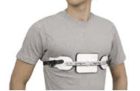
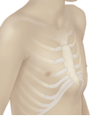

Pectus Carinatum and Anesthesia    body {font-family: 'Open Sans', sans-serif;}

### Pectus Carinatum and Anesthesia

Pectus carinatum is a deformity of a child's chest wall in which there a protrusion of the sternum (it is pushed outward). Rather than growing flat along the chest wall, the costal cartilages grow outward pushing the sternum forward.  
  
It’s often asymmetrical, with one side of the chest affected more than the other. In addition, some children have pectus carinatum on one side of the chest and an indentation called pectus excavatum on the other side of the chest.  
  
The distance between the sternum and the spine in all patients was considerably greater than that in normal patients of the same age.  
  
**Cause:** Unknown  
  
**Occurrence**  
1 out of 1500 children  
6 times LESS common than excavatum anomalies  
Occurs 4 times more often in men  
25% of patients have a familial occurrence  
20% of patients have been reported to have congenital heart disease,  
22% have scoliosis  
  
**Onset**  
Most of the time it doesn’t become apparent until age 11 or 12.  
It’s rare for the condition to show up after that.  
In rare cases, it is present during infancy and may be associated with premature fusion of the segments of the breastbone, a short wide breastbone and congenital heart disease.  
  
**May be associated with the following  
**Poland syndrome  
Spondylothoracic dysplasia (Jarcho-Levin syndrome)Asphyxiating thoracic dystrophy (Jeune syndrome)  
Marfan syndrome  
Ehlers-Danlos syndrome  
  
Pectus carinatum is primarily a cosmetic concern.  
Mild cases may not need any treatment at all, while moderate-to-severe cases can be treated effectively by bracing or surgery.  
  
**There are two basic types of pectus carinatum:  
Chondrogladiolar prominence** (also known as “chicken breast”) — nearly 95 percent of people who have pectus carinatum have this type.  
**Chondromanubrial prominence** (also known as “Pouter pigeon breast”) — this rare type of pectus carinatum can be more complex to treat.  
  
**Signs and symptoms  
**Most have no symptoms  
Some children report to have chest pain and shortness of breath or limited stamina with exercise.  
Frequent respiratory infections  
Asthma  
  
**Treatment**  
Surgical and nonsurgical  
  
**Nonsurgical:** A sternal brace that applies external compression.  
It usually the first option  

****

****

  
**Surgical:** Utilized when the sternal brace is ineffective  
The classic method for surgical repair of chest deformities was described first by Ravitch.  
Today, it is a modification of the Ravitch procedure and minimally invasive.  
There is also a Sandwich procedure.  
  
Either way, children with pectus carinatum almost always go on to lead completely normal lives.  
  
The type of repair depends on the location of the sternal protrusion, the degree of asymmetry, and the severity of any associated depression, but includes some common elements.  
  
One modification of the Nuss procedure introduces a curved bar through small incisions made on either side of the chest. The bar is tunneled and placed under the muscles of the chest and over the sternum, immediately depressing the chest protrusion. The bars are anchored to the ribs with special stabilizers and remain in place for several years so the chest cartilage can harden in the correct position.  
The bar is easily removed and ensures good long-term results, with recurrent protrusion or depression very uncommon.  
  
**Pre op**  
CBC, BMP and coagulation studies  
Assess for clinical associations  
Consider one of the regional options below because these are painful post operatively.  
Assess for possible associations list above.  
  
**Anesthesia:** General with ETT  
**Airway issues:** none**Regional:** Thoracic epidural or paravertebral are no longer commonly used.  
                 Bilateral On-Q continuous infusion pump is being more frequently used.  
  
**Thoracic epidural placement:  
Placement:** Needle insertion: anywhere from T 6-7 to T10-11, but the goal should be to locate the catheter tip in the region of T5-7.**Older children:** Can be placed with sedation prior to induction.  
This allows assessment of the onset of the block. Many anesthesia providers do not wait to assess before induction.  
**Younger children:** Commonly inserted after induction of general anesthesia  
  
**Thoracic epidural dosing:**  
After a common test dose, the catheter is dosed with local anesthetic with or without opioid.  
Some anesthesia providers supplement the epidural intraoperatively with bolus administration of 60% of the original bolus every 90 minutes.  
  
**Decrease in heart rate:** Common with adolescents after an epidural bolus.  
**Decrease in BP:** May decrease by 10 – 20% and may require fluid administration.  
  
table.tableizer-table { font-size: 12px; border: 1px solid #CCC; font-family: Arial, Helvetica, sans-serif; } .tableizer-table td { padding: 4px; margin: 3px; border: 1px solid #CCC; } .tableizer-table th { background-color: #104E8B; color: #FFF; font-weight: bold; }

| Kg | Local anesthetic | Opioid |
| --- | --- | --- |
| 30-50 | 0.25% bupivacaine | 1 mcg/kg of fentanyl or  
7-8 mcg/kg of hydromorphone |
| 50 + | 0.25% bupivacaine or  
1.5-2.0% lidocaine | Same as above |

  
  
table.tableizer-table { font-size: 12px; border: 1px solid #CCC; font-family: Arial, Helvetica, sans-serif; } .tableizer-table td { padding: 4px; margin: 3px; border: 1px solid #CCC; } .tableizer-table th { background-color: #104E8B; color: #FFF; font-weight: bold; }

| Kg | Local anesthetic | Opioid |
| --- | --- | --- |
| 30-50 | 0.25% bupivacaine | 1 mcg/kg of fentanyl or  
7-8 mcg/kg of hydromorphone |
| 50 + | 0.25% bupivacaine or  
1.5-2.0% lidocaine | Same as above |

  
  
**Muscle Relaxation:** Required**Position:** Supine, arms abducted  
  
**Duration:** 2 hours  
**EBL:** Minimal  
**IV Access:** Regular**A-line:** Not needed**Age Range:** 14 to 57 years  
**Average age:** 15-19  
**Hydration:** Normal**Chest tube:** Depends on the procedure.  
  
**Bar removal:** After 2 years. Takes about 1 hour.**Possible Postoperative Complications  
**Wound seroma  
Pleural effusion  
Unintentional pneumothorax  
Mild-to-moderate hypertrophy of the cutaneous scar occurred  
Bleeding  

Boston Children’s Hospital  
Conditions and treatments  
http://www.childrenshospital.org/conditions-and-treatments/conditions/pectus-carinatum/symptoms-and-causes  
  
University of San Francisco  
Pediatric Surgery  
https://pedsurg.ucsf.edu/conditions--procedures/pectus-carinatum.aspx  
  
Pectus excavatum and carinatum.  
Eur J Med Genet. 2014;57:414–7.  
Cobben JM, Oostra RJ, van Dijk FS.  
  
Nonoperative management of pectus carinatum.   
J Pediatr Surg. 2006;41:40–5.  
Frey AS, Garcia VF, Brown RL, et al.  
  
Unusual sternal deformity with cardiac symptoms operative correction.   
J Thorac Surg. 1952;23:138–44.   
Ravitch MM.  
  
A minimally invasive technique to repair pectus carinatum: preliminary report.   
Arch Bronconeumol. 2005;41:349–51.  
Abramson H.  
  
A 5-year experience with a minimally invasive technique for pectus carinatum repair.  
 J Pediatr Surg. 2009;44:118–23.  
Abramson H, D’Agostino J, Wuscovi S.  
  
Minimally invasive repair of pectus carinatum using a newly designed bar and stabilizer: a single-institution experience.   
Eur J Cardiothorac Surg. 2011;40:339–42.   
Yuksel M, Bostanci K, Evman S.  
  
Current readings: surgical repair experience of congenital chest wall deformities.  
Semin Thorac Cardiovasc Surg. 2013;25:317–22. doi:  
Lakoma A, Kim ES.  
  
Bracing is an effective therapy for pectus carinatum: interim results. J  
J. Pediatr Surg. 2013;48:184–90.  
Lee RT, Moorman S, Schneider M, Sigalet DL.  
  
Minimal invasive extrathoracic presternal compression using a metal bar for correction of pectus carinatum.   
Pediatr Surg Int. 2014;30:25–30.  
Lee SY, Song IH, Lee SJ.  
  
Repair of pectus chest deformities in 320 adult patients: 21 year experience.   
Ann Thorac Surg. 2007;84:429–33.  
Jaroszewski DE, Fonkalsrud EW.