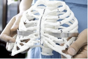
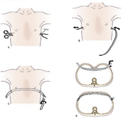

Pectus Excavatum and Nuss Procedure    body {font-family: 'Open Sans', sans-serif;}

### Pectus Excavatum and Nuss Procedure

Pectus excavatum (PE), or "funnel chest," is a congenital deformity of the chest wall characterized by a sternal depression.  
It is caused by an overgrowth causing a dorsal deviation of sternum and third to seventh costal cartilage and ribs  
The overgrowth causes a depression of the sternum and the chest has a “sunken in” appearance.  
This results in progressive compressive/restrictive symptoms due to compression of lung and cardiac structures  
  
Accounts for 90 percent of anterior chest wall disorders   
Occurs in 1 in 300 -1,000 births.  
Male to female ratio: 4:1  
  
Often present at birth but becomes more noticeable during times of rapid growth, such as puberty.  
  
**Etiology:** Unknown  
Usually sporadic, but may be associated with connective tissue disorders, neuromuscular disease, and some genetic conditions  
  
**Associated connective tissue disorders:**  
Marfan’s syndrome  
Ehlers Danlos syndrome  
Osteogenesis imperfecta  
**Associated neuromuscular disease:** Spinal muscular atrophy  
  
**Associated genetic conditions:**  
Noonan syndrome  
Turner syndrome  
Multiple endocrine neoplasia type 2b  
  
**_Note:_** _Most patients with PE have no associated medical conditions._  
  
**Association with repaired congenital diaphragmatic hernias**  
This association is presumably because the axis of contraction of the diaphragm is more horizontal than vertical, so that the diaphragm pulls the lower edge of the sternum inward.  
  
**The clinical significance of PE depends on three issues:**  
Severity of the chest wall defect  
Cardiopulmonary morbidity  
Psychosocial impact, because the defect alters the patient's appearance  
  
**Manifestations  
**Young children with minimal deformities are asymptomatic and do not require operation.  
The deformity frequently increases with growth and symptoms may develop as the chest wall loses the flexibility of the young child.  
  
**Symptoms of SEVERE pectus excavatum  
**Exercise intolerance: 82 %   
Chest pain: 68%  
Poor endurance: 67%  
Shortness of breath: 42%  
  
**Cardiac auscultation:** Possible murmur due to compression of the pulmonary outflow tract. There may also be a click if mitral valve prolapse (MVP) is present. MVP may resolve after PE repair.  
Echocardiography may be performed to ascertain the presence of MVP.  
  
**Cardiac effects  
**Cardiac function at rest is usually normal.  
Cardiac output during exercise may be restricted due to sternal compression and displacement of the heart.  
  
**Stroke volume** (SV): May decrease by 40% in the upright vs the supine position, while no change occurs in normal controls.  
After pectus repair the cardiac index in the upright position increases to a more normal value with a smaller difference from supine.  
**  
Cardiorespiratory effects should be evaluated by:**  
Computed tomography (CT) to quantify the severity of PE  
Pulmonary function testing: restrictive with moderate and severe PE  
Exercise testing and cardiac evaluation  
**Two current surgical approaches to correct PE: (may have variations)  
Modified Ravitch procedure:** Referred to as an open procedure.  
Involves the resection of the subperichondrial cartilage, a sternal osteotomy underneath the angle of the PE, and temporary internal fixation to support the sternum.  
  
**Nuss procedure:**  Referred to as the "minimally invasive thoracoscopic " or "closed" procedure. It does NOT involve cartilage resection.  
A custom-contoured steel bar (Nuss bar) is inserted and applies outward pressure to the sternum at the point of maximal inward deflection.  
The Nuss bar is placed in the pleural space, passed behind the sternum, rotated 180 degrees, then attached laterally to the outer edge of the rib cage.  
The bar is anchored to the ribs with special stabilizers and remains in place for a few years so the chest cartilage can harden in the correct position.  

****

****

  
**Anesthetic management of patients for Nuss procedure**  
**Intraoperatively, anesthesia focuses on three areas:** areas Potential for catastrophic hemorrhage caused by perforation of large vessels and the heart.  
Potential for malignant arrhythmias.  
Consequences of bilateral iatrogenic pneumothoraces. areas  
  
**Preoperative testing:  
**CT and echocardiogram is adequate.  
Echocardiogram is performed selectively in patients with clinical evidence of Marfan syndrome or with any cardiac symptoms or murmurs.  
  
**Generally, to consider corrective surgery, patients need two or more of the following criteria:**  
Haller index greater than 3.25 (measured on CT scan).  
Cardiac compression, displacement, mitral valve prolapse, murmurs, or conduction abnormalities.  
Pulmonary function testing showing restrictive respiratory disease.  
Failed previous repair of PE.  
  
**Anesthesia:** Usually a combined general and thoracic epidural anesthesia.**Postoperative pain:** Can be managed with epidural infusion, usually of bupivacaine and an opioid (fentanyl, morphine or hydromorphone).  
  
**Regional Anesthesia  
**Thoracic epidural or paravertebral are no longer commonly used.  
Bilateral On-Q continuous infusion pump is becoming widely used.  
  
**Thoracic epidural placement:  
Placement:** Needle insertion: anywhere from T 6-7 to T10-11, but the goal should be to locate the catheter tip in the region of T5-7.**Older children:** Can be placed with sedation prior to induction.  
This allows assessment of the onset of the block. Many anesthesia providers do not wait to assess before induction.  
**Younger children:** Commonly inserted after induction of general anesthesia  
  
**Thoracic epidural dosing:**  
After a common test dose, the catheter is dosed with local anesthetic with or without opioid.  
Some anesthesia providers supplement the epidural intraoperatively with bolus administration of 60% of the original bolus every 90 minutes.  
Other providers may start the infusion in the OR after the bolus is administered.  
  
**Decrease in heart rate:** Common with adolescents after an epidural bolus.  
**Decrease in BP:** May decrease by 10 – 20% and may require fluid administration.  
  
                 **Intraoperative epidural dosing** (Lynne G. Maxwell, MD, FAAP)  
                          Volume 0.3 ml/kg to maximum of 10 ml  
               (may add 1 mcg/kg of clonidine to maximum of 100 mcg) table.tableizer-table { font-size: 12px; border: 1px solid #CCC; font-family: Arial, Helvetica, sans-serif; } .tableizer-table td { padding: 4px; margin: 3px; border: 1px solid #CCC; } .tableizer-table th { background-color: #104E8B; color: #FFF; font-weight: bold; }

| Kg | Local anesthetic | Opioid |
| --- | --- | --- |
| 30-50 | 0.25% bupivacaine | 1 mcg/kg of fentanyl or  
7-8 mcg/kg of hydromorphone |
| 50 + | 0.25% bupivacaine or  
1.5-2.0% lidocaine | Same as above |

  
  
**For Postoperative epidural infusion** (Lynne G. Maxwell, MD, FAAP)  
**Rate:** 0.25 mL/kg/hr to maximum of 10 mL/hr- If PCEA is desired, continuous rate is reduced to 0.2 mL/kg/hr (maximum 10 mL/hr) with 1-2 boluses of 2-3 mL (lockout 15-30 minutes). table.tableizer-table { font-size: 12px; border: 1px solid #CCC; font-family: Arial, Helvetica, sans-serif; } .tableizer-table td { padding: 4px; margin: 3px; border: 1px solid #CCC; } .tableizer-table th { background-color: #104E8B; color: #FFF; font-weight: bold; }

| Kg | Local anesthetic | Opioid |
| --- | --- | --- |
| 30-50+ | 0.1% bupivacaine or  
0.2 % ropivacaine | May add clonidine 0.4-0.6 mcg/ml.  
(If clonidine is used, the lower concentration of opioid is used.)  
  
**Rate:** 0.25 ml/kg/hr maximum of 10ml/hr  
If catheter tip is low thoracic or lumbar, higher infusion volumes may be needed.  
  
**If PCEA is desired:** Continuous rate is reduced to 0.2 ml/kg/hr (maximum 10 ml/hr)  
with 1-2 boluses of 2-3 ml (lockout 15-30 minutes). |

  
  
**Muscle Relaxation:** Required**Position:** Supine, arms abducted  
  
**Anesthesia Induction:** Inhalation or IV  
**Inhalation agent after induction:** Sevoflurane or isoflurane  
**Nitrous oxide:** Avoid, because of a risk of pneumothorax during the procedure  
**Muscle relaxation:** Required. Rocuronium, atracurium, cisatracurium.    
Rocuronium (1–1.5 mg/kg) has the advantage of rapid onset, long effect, minimal histamine release and potential rapid reversal with sugammadex in case of failure to intubate.  
**Ketamine:** used as an adjunct to IV opiates  
Total intravenous anesthesia (TIVA) using a propofol and remifentanil infusion is also a well-established anesthetic technique.  
**IV access:** 1-2 large bore sites are recommended in case of hemorrhage.  
**Arterial line:** Necessary.  
  
**Perioperative transthoracic echocardiogram** (TTE): Use for right ventricular obstruction and monitoring for the manipulation of the ventricle during insertion of the pectus bar.  
Rotation of the TTE probe in the mid esophageal position can help detect the presence of fluid in the pleural space, which can alert the surgeons to potential sources of bleeding  
TOE can also help diagnose pericardial/pleural collections, myocardial injury, or any iatrogenic valvular damage. The mitral and tricuspid valve should also examined be before and after the procedure to exclude valvular injuries.  
**_NOTE:_** _TTE is preferred to TOE in most literature sources._  
  
**Cardiac output monitoring: Optional** with esophageal Doppler or TTE      
Bilateral paravertebral block (PVB) with catheters, or a pectoralis block (PEC), have both been shown to provide effective analgesia of the thoracic wall as well as an alternative methods.  
  
**Remifentanil infusion:** Some anesthesia providers utilize this infusion to reduce stress response to sternotomy or very stimulating time periods during surgery.  
Remifentanil can then be rapidly titrated with its context-sensitive half time allowing for rapid recovery, reducing coughing and bucking on extubation.  
  
**Tachycardia and arrhythmias:** Common during this procedure due to intense stimulation and possible cardiac manipulation.  
It commonly occurs when the Nuss bar is inserted under the sternum.  
**IV access:** A small 22g catheter is acceptable for induction, however a large bore should be inserted after the patient is asleep.  
**Positioning concerns:** When the Nuss bar is placed through the left sided incision in the lateral chest wall at the level of the maximum sternal displacement, abduction of the arms is necessary for access by the surgeon.  
The surgeon may want the left arm especially abducted greater than 90°, which has been reported to result in transient brachial plexus injuries.  
Some surgeons may increase the risk of this complication by placing a vertical roll between the scapulae to push the chest forward. Recently, Fox et al have suggested utilizing an arthroscopy sling for the left arm which appears to reduce the incidence of brachial plexus injury  
**Foley catheter:** Required until epidural is discontinued  
**Duration:** 2-3 hours.  
  
**Possible complications of Nuss procedure**  
Intraoperative hypotension, tachycardia, and hypercapnia were the most common complications.  
Postoperative ileus  
Lung parenchyma laceration-pneumothorax  
Ulnar nerve palsy-from positioning  
Brachial nerve palsy-from positioning  
  
**Other, less frequent complications**  
Perforation or compression of the of the right ventricle  
inferior vena cava compression  
Pericarditis  
Pleural effusion  
Inadvertent visceral perforation  
Bar slippage misplacement  
Over-correction  
Perforation of the heart and great vessels  
Bar misplacement requiring reoperation  
Lung atelectasis and pneumonia  
Bar allergy  
Thoracic outlet syndrome  
Wound infection  
Epidural complications  
  
**Contraindications of surgery**  
Complex congenital anomalies  
Neurodevelopmental delay  
Congenital heart disease with primary cardiac dysfunction  
Chronic immunosuppression  
  
**Emergence:** Avoid. Coughing and straining on the endotracheal tube may cause subcutaneous emphysema.  
**Extubation:** Deep extubation if not contraindicated  
  
**Post op pain:** Is worse as age increases due to increase ossification of ribcage.  

Boston Children’s Hospital  
Conditions and treatments  
http://www.childrenshospital.org/conditions-and-treatments/conditions/pectus-carinatum/symptoms-and-causes  
  
University of San Francisco  
Pediatric Surgery  
https://pedsurg.ucsf.edu/conditions--procedures/pectus-carinatum.aspx  
  
Pectus excavatum and carinatum.  
Eur J Med Genet. 2014;57:414–7.  
Cobben JM, Oostra RJ, van Dijk FS.  
  
Nonoperative management of pectus carinatum.   
J Pediatr Surg. 2006;41:40–5.  
Frey AS, Garcia VF, Brown RL, et al.  
  
Unusual sternal deformity with cardiac symptoms operative correction.   
J Thorac Surg. 1952;23:138–44.   
Ravitch MM.  
  
A minimally invasive technique to repair pectus carinatum: preliminary report.   
Arch Bronconeumol. 2005;41:349–51.  
Abramson H.  
  
A 5-year experience with a minimally invasive technique for pectus carinatum repair.  
 J Pediatr Surg. 2009;44:118–23.  
Abramson H, D’Agostino J, Wuscovi S.  
  
Minimally invasive repair of pectus carinatum using a newly designed bar and stabilizer: a single-institution experience.   
Eur J Cardiothorac Surg. 2011;40:339–42.   
Yuksel M, Bostanci K, Evman S.  
  
Current readings: surgical repair experience of congenital chest wall deformities.  
Semin Thorac Cardiovasc Surg. 2013;25:317–22. doi:  
Lakoma A, Kim ES.  
Bracing is an effective therapy for pectus carinatum: interim results. J  
J. Pediatr Surg. 2013;48:184–90.  
Lee RT, Moorman S, Schneider M, Sigalet DL.  
  
Minimal invasive extrathoracic presternal compression using a metal bar for correction of pectus carinatum.   
Pediatr Surg Int. 2014;30:25–30.  
Lee SY, Song IH, Lee SJ.  
  
Repair of pectus chest deformities in 320 adult patients: 21 year experience.   
Ann Thorac Surg. 2007;84:429–33.  
Jaroszewski DE, Fonkalsrud EW.