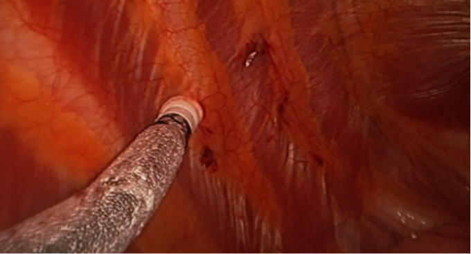
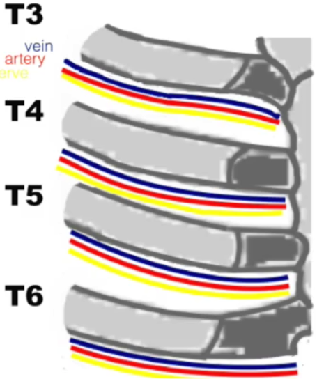

Cryoablation with Pectus Excavatum Repair (Nuss procedure)    body {font-family: 'Open Sans', sans-serif;}

### Cryoablation with Pectus Excavatum Repair (Nuss procedure)

Nuss procedure is a minimally invasive thoracoscopic method of repairing pectus excavatum.  
However, the Nuss procedure results in a significant amount of postoperative pain leading to high opioid requirements, activity restrictions, and loss of productivity.  
Refer to “Pectus Excavatum and Nuss Procedure” for details.  
  
The use of intercostal nerve cryoablation (INC) is now is increasingly being used intraoperatively for postoperative pain control in patients undergoing Nuss procedure.

****

The surgeon will freeze 4 intercostal nerves (T3 through T6) bilaterally prior to placing the Nuss bar is introduced into the pleural space.  
Some surgeons may block T3-T8.  
The cryoablation will temporarily decrease pain transmission through these nerves.  
The onset for the full effect may be 12-24 hours.  
This does not eliminate the pain completely.  
The cryoablation lasts between 2-3 months.  
Patients may experience some skin numbness of the chest wall.  
The numbness should resolve within 3-6 months when the nerve regenerates.  
  
**The procedure:**  
The same incision for the Nuss procedure can be used for the cryoablation.  
Many surgeons prefer a vertical incision at the anterior axillary line for the insertion of the Nuss bar and usage use of the cryoablation probe.  
The appropriate lung will be deflated using the DLT and the pleural cavity is insufflated with CO2.  
The probe is inserted through the skin incision and then tunneled subcutaneously and superficial to the ribs up to the initial ablation site at T3.  
The tip of the probe in inserted into the intercostal muscles but does NOT enter the partial pleural at the intercostal groove at the location of the nerve.  
Some surgeons may perform this procedure from within the pleural cavity (inferior portion of the intercostal muscles) as seen with the image below.

****

The neurovascular bundle is situated between the internal and innermost intercostal muscle  
layers (below).

****

  
The surgeon can verify proper positioning of the probe by the fasciculation of the innermost intercoastal muscle resulting from the stimulation of the intercostal nerve.  
After probe position has been confirmed, the ablation is initiated.  
The probe is cooled to -60 degrees Celsius for 90 to 120 seconds.  
The formation of ice crystals confirms effectiveness of the probe.  
After the ablation is complete, the probe warms to ambient temperature before it is removed.  
Proper thawing allows the safe release of the probe form the tissue.  
After the ablation of T3, the probe is slowly withdrawn and the procedure is repeated for T4-T5 and T5-T6.  
When cryoablation is completed, the lung is reinflated.  
The contralateral lung will be deflated followed by the same procedure.  
Each side takes about 15-30 minutes.  
The Nuss procedure will then follow the cryoablation  
  
**ETT:** DLT**Positioning:** Supine, arms out  
**Arterial line:** Yes  
**IVs:** 2  
**Duration of bilateral cryoablation:** 30 to 60 minutes  
**EBL:** Minimal  
**Onset of cryoablation analgesia:** 12 hours  
**Note:** Some surgeon may also block the nerves using a local anesthetic with rapid onset.  
**Duration of cryoablation analgesia:** 3 months  
**Post op pain management:** Either epidural infusion or continuous pain pumps  
  
**Possible complications:**  
Hemothorax  
Pneumothorax  
Intercostal hemorrhage  
Intercostal nerve damage  
  
This procedure is new.  
No complication have been documented to date.  
  
**Conclusions and relevance of** **cryoablation during the Nuss procedure:  
**May decrease hospital length of stay  
May decrease opioid requirement  
May eliminate or minimize the requirement for thoracic epidural analgesia  
  

Intercostal Cryoablation: ANovel Method of Pain Management for the Nuss ProcedureAmerican Pediatric Surgical Association, 2016 (accessed 08/2021)  
https://www.csurgeries.com/video/intercostal-cryoablation-a-novel-method-of-pain-management-for-the-nuss-procedure/  
Intercostal Cryoablation is Improving Pectus Excavatum RecoveryCleveland Clinic (accessed 08/2021)  
https://www.youtube.com/watch?v=5DAZy\_hS7Cw  
Intraoperative intercostal nerve cryoablation During the Nuss procedure reduces length of stay and opioid requirement: A randomized clinical trial  
Journal of Pediatric Surgery 2019 Nov;54(11):2250-2256.  
Claire E Graves 1 , Jarrett Moyer 1 , Michael J Zobel 1 , Roberto Mora 1 , Derek Smith 1 , Maura O'Day 1 , Benjamin E Padilla  
  
Cryoablation is associated with shorter length of stay and reduced opioid use in pectus excavatum repair  
Pediatric Surgery International 37, pages 67–75 (2021)  
R. Luke Rettig, ndrew G. Rudikoff, Hoi Yee Annie Lo, Donald B. Shaul, Franklin M. Banzali, Antonio Hernandez Conte & Roman M. Sydorak