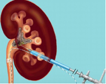
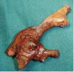
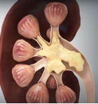

Percutaneous Nephrolithotomy (PCNL)    body {font-family: 'Open Sans', sans-serif;}

### Percutaneous Nephrolithotomy (PCNL)

\- PCNL is a procedure to remove renal calculus that is too large to pass independently.  
\- It is the treatment of choice when other less invasive measures have failed.  
\- It is the gold standard treatment for the removal of renal staghorn stones.

****

\- Prior to the nephrolithotomy procedure, the interventional radiologist will first insert a nephrostomy tube into the renal pelvis.  
\- The nephrostomy tube (sometimes a wire) guides the urologist to access the renal pelvis accurately.  
\- The patient is then transported to a main operating room already intubated.  
\- After the patient is placed in a prone or lateral position, the urologist advances a nephroscope into the renal pelvis to visualize and remove the stone(s).  
\- Sometimes the interventional radiologist will insert the wire(s) down the nephrostomy tube and remove the tube leaving the wire(s) in the renal pelvis.  
\- The wires are used as a guide to enter the kidney with the nephroscope.  
\- Fragmentation can then be done using an ultrasonic probe or a laser through the nephroscope.  
\- Because the pathway tract is dilated, it allows passage of larger instruments, and the urologist can suction out fragments or grasp the stone or its particles as they are produced.  
\- Once the procedure is complete, the nephrostomy tube is usually left in the flank to drain the kidney overnight or for several days.  
\- Suppose the patient only arrives from radiology with only wires.  
\- In that case, the urologist will insert a council tip foley catheter over the wire into the renal pelvis to act as a nephrostomy tube for drainage.  
\- It is left in for two to three days.  
\- A ureteral stent is also placed in the ureter to drain urine from the kidney while it is healing.  
  
Renal staghorn stone:

****

****

This type of stone is more complex and requires more operative time.  
This may result in fluid absorption, dilutional anemia, hypothermia, or significant blood loss.

  
**Labs:** BMP and CBC in case you need to compare before and after.**Anesthetic:** General/ETT.  
**Position:** Usually Prone, but sometimes lateral  
**Duration:** 1-4 hours; depends on the stone size and the skill of the urologist.  
**EBL:** Usually minimal.  
  
**Possible Complications  
**\- Excess fluid absorption leading to dilutional anemia  
\- Hypothermia  
\- Large blood loss.  
  

.Jaffe, Richard A.  _Anesthesiologist's Manual of Surgical Procedures_ . Philadelphia, Pa.: Lippincott  
Williams & Wilkins, 2009.  
  
Kaplan, Steven A., Alan W. Partin, and Anthony Atala. _Minimally Invasive Procedures in Urology_ . New  
York: Dekker, 2005.  
  
Macksey, Lynn Fitzgerald.  _Surgical Procedures and Anesthetic Implications: A Handbook for Nursing  
Practice_ . Sudbury, MA: Jones & Bartlett Learning, 2011.  
McAninch, Jack W., Tom F. Lue, and Donald R. Smith. _Smith and Tanagho's General Urology / Editors, Jack W. McAninch, Thomas F. Lue_ . New York: McGraw-Hill Professional, 2013.