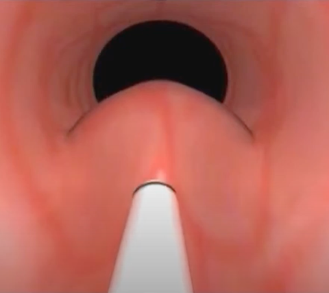
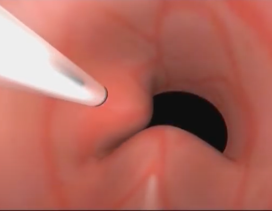
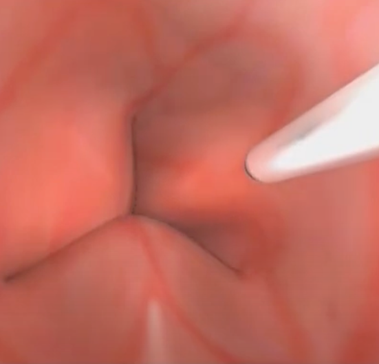

Periurethra lnjection of Bulkamid    body {font-family: 'Open Sans', sans-serif;}

### Periurethra lnjection of Bulkamid

A urethral bulking agent procedure.The injection of a soft, non-absorbable hydrogel into the submucosal space (walls) of the proximal urethra (bladder neck) at 3 to 4 different sites improves the volume of the bladder's neck and prevents urine leakage.  
  
**Goal:** To elevate the urethral mucosa, thereby increasing coaptation and urethral resistance.  
Typically provides long-lasting results.  
The hydrogel does not dissolve, so it remains in the tissue for many years.  
  
**Indications:**  
Stress Urinary Incontinence (SUI)  
Vesicoureteral Reflux (VUR)  
  
**Bulkamid:** A smooth, water-based gel (bulking agent) that swells the walls of the periurethral urinary tract to minimize leakage.  
  
**Contraindications of Bulkamid injection:  
**Acute UTI  
Male patients**  
Procedure:**  
They were typically performed as an outpatient procedure.  
  
**Anesthesia:** Usually MAC  
**Position:** Lithotomy  
**Duration:** 15-30 minutes  
**EBL:** Minimal  
Not a painful procedure  
**Possible complications:  
**Hematuria  
Delayed urination  
Painful urination  
Urinary tract infection.  
Potential migration of the hydrogelAllergic reactions (rare)  

****

****

****

Bulkamid -Urethral Bulking System  
Accessed 08/2024  
https://www.accessdata.fda.gov/cdrh\_docs/pdf17/P170023C.pdf  
  
Current use of injectable agents for female stress urinary incontinence.  
Reviews in Urology. 2005;7:S12.  
Herschorn S.  
  
Periurethral bulking agents for female stress urinary incontinence in Canada  
Canadian Urological Association Journal 017 Jun; 11  
Adiel Mamut, MD and Kevin V. Carlson, MD