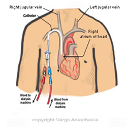

Permacath Insertion     body {font-family: 'Open Sans', sans-serif;}

### Permacath Insertion

  
**Anesthesia Plan:** Same as a Portacath-Usually a MAC

****

A Permacath is a flexible plastic tube that can be put into the Jugular vein (usually right IJ) for dialysis. It is a double lumen, so blood can flow in and out at the same time during dialysis.

 Although arteriovenous fistula (AVF) remains the best route of dialysis in these patients, central venous access is required in 60% of them during their renal replacement therapy.  
The right internal jugular vein is considered the first choice for cannulation as it has the least long-term complications. Technique of catheter insertion is either surgical cutdown  or percutaneous Seldinger technique which is performed blindly, or ultrasound guided.

The surgeon will access the jugular vein and advance a guide wire into the superior vena cava where the catheter enters the skin and where the needle puncture is made. The surgeon then will create a tunnel so the catheter can be threaded through under the skin. 

At the exit site there is a single tube which branches into two, forming a Y appearance. The tube sits on the outside upper chest and is about 10 -12cm long. At the end of each branch of the Y, a cap is applied. 

Most surgeons use an ultrasound machine to access the right IJ just at the base of the neck. The surgeon usually uses the Seldinger technique (using a guide wire).

After the surgeon threads the guide wire down the IJ, observe your monitor for ectopy because the wire is probably too far down tickling the right atrium. Inform the surgeon and the guidewire will be pulled back. Placement will be immediately verified by the C-arm.

**Anesthetic:** (Same as a Portacath) Usually Deep MAC (room air general) with NC monitoring ETCO2.  
**Common cocktail:** 2mg versed, 2cc fentanyl and Propofol infusion. A small propofol bolus prior to local injection.  
**Duration:** 30-60 minutes.  
**Position:** Supine, arms tucked. Sometimes the surgeon will request the nurse to pull the arm of the insertion side towards the foot for better access. Some Trendelenburg before the insertion to fill the neck vein and make the puncture easier. The bed is leveled back out after the guide wire is verified.  
**IV Access:** 20G is acceptable.

**Check K+:** Yes, many of these patients are end stage renal disease. You should never go to the OR with these patients without knowing their K+.

**Possible Complications:**  
pneumothorax

hemothorax  
wound infection

**Benefits of having a Permacath:**  
The patient does not require an IV placed every time they need chemotherapy.  
Allows dialysis access while their new AV fistula matures or if the AV graft or fistula is malfunctioned.

**Accessing an Existing Permacath for Anesthesia**

For IV access, we usually avoid using an existing permacath.

However, they have been used on many occasions when the patient is a difficult IV stick. DO NOT flush the catheter. There is usually a certain dose of heparin that sits in the catheter to prevent it from clotting. The patient will receive a dose of heparin if you do. Always draw out first and discard the waste.

**More Notes:**

The Permacath will have a kind of cuff attached that will help secure the catheter. Scar tissue builds up around the cuff, which helps keep it in place and prevent infection. No one will be able to see the cuff that is under the skin. The visible portion of the catheter is a single catheter exiting the chest wall with two extensions.

Jaffe, Richard A. _Anesthesiologist's Manual of Surgical Procedures_., 2012.

Kalbande, Manohar B. _Vascular Surgery Made Easy_. 2013.

Macksey, Lynn Fitzgerald. _Surgical Procedures and Anesthetic Implications: A Handbook for Nurse Anesthesia Practice_. Sudbury, MA: Jones & Bartlett Learning, 2012.

Moore, Wesley S., M.D. _Vascular and Endovascular Surgery: A Comprehensive Review Expert Consult:_2013