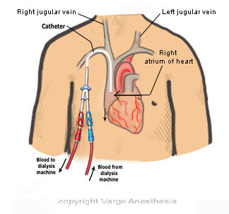

Permacath Removal    body {font-family: 'Open Sans', sans-serif;}

### Permacath Removal

This procedure is usually much quicker and less stimulating than the initial insertion.**Anesthesia:** Usually MAC

****

**Indications of permcath removal are:**  
\- Access is no longer required, either due to the completion of renal treatment or the availability of a better alternative.  
\- Catheter-related infection  
\- Persistent catheter infection  
\- Damaged or inappropriately functioning catheter  
**  
Procedure:**  
\- A local anesthetic is administered to numb the area.  
\- The surgeon makes a small incision and removes the catheter from the vein.  
\- Some surgeons use two hemostats to release the cuff from the tissue poking deep into the hole by holding pressure at the jugular (entrance site under the skin) and sliding the catheter out.  
\- Simple traction is enough to pull it out for a cuff that has been in place for less than 3 weeks.  
\- Tip culture may be performed when there is redness and drainage at the exit site.  
\- Once the catheter is removed, gauze is placed, and the area is stitched and bandaged to cover the operated area.  
  
**After the procedure:**  
\- The patient is kept under observation for a few hours before discharge.  
\- Sometimes, the patient may experience post-op redness or swelling in the operated area.  
  
**Anesthesia:** Usually MAC  
Low-dose propofol just prior to the local injection.  
**Duration:** 1-15 minutes  
**Position:** Supine, arms tucked  
**EBL:**  Minimal  
  
**Possible complications:  
**Hematoma  
Bleeding  
Infection  

Perma-Cath Placement or Removal  
Surgical Affiliates of New Jersey  
Accessed 12/2023  
https://www.surgicalaffiliatesnj.com/permcath-placement-removal