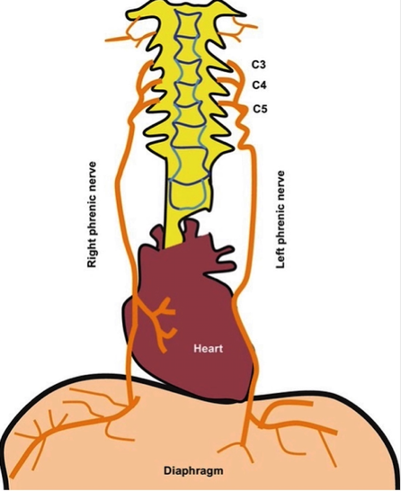

Phrenic Nerve Reinnervation via VATS or Open Thoracotomy Approach    body {font-family: 'Open Sans', sans-serif;}

### Phrenic Nerve Reinnervation via VATS or Open Thoracotomy Approach

By Dorothy Duffy-Gross M.S.N., A.P.N., C.R.N.A., Jersey Shore University Medical Center, Neptune, N. J.  
Personal reference- Dr. Matthew Kaufman, Institute for Advanced Reconstruction.

**Also referred as:**  
Phrenic nerve decompression and neurolysis| for diaphragmatic paralysis  
Phrenic nerve bypass for diaphragmatic paralysis  
Phrenic nerve transfer for diaphragmatic paralysis  
  
**VATs versus Cervical Incision:  
**Surgical incision site depends upon the location of the damaged portion of the phrenic nerve.  
If the damage is in the cervical spinal roots, a lateral neck incision will be performed.  
If the damaged portion is on the diaphragm or thorax, a laparoscopic VATS or open thoracotomy approach is employed.  
  
**NOTE:**  
Sometimes patients have more than one area of damage and require a lateral neck incision and a laparoscopic VATS.  
If the patient will need a diaphragmatic pacemaker, a laparoscopic VATS or open thoracotomy approach.  
If the injury to the phrenic nerve is bilateral, the surgeon will operate on the side with the most damage and return at a later date to operate on the contralateral side.  
If nerve grafting is required, the sural nerve is retrieved from the patient’s lower midcalf.  
The surgeon usually offers the patient the choice between their left or right calf.  
Patients usually opt for their left, non-driving leg.  
  
**Unilateral phrenic nerve injury:  
**Unilateral phrenic nerve injury often results in lifelong symptomatic hemidiaphragmatic paralysis, and currently few treatment options exist.  
With the advancement of surgical nerve re-innervation, a phrenic nerve can now be re-innervated through a cervical or thoracic approach.  
Despite the novelty of this recent innovation by Dr. Kaufman, early results have been promising.  
  
**Effects of phrenic injury on the diaphragm:**Injury to one phrenic nerve leads to paralysis of the ipsilateral diaphragm.  
If both phrenic nerves are injured, both sides of the diaphragm are affected.  
If the injury is complete, this usually results in ventilator dependency.  
  
**Preop EMG:** Determines the location of the damaged portion of the phrenic nerve._  
If the damaged portion of the phrenic nerve is thoracic or on the diaphragm, a V.A.T.S or open thoracotomy approach is required._  
**  
Basic anatomy of the phrenic nerve:**

****

  
The phrenic nerve arises from cervical nerve roots C3, C4 and C5.“C3 4 and 5 keep the diaphragm alive.”  
  
**The right phrenic nerve:** Descends immediately lateral to the superior vena cava.  
**The left phrenic nerve:** Passes in along the aortic arch and main pulmonary artery.  
  
**Diaphragm and pulmonary mechanics:**Diaphragmatic movement normally accounts for 75% of the change in lung volumes.  
  
**Therefore, this patient population has a reduction in:**  
Inspiratory capacity (IC)  
Total lung capacity (TLC)  
Functional residual capacity (FRC)  
  
Smaller airways are highly dependent on lung volumes.  
The volume at which these airways begin to close in dependent areas of the lung is called closing capacity.  
At lower total lung volumes, patients have an increase in closing capacity.  
At lower lung volumes, alveoli in dependent areas continue to be perfused but are no longer ventilated.  
This results in intrapulmonary shunting of deoxygenated blood.  
These patients have chronic hypoinflation of the lower lung thereby causing atelectasis and V/Q mismatching, reducing oxygen exchange.  
**Note:** _Further reduction in FRC occurs when an unanesthetized upright patient is anesthetized. This is the result of the shift of zone 4 (dependent) lung to the posterior portions of the lung from the inferior portions in awake individuals._  
  
**Documented causes of diaphragmatic paralysis:**  
Cervical spinal cord injury or compression  
Carotid-subclavian bypass  
Interscalene block  
Neck or spine trauma  
Cardiovascular open procedures  
Pacemaker insertion  
Neck surgery (thymectomy, thyroidectomy, cervical lymphadenectomy)  
Thoracic outlet operation  
Chronic repetitive trauma such as weightlifting  
Chiropractic manipulation of the neck  
Pulmonary lobectomy  
Viral neuritis  
Idiopathic  
Phrenic nerve compression  
  
**A-fib ablation:** The right phrenic nerve is most commonly affected as it descends in close proximity to sites of ablation in the superior vena cava and both right superior and inferior pulmonary veins.  
  
**Phrenic nerve decompression:**Phrenic nerve decompression involves the removal of musculofascial and vascular sites of adhesions, swelling and scarred tissue from the phrenic nerve.  
These adhesions, swelling and scar tissue can cause nerve impingement and a deficiency in nerve transmission.  
  
**Two types of phrenic nerve grafting:**  
Interposition grafting  
Nerve transfer or neurotization  
  
**Phrenic nerve interposition grafting:** Sural nerve  
Interposition grafting involves bypassing an abnormal segment or segments within the phrenic nerve using a harvested nerve.  
The harvested nerve is usually the sural nerve which is located near the midline in the lower leg and travels behind the lateral malleolus to innervate the foot.  
The sural nerve supplies sensation to the posterolateral aspect of the calf and the lateral aspect of the foot.  
Therefore, motor function is unaffected by the absence of the sural nerve.  
**  
Phrenic nerve transfer or neurotization:**  
This involves finding a functional nerve in the neck or chest (i.e., spinal accessory or nerve to rectus) and transferring it to the phrenic nerve, using the sural to connect the two.  
The sural nerve supplies sensation to the posterolateral aspect of the calf and the lateral aspect of the foot.  
Therefore, motor function is unaffected.  
  
**Phrenic nerve regeneration after phrenic nerve regeneration:**Nerve regeneration occurs at a rate of 1mm per day.  
It takes about 10 months for patients to benefit symptomatically from nerve grafting.  
The patient may experience immediate improvement from the decompressed portion of the nerve.  
  
**Surgical goals:**  
Reverse the symptoms (partially or completely) associated with unilateral or bilateral paralysis  
Reduce infection related to atelectasis  
Reduce sleep-disordered breathing  
Reduce the exacerbation of underlying pulmonary disease  
Reduce fatigue  
Reduce depression  
Improve quality of life  
  
**Review of diaphragmatic pacemakers:  
**Diaphragmatic pacemakers require electrical metal leads directly inserted into the diaphragm.  
These leads are connected to 2 wires that are surgically incised thru the abdominal lateral wall and then are connected to an external diaphragmatic pacemaker.  
The external diaphragmatic pacemaker sends radiofrequency energy to the implanted receivers within the diaphragm.  
The receivers then convert the radio waves into stimulating pulses.  
These pulses cause the diaphragm to contract.  
This contraction causes inhalation of air.  
When the pulses stop, the diaphragm relaxes and exhalation occurs.  
Repetition of this series of pulses produces a normal breathing pattern.  
  
**Diaphragmatic pacing and nerve regeneration:**  
Electrical stimulation can enhance nerve regeneration and prevent further muscle atrophy in patients with unilateral or bilateral diaphragmatic dysfunction.  
  
In patients with complete or partial ventilator dependency, diaphragmatic pacing creates negative pressure ventilation opposed to positive pressure ventilation.  
As a result, a patient with diaphragmatic pacemakers can come off their ventilators for 2-24 hours at one year or greater.  
Hence improving their quality of life by making it easier to eat and speak.  
  
**The goals of the diaphragmatic surgical intervention:**  
To partially or completely reverse the symptoms associated with unilateral or bilateral paralysis.  
Reduce atelectasis  
Reduce pulmonary infections related to atelectasis  
Reduce underlying pulmonary disease  
Reduce sleep-disordered breathing  
Improve quality of life  
  
**Preop:**  
A general preoperative assessment is performed followed by **a very detailed pulmonary evaluation.**  
Is the patient dyspneic?  
**Note:** The extent of shortness of breath usually coincides with the severity of damage and how difficult it will be to extubate postoperatively.  
Assess home oxygen use and what concentration or flowrate is required.  
Assess onset and history of dyspnea.  
  
**Does the patient require CPAP or BiPAP?**Continuous positive airway pressure (CPAP)  
bi-level positive airway pressure (BiPAP)  
CPAP or BiPAP are noninvasive treatment modalities using positive airway pressure supplementation for treatment of diaphragmatic paralysis.  
Patients who have required CPAP or BiPAP at home require the appropriate equipment set up in the post-anesthesia care unit for application immediately post-op.  
  
History of COPD and types of medications?  
Assess for OSA  
Assess exercise reserve.  
Can the patient tolerate being supine?  
Does the patient require the head of bed up and at what angle?  
Positioning limitations are important to know during emergence and extubation.  
Does the patient have severe left sided diaphragmatic paralysis?  
If so, the elevated diaphragm can alter the relative position of the stomach and the elevated diaphragm, causing GERD.  
The gastric contents are positioned more cephalad in a supine patient.  
Does the patient have symptomatic preoperative acid reflux?  
If so, RSI and aspiration prophylaxis are indicated.  
**  
Room set-up:**Additional IV tubing and supplies to insert a second IV post intubation.Underbody warming blanket.  
**Pre-op sedation:** Minimal or none.  
Explain to the patient that sedation is minimized to ensure the ability of the patient to perform a “sniff test.”  
The sniff test allows evaluation of diaphragmatic function while the patient inhales deeply through the nose under fluoroscopy.  
This test is completed before induction.  
  
**Upon entering the room and during the sniff test** _(chest fluoroscopy)_An X-Ray technician and equipment should be present when the patient arrives in the room.  
General monitors are applied, keeping in mind that bed will be rotated after induction.  
The blood pressure cuff should be positioned on the arm opposite the surgical side.  
  
**Sniff test:**  
Depending on the severity of the patient’s diaphragmatic paralysis, oxygen is supplied by a simple oxygen facemask prior to the sniff test, to increase the patient's oxygen reserve.  
The patient may be sitting straight or at various angles as directed by the surgeon.  
A metal instrument, usually a Kelly clamp, is placed on the patient's chest wall parallel to and at the level of the diaphragm.  
Under chest fluoroscopy, the patient is asked to take a deep breath in (inspire) and deep breath out (expire).  
The visualized paralyzed diaphragm is usually elevated and displays diminished mobility.  
The level of the diaphragm is marked for accurate EMG testing throughout the procedure.  
**IV access:** A second IV is commonly started post induction to initiate remifentanil infusion prior to incision.  
IV lines are hanging outside of the padding and tucked sheet for accessibility.  
  
**Fluids:** Lactated Ringers to replace NPO deficit.  
Surgical incision is relatively small with minimal insensible fluid loss.  
  
**Midazolam** may be administered after the sniff test.  
**Anesthesia:** General anesthesia/ETT.  
**Induction:** Preoxygenate the patient with 100% O2 for 10 minutes via well-sealed facemask prior to intubation to compensate for a lack of pulmonary reserve, which reduces safe apnea time.  
This is based on the severity of the patient’s diaphragmatic paralysis.  
Elevate the HOB to the patient’s comfort since many have orthopnea.  
Because EMG testing is used, the duration of muscle relaxation is limited.  
  
Consider 1 MAC of inhalational agent or less supplemented by a continuous remifentanil infusion.Avoid spontaneous respirations intraoperatively.  
  
**Intubation:** Single lumen ETT taped to the side of the face opposite the surgical site.  
  
**Muscle relaxation:** Yes, for about 30 minutes prior to EMG monitoring.  
**Duration:** 2-3 hours  
**Decadron:** 10 mg  
**Antibiotics:** Yes  
**Antiemetics:** Yes  
  
**Remifentanil:** Low dose of 0.06mcg/kg/min can be initiated prior to incision and titrated based on the patient's response to incision.**Inhalation agent:** 1 MAC  
**Position:**  
The patient’s head is placed on a gel donut.  
Arms are tucked bilaterally.  
Gel padding should be utilized.  
Additional padding is placed in the patient's hand with the thumb facing up.  
  
Supine, arms to the side and bed rotated 90 degrees with the operative side away from the anesthesia machine.A shoulder roll is placed to facilitate surgical site exposure.  
Hyperextension of the neck is avoided.  
When the operative site is the neck and sural nerve, the patient's arm is tucked on the same side of cervical neck incision.  
  
Padding is placed in the patient's hand with the thumb facing up.The patient’s other arm (non-operative side) is secured with padded wrist straps and padded arm boards.  
**  
Ventilator settings:  
**Avoid nitrous oxide  
  
**PEEP:** +5  
Pressure support may be used with spontaneous ventilation.  
Sugammadex may be used to limit relaxation to the required duration.  
**  
EMG testing:**  
EMG measures muscle response and electrical activity in response to nerve stimulation of the muscle.  
Ground electrodes are placed by the electrodiagnostic technician.  
These ground electrodes are then connected to a sterile electrical probe.  
The surgeon uses the sterile electrical probe on the phrenic nerve to differentiate healthy electrical conducting nerves from damaged non conducting nerves.  
  
**Intraoperative neurolysis:  
**Patients are evaluated with an intraoperative E.M.G. both before and after neurolysis.  
If comparative intraoperative testing fails to show improvement after decompression, nerve grafting is then performed.  
  
**EBL:** Minimal  
**Duration:** Usually 2-3 hours  
  
**Discontinue remifentanil** about 10-15 minutes prior to extubation.  
Consider MDI with albuterol (Proventil®) down the ETT with emergence.**Emergence** can be challenging since the patient’s ventilation is already compromised.  
Elevate the head of bed to enhance diaphragmatic flattening.  
Avoid sudden manipulation of the neck as it may potentially cause damage to the intricate cervical surgery and/or cause a hematoma at the surgical site.  
The head of bed is turned back to the anesthesia machine.  
Apply CPAP with spontaneous respirations.  
  
**Pulmonary** **recruitment with emergence:** Yes  
Consider albuterol MDI, 2-3 insufflations, via ETT prior to extubation.  
  
**Awake extubation:** Yes, with the patient sitting up.  
Consider transporting the patient with a simple face mask or nonrebreathing mask.  
**Note:** If the patient required CPAP or BiPAP for their phrenic nerve injury prior to surgery, it should be readily available and already set up in the recovery room prior to arrival.  
  

Kaufman MR, Bauer TL. Surgical Treatment of Phrenic Nerve Injury. CTSNet, Inc. 2019. doi:10.25373/ctsnet.786Kaufman MR, Bauer TL. Surgical Treatment of Phrenic Nerve Injury. In: Collins KA, Friedberg JS, eds. UpToDate. Waltham, MA; 2018.  
  
Kaufman MR, Bauer T, Massery M, et al. Phrenic Nerve Reconstruction for Diaphragmatic Paralysis and Ventilator Dependency. 1st ed. Elkwood AI, Kaufman MR, Schneider LF, editors. Switzerland: Springer International Publishing; 2017.  
  
Kaufman MR, Fields R, Cece J, et al. Patient Susceptibility & Technical Factors Associated with Persistent Diaphragmatic Paralysis after Interscalene Nerve Block. J Anesth & Clin Res, 2016; 7(9).  
  
Kaufman MR, Schneider L, Elkwood AI, et al. Recovery of Functional Diaphragmatic Activity following Complicated Unilateral or Bilateral Phrenic Nerve Injuries using Multi-Modality Treatment. J Musculoskelet Disord Treat, 2016; 2(5).  
  
Kaufman MR, Elkwood AI, Brown D, et al. Long-Term Follow-Up after Phrenic Nerve Reconstruction for Diaphragmatic Paralysis: A Review of 180 Patients. J Reconstr Microsur, 2016; Sep. 25.  
  
Kaufman MR, Elkwood AI, Brown D, et al. Diaphragmatic Reinnervation in Ventilator-Dependent Patients with Cervical Spinal Cord Injury and Concomitant Phrenic Nerve Lesions Using Simultaneous Nerve Transfers and Implantable Neurostimulators. J Reconstr Microsurg, 2015; 31(5):391-5.  
  
Kaufman MR , Elkwood AI, Rose MI, et al. Surgical Treatment of Permanent Diaphragm Paralysis after Interscalene Nerve Block for Shoulder Surgery. _Anesthesiology_ . 2013 Aug;119(2):484-7.  
  
Butterworth, John F., Mackey,David C., and Wasnick, John D. Morgan and Mikhail’s :CLINICAL ANESTHESIOLOGY McGraw-Hill Education 2018  
  
Barash, Paul G., Bruce F. Cullen, and Robert K. Stoelting. CLINICAL ANESTHESIA. Philadelphia: Lippincott, Williams and Wilkins, 2009