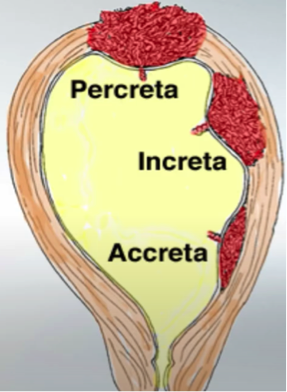
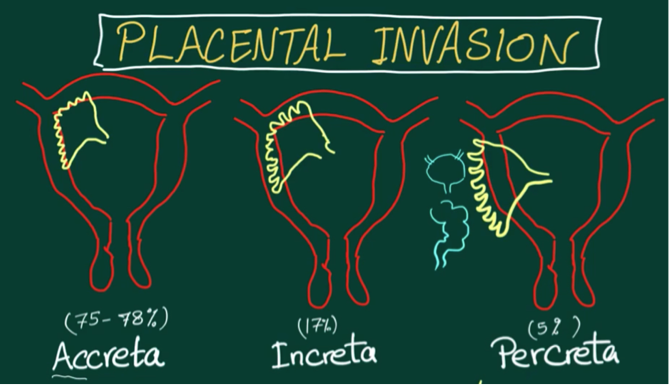
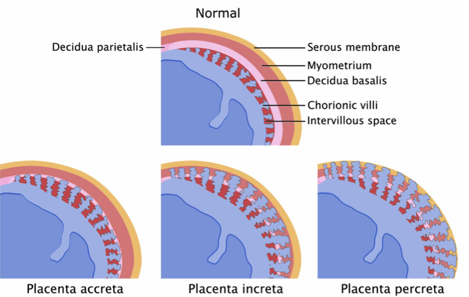

Placenta Invasions    body {font-family: 'Open Sans', sans-serif;}

### Placenta Invasions

Also known as abnormally invasive placenta (AIP).  
AIP consist of the placenta accreta spectrum (placenta accreta, increta, and percreta)  
  
_Retained placental membranes and tissues are responsible for 5% to 10% of postpartum hemorrhages and the leading cause of obstetric hysterectomies.  
_  
**Three types of placental invasion:**  
**1) Placenta accreta:** (63-80%)  
The mildest form  
The placental chorionic villi attach deeply into the uterine wall (myometrium rather than the decidua).  
**Note:** The placental villi DO NOT penetrate the myometrium (uterine muscle).  
**_Accreta starts with the letter A, so it Attaches._**  
  
**2) Placenta Increta:** (15%)  
The placental chorionic villi invades or infiltrates the myometrium of the maternal uterus.  
**_Increta starts with the letter I, so it Invades/Infiltrates._**  
  
**3)** **Placenta Percreta:** (5%)  
The placental chorionic villi perforate (penetrate) myometrium or beyond the serosa or adjacent organs such as the bladder.**  
_Percreta starts with the letter P, so it penetrates._**  
  
****  
  
****  
  
****  
  
****  
  
**For references, refer to:**  
Placenta accreta references  
Placenta increta references  
Placenta percreta references