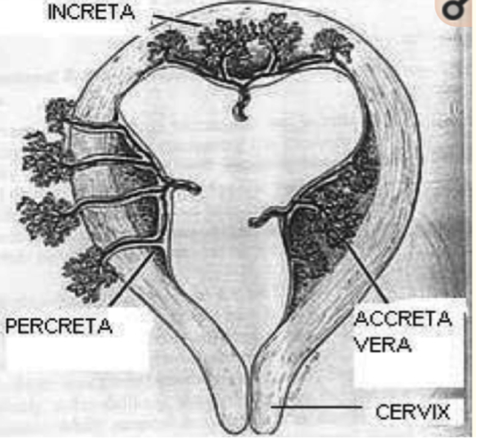
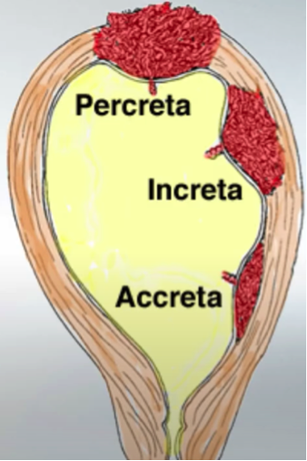

Placenta Percreta    body {font-family: 'Open Sans', sans-serif;}

### Placenta Percreta

Placenta percreta is part of the placenta accreta spectrum (placenta accreta, increta, and percreta)  
Also known as abnormally invasive placenta (AIP).  
Placenta percreta is the severest form of placental invasion.  
  
In placenta percreta, the placental villi penetrate the tissue through the myometrium of the uterus and serosa, with the possible involvement of other organs (usually the bladder).  
Because of its propensity for severe hemorrhage, it is a potentially life-threatening condition.  
_It is the leading cause of obstetric hysterectomy and can cause poor to disastrous maternal outcomes.  
  
_It requires a multidisciplinary approach for management.  
  
****  
  
****  
  
**Diagnosis:  
**Commonly discovered at the time of delivery.  
Antenatal diagnosis may be achieved with:  
Ultrasound  
MRI  
Cystoscopy  
**  
Management of placenta percreta:  
**Management depends on the facility and the obstetric provider.  
It can be managed using cesarean hysterectomy (with no future fertility)  
  
**Conservative management:** Preserve the placenta, (thus preserving future fertility)  
**  
Management of placenta percreta with bladder invasion:  
**Placenta percreta with bladder invasion may require partial cystectomy.  
A urogynecologist, urologist, or gynecologic oncologist should be consulted when the bladder is involved.  
Cystoscopy or intentional cystotomy during surgery is often helpful for assessing the degree of bladder, and possible ureteral, involvement.  
Every attempt should be made to minimize potential for blood loss by avoiding removal of the placenta at the time of delivery and either performing a hysterectomy or using methotrexate therapy to ablate the residual placenta in the postpartum period.  
  
If hemorrhage does occur during delivery, immediate surgical removal of the uterus should be considered, and depending on the severity of the hemorrhage and the depth of invasion of the placenta into the bladder, excision and/or reconstruction of the bladder may be necessary.  
  
_Currently, arterial embolization in women with postpartum hemorrhage due to AIP is the best evidence-based therapeutic option._**  
Interventional radiology is preferred for postpartum hemorrhage**  
**Uterine artery embolization:  
**Refer to “Postpartum Hemorrhage and Interventional Radiology” for details ontranscatheter arterial embolization (TAE) for postpartum hemorrhage.  
Uterine artery embolization uses a percutaneous approach, using specific agents to occlude the uterine arteries and other arteries present in the complex vascularization of the uterus.  
**Goals of arterial embolization in postpartum hemorrhage due to AIP:**  
Stop the distal bleeding and avoid surgical morbidity.  
Induce thrombosis of the intervillous space  
Reduce the risk of further bleeding  
Improve the speed of placental resorption when conservative management is performed Preserve fertility and potential further pregnancies by avoiding uterine necrosis.  
  
**Uterine artery embolization for postpartum hemorrhage due to AIP is challenging.  
The challenges are:  
**The patients is usually unstable and hemorrhaging.  
Angiographic findings are often unusual, resulting in a more complex and longer procedure.  
Arterial embolization may fail or require repeated procedures in AIP.  
**Why AIP complicates uterine artery embolization:  
**The angiographic findings in women with AIP are greatly variable  
A full pelvic angiogram is needed because it is crucial to understand the vascularization of the remaining placenta and because the vascularization is often complex.  
AIP presents complications because there are many feeding vessels contributing to placental vascularization.  
  
Some of these vessels supply blood to organs that are sensitive to ischemia such as the bladder or the gastrointestinal tract.  
  
Uterine arteries are always involved in the placental vascularization; however, other arteries such as ovarian, pudendal, obturator, sacral, and inferior epigastric arteries can also participate to the uteroplacental vasculature.  
  
**Prophylactic balloon catheter placement in the iliac arteries:**  
The insertion of balloon catheters in the iliac arteries consists of placing one inflatable balloon catheter in each iliac artery in women with AIP before cesarean section under fluoroscopic guidance.  
The balloons are then inflated after the fetus has been delivered to control hemorrhage.  
This approach in women with AIP remains controversial.  
Several studies reported no benefit from the use of prophylactic balloon catheters in the internal iliac arteries with EBL up to 16,000 mL.  
  
**Prophylactic balloon catheter placement in the abdominal aorta:**  
The use of prophylactic balloon occlusion in the abdominal aorta in the management of women with AIP produces encouraging results.  
The balloon is positioned by an interventional radiologist prior to cesarean section and inflated after delivery of the fetus.  
More trials are needed to validate the safety and efficacy of occlusion balloons and prophylactic procedures.  
  

The role of interventional radiology in the management of abnormally invasive placenta: a systematic review of current evidences  
Quantitative Imaging in Medicine and Surgery. 2020 June; 10(6) 1370-1391Philippe Soyer, Maxime Barat, Romaric Loffroy, Matthias Barral Raphael Dautry,Vincent Vidal, Olivier Pellerin, Francois Cornelis, Maureen P. Kohi, and Anthony Dohan  
  
Placenta Accreta Diagnosis and Management Expert Consensus Panel FIGO consensus guidelines on placenta accreta spectrum disorders: conservative management.  
_International Journal_ of Gynecology & _Obstetrics_ 2018;140:291-8.  
Sentilhes L, Kayem G, Chandraharan E, Palacios-Jaraquemada J, Jauniaux E, FIGO  
  
Placenta Percata With Invasion into Urinary Bladder  
Urology Case Reports Vol. 2, Issue 1, Jan 2014; pp 31-32  
Zachary L.SmithShailen S.SehgalKeith N.Van ArsdalenIrwin S.Goldstein  
  
Perioperative endovascular internal iliac artery occlusion balloon placement in management of placenta accreta.  
American Journal of Roentgenology 2007;189:1158-63  
Tan CH, Tay KH, Sheah K, Kwek K, Wong K, Tan HK, Tan BS.  
  
Uterine artery embolization for emergent management of postpartum hemorrhage associated with placenta accreta.  
_**Acta Radiologica**_ 2011;52:638-42.  
Jung HN, Shin SW, Choi SJ, Cho SK, Park KB, Park HS, Kang M, Choo SW, Do YS, Choo IW.  
  
Transcatheter arterial embolization for postpartum hemorrhage: indications, technique, results, and complications.  
**CardioVascular** and Interventional **Radiology** 2015;38:1068-81.  
Soyer P, Dohan A, Dautry R, Guerrache Y, Ricbourg A, Gayat E, Boudiaf M, Sirol M, Ledref O.  
  
Predictive factors for failure of pelvic arterial embolization for postpartum hemorrhage.  
_**International Journal**_ of Gynecology & _**Obstetrics**_ 2012;117:119-23.  
Poujade O, Zappa M, Letendre I, Ceccaldi PF, Vilgrain V, Luton D.