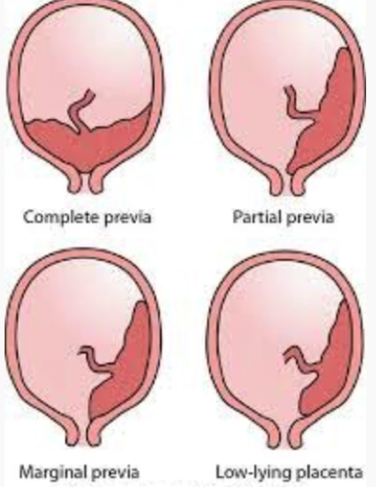

Placenta Previa    body {font-family: 'Open Sans', sans-serif;}

### Placenta Previa

Previa means first, thus placenta first.  
  
Implantation of the placenta takes place in the lower uterus instead of the upper.  
It may lie low or cover the internal cervical os totally or partially.  
_If placenta previa occurs during early pregnancy, it usually resolves by 28 weeks as the uterus enlarges._  
  
****  
  
**Four grades of placenta previa**  
**Low lying placenta previa (Type 1):** The placenta is in the lower part of the uterus but does not reach the internal os of the cervix.  
**Marginal placenta previa (Type 2):** The edge of the placenta reaches the margin of the internal os of the cervix but does not cover it.  
It is more dangerous if the placenta is implanted at the posterior or back wall of the uterus.  
**Partial placenta previa (Type 3):** The placenta partially covers the internal os of the cervix.  
**Complete placenta previa (Type 4):** The placenta lies over the internal os of the cervix, completely covering it.  
  
**Statistics and facts:  
**Occurs in around 1 out if every 200 pregnancies  
Recurrence rate in patients with prior placenta previa is 4–8%  
  
**Onset:** After 20 gestation  
The earlier the detection, the less likelihood that it will persist at the time of delivery.  
1/3 present before 30 weeks, 1/3 between 30 and 36 weeks, and 1/3 after 36 weeks  
1–6% of pregnancies have sonographic evidence of previa between 10 and 20 weeks of gestation.  
Extension over the cervical os is the best predictor that placenta previa will be present at term.  
  
**Risk factors for placenta previa:  
Multiparity:** Risk increases with every successive pregnancy.  
Twin pregnancy increases the surface area of the placenta requiring more space for implantation.**Age:** Incidence increases with age; it is 2% in women over the age of 40.  
**Previous placenta previa  
Previous cesarian section:** The incidence of placenta previa increases with the number of caesarian sections.  
**No previous c-section:** 1.9%  
**One previous c-section:** 15.6%  
**Two pervious c-sections:** 23.5%  
**Three previous c-sections:** 29.4%  
**Four previous c-sections:** 33.3%  
**Five previous c-sections:** 50%  
_American Journal of Obstetrics and Gynecology, Sept 2005 issue_  
  
**Prior uterine surgery (endometrial damage):**  
Multiple D&Cs, myomectomy (fibroid removal), abortion and miscarriage can scar certain parts of the uterus that increase the risks of placenta previa.  
  
**Smoking/cocaine:  
**The blood vessels of the uterus become constricted, resulting in placental hypoperfusion.  
The placenta implants over a wider area of the uterine wall to increase its own blood supply and may encroach on the lower part of the uterus.  
  
**Conditions possibly coexisting with placenta previa:  
**Placenta accreta (placenta invades myometrium and becomes inseparable from the uterine wall).  
Increased risk for cesarean delivery  
Preterm labor and preterm rupture of membranes|  
Malpresentation  
Intrauterine growth restriction (IUGR)  
Respiratory distress syndrome  
Anemia  
Vasa previa and velamentous umbilical cord insertion  
Congenital anomalies  
Amniotic fluid embolism  
**  
Possible presentation:  
**Painless vaginal bleeding with bright red blood occurs after 20 weeks’ gestation (usually around 32 weeks).  
  
**Bleeding varies:** Can be intermittent or continuous.  
Bleeding may be heavy, sometimes resulting in hemorrhagic shock.  
In some patients, uterine contractions accompany bleeding.  
  
_Digital cervical exam is contraindicated in any woman with bleeding until placental position has been verified.  
_  
**Diagnosis:** Transvaginal or abdominal ultrasonography.  
Sometimes not diagnosed until increased bleeding occurs during labor.  
  
**Treatment goals:  
**Plan or prevent preterm birth  
Manage maternal hemorrhage  
  
**Treatment of placenta previa:**  
Depends on the amount of bleeding and the maturity of the fetus.  
Fetal heart rate monitoring is indicated in all parturients with suspected symptomatic placenta previa.  
  
**Management of minor bleeding at less than 34 weeks’ gestation:**  
Conservative treatment, hospital admission, complete bed rest and IV steroids to enhance fetal lung maturity.  
  
**Management of minor bleeding at term:** C-section  
**Delivery is indicated for any of the following:**  
Heavy or uncontrolled bleeding  
Non-reassuring results of fetal heart monitoring  
Maternal hemodynamic instability  
  
**Possible complications:**  
**Maternal:** Related to blood loss  
**Fetal:** Hypoxia, preterm delivery  
  
**Severe or uncontrollable bleeding with immature fetus:**  
C-section  
Postpartum hemorrhage protocol  
  
**Anesthetic:**If massive maternal hemorrhage is present: Refer to “Postpartum Hemorrhage” link.  
C-section  
  

Placenta Previa  
5-Minute Clinical Consult (accessed 02/2021)  
https://im.unboundmedicine.com/medicine/view/5-Minute-Clinical-Consult/116460/all/Placenta%20Previa  
  
Placenta Previa  
Merck Manual Professional Version (accessed 02/2021)  
https://www.merckmanuals.com/professional/gynecology-and-obstetrics/abnormalities-of-pregnancy/placenta-previa?query=placenta%20previa#v1074356  
  
Placenta Previa  
Gyneonline.com (accessed 02/2021)  
https://gynaeonline.com/placenta\_previa.htm  
  
Chestnut, David H.  _Chestnut's Obstetric Anesthesia: Principles and Practice_ . Philadelphia:  
Mosby/Elsevier, 2009.   
  
Datta, Sanjay, Kodali, and Segal.  _Obstetric Anesthesia Handbook_ . New York: Springer, 2010.  
  
Macksey, Lynn Fitzgerald.  _Surgical Procedures and Anesthetic Implications: A Handbook for Nurse  
Anesthesia Practice_ . Sudbury, MA: Jones & Bartlett Learning, 2012.