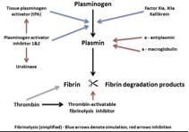

Plasminogen    body {font-family: 'Open Sans', sans-serif;}

### Plasminogen

Plasminogen has an important role in both normal and abnormal blood clotting and dissolving clots.  
  
A fibrin clot, or thrombus, is the final step of the coagulation process that seals off a damaged blood vessel, but unwanted fibrin clots can also form inside undamaged vessels, resulting in thrombosis and obstructed blood flow. Either way, when a blood clot is no longer needed, the clot must be dissolved in order for normal blood flow to resume following tissue repair.  
The dissolution of the clot occurs through the action of _plasmin_  
  
**Plasminogen must be converted to plasmin for fibrinolysis  
  
There are two main plasminogen activators:**  
Tissue plasminogen activator (tPA)  
Urokinase (uPA)  

****

  
Tissue plasminogen activator (tPA) is released by endothelial cells in damaged blood vessels.  
tPA is a serine protease and catalyzes the conversion of plasminogen into plasmin-clot busting.  
  
The conversion of plasminogen to plasmin involves the cleavage of the peptide bond between Arg-561 and Val-562. Plasmin then hydrolyzes the peptide bonds of fibrin leading to clot breakdown (fibrinolysis).  
  
**Plasmin** functions in the fibrinolytic mechanism to dissolve blood clots, whether formed normally in cases of injury or abnormally in cases of thrombosis.  
  
Plasmin levels must be carefully regulated; increased levels of plasmin may result in excessive bleeding and decreased levels of plasmin may result in thrombosis.  
  
A decreased plasminogen level may interfere with the body’s ability to dissolve clots and thus also result in thrombosis.  
  
_**Primary fibrinolysis**_ refers to the normal breakdown of clots.  
  
**_Secondary fibrinolysis_** is the breakdown of blood clots due to a medical disorder or other cause. This may result to dangerous bleeding.  
  
Plasmin also degrades many blood plasma proteins, including fibrin clots.  
  
Because a leading cause of heart attack or stroke is thrombosis, clinical treatments focus on increasing plasmin activation.  
  
Tissue plasminogen activators are used to treat medical conditions related to blood clotting including embolic or thrombotic stroke, myocardial infarction, and pulmonary embolism.  

DeMers G, Meurer WJ, Shih R, Rosenbaum S, Vilke GM (December 2012). "Tissue plasminogen activator and stroke: review of the literature for the clinician". _J Emerg Med_ . **43** (6): 1149–54  
  
Plasminogen: The Clot Buster  
Cedarburg SMART Team: Daniel Greinke, Jessica Knap, Michelle Sella, Elissa Hornick, Kelsey Jeletz,  
Kirsten Loberg and Sara Panighetti  
http://cbm.msoe.edu/images/contentImages/smartTeams/alumni/2008-09/Cedarburg.pdf