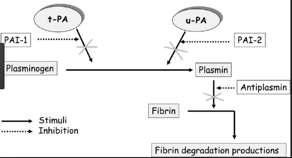

Plasminogen Activator Inhibitors 1-2    body {font-family: 'Open Sans', sans-serif;}

#### Plasminogen Activator Inhibitors 1 & 2  
_Prevents fibrinolysis and may increase thrombosis._

****

  
Exist as 1 and 2 (PAI-1 and PAI-2).  
PAI-1 rapidly inhibits tissue plasminogen activator (tPA).  
PAI-2 inhibits urokinase (u-PA).  
They both prevent the conversion of plasminogen to plasmin preventing clot breakdown.  
  
Plasminogen activator inhibitors are the main physiological inhibitors of the fibrinolytic enzyme plasmin (inactivates plasmin) on the fibrin clot or in the circulation by forming plasmin-anti-plasmin complexes.  
Plasmin is an important enzyme that participates in fibrinolysis and degradation of various other proteins.  
  
_Some literature states that PAI-1 inhibits both tissue plasminogen activator (_ _tPA) and urokinase (u-PA) in normal human plasma, preventing fibribrinolysis._

****

  
**Plasminogen Activator Inhibitor I (PAI-1)**  
PAI-1 is synthesized by:  
Hepatocytes  
Endothelial cells  
Megakaryocytes  
Adipocytes  
  
PAI-1is present in platelets and plasma; can bind to fibrin and INHIBIT plasminogen activators tPA and uPA.  
A serine protease inhibitor (serpin).  
  
PAI-1 is an acute phase reactant protein, and may increase 30- 50-fold over baseline, possibly immediately inactivating systemically administered tPA.  
  
In healthy individuals, highly variable plasma levels of PAI-1 have been observed.  
  
**PAI-1 levels are significantly increased in patients with coronary artery disease.**  
  
Impairment of fibrinolytic activity in blood has been claimed to contribute to the development of CAD and MI due to an increased thrombosis.  
PAI-1 levels are shown to be elevated in several thromboembolic disease states.  
PAI-1 occur in different structure forms.  
PAI-1 was significantly higher in patients dying within a week after onset of septic shock than in survivors.  
  
Thus, in patients with septic shock, PAI-1 appears to be a strong predictor of mortality. This early marker may help the clinician in identifying a subgroup of patients particularly at risk.  
  
**Produced:** By liver  
Circulates in plasma at ~70 μg/ml.  

SERPINF2 serpin family F member 2 - _Homo sapiens_ (human)  
Gene ID: 5345, updated on 10-Jul-2017  
  
Natural heterogeneity of α2-antiplasmin: functional and clinical consequences.  
Abdul S, Leebeek FW, Rijken DC, Uitte de Willige S.  
Blood. 2016 Feb 4;127(5):538-45.  
  
Sattar, Husain. _Fundamentals of Pathology_ . Pathoma LLC, 2011, p. 36.  
  
 Aoki N, Suni Y, Miura O, Hirosawa S; Human α 2 Plasmin Inhibitor; Methods in Enzymology, 223, pp 185-197, 1993.  
Shieh BH, Travis J; The Reactive Site of Human α2-Plasmin Inhibitor ; JBC 262, pp 6055-6059, 1987.Moroi M, Aoki N; Isolation and Characterization of α 2 \-Plasmin Inhibitor from Human Plasma; JBC 251, pp 5956-5965, 1976.  
  
Harpel PC; Blood Proteolytic Enzyme Inhibitors: Their Role in Modulating Blood Coagulation and Fibrinolytic Enzyme Pathways; in Hemostasis and Thrombosis, eds. RW Colman, J Hirsh, VJ Marder and EW Salzman, pp. 738-747, J.B. Lippincott Co., Philadelphia PA, USA, 1982.  
  
Textbook of Coronary Thrombosis and Thrombolysis; 2008  
by R. C. Becker  
  
Plasminogen activator inhibitor in the blood of patients with coronary artery disease  
_Br Med J (Clin Res Ed)_ 1985; 291.  
  
Plasminogen activator inhibitor 1: a new prognostic marker in septic shock.  
Pralong G , Calandra T , Glauser MP , Schellekens J , Verhoef J , Bachmann F , Kruithof EK  
Thrombosis and Haemostasis \[01 Jun 1989, 61(3):459-462\]