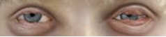

Plasminogen Deficiency    body {font-family: 'Open Sans', sans-serif;}

### Plasminogen Deficiency

**Quick Note:** Affected individuals DO NOT appear to have an increased incidence of arterial or venous thromboembolic disease.  
  
**Common symptoms  
**Fibrin rich pseudomembranes- lesions are commonly described as ligneous membranes that may impair normal tissue and organ function.  
  
Ophthalmologic lesions (ligneous conjunctivitis) are the most common.

****

  
One study reported bilateral involvement in 65% of patients.  
One-third of patients have corneal involvement, with a resultant potential for loss of vision.  
Although most patients present at a young age (median onset ~1 year), there are numerous reports of lesions that do not develop until adulthood.  
  
**Ligneous gingivitis (periodontitis):** The second most common manifestation is within the oral cavity, with 34-43% of patients expressing lesions.  
  
**Similar lesions** are noted to affect the gingiva, ear, respiratory tract, and female genitourinary tract.  
  
Congenital occlusive hydrocephalus has been reported to occur in up to 14% of patients.  
Type I plasminogen deficiency (homozygous): there were no reported cases of venous thrombosis.  
Type II plasminogen deficiency from Japan: there was no increase in the incidence of venous thrombosis.  
  
**Laboratory Evaluation  
**In patients with lesions suspected to be ligneous, a plasminogen antigen and activity level should be obtained.  
  
**Plasminogen activity:** normal range of 70-130%.  
  
**Antigenic testing** is commonly performed via immunologic assays 6-25mg/dl.  
By the age of 1 year, the plasminogen levels have reached a stable level, and do not vary with age.  
  
**Treatment is** targeted to inhibit either inflammation or fibrin generation.  
  
**Treatment Modalities  
**Topical plasminogen eye drops.  
Systemic plasminogen.  
FFP.  
Heparin/corticosteroids.  
Argatraban.  
Warfarin.  
Oral contraceptives.  

Schuster V, Seregard S. Ligneous conjunctivitis. Survey of Ophthalmology 2003;48:369-88  
  
Aoki N, Moroi M, Sakata Y, Yoshida N, Matsuda M. Abnormal plasminogen. A hereditary molecular abnormality found in a patient with recurrent thrombosis. J Clin Invest 1978;61:1186-95.  
  
Castellino FJ, Ploplis VA. Structure and function of the plasminogen/plasmin system. Thromb Haemost 2005;93:647-54.  
  
Mehta R, Shapiro AD. Plasminogen deficiency. Haemophilia 2008;14:1261-8.  
  
Rare Coagulation Disorders-Resource Room  
Plasminogen Deficiency -Disease Overview  
Rakesh Mehta, MD and Amy D. Shapiro, MD  
http://www.rarecoagulationdisorders.org/diseases/plasminogen-deficiency/disease-overview