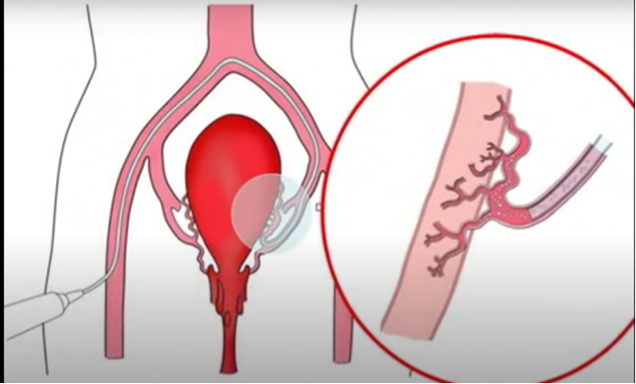

Postpartum Hemorrhage (PPH) and Interventional Radiology (IR)    body {font-family: 'Open Sans', sans-serif;}

### Postpartum Hemorrhage (PPH) and Interventional Radiology (IR)

**Anesthesia and surgical concerns:  
**Procedures to treat PPH are emergent.  
Patients are intubated, actively bleeding, and receiving blood products during transport from the L&D area to the IR suite.  
Once the patient arrives in IR and is connected to an anesthesia machine, two anesthesia providers are usually required to continue the massive transfusion protocol.  
  
During this interval, DIC may be present or evolving.  
Due to the limited space and inconvenient IR room ergonomics, anesthesia management may be more difficult. It is advisable to conduct drills to prepare for this event.  
Continue the massive transfusion protocol, maintaining hemodynamics until the hemostasis is achieved.  
  
**Conservative management consists of:**  
Vaginal packing  
Uterine massage  
IV uterotonic medications such as oxytocin or methylergonovine  
Uterine balloon  
Curettage of retained placenta  
Postpartum hemorrhage protocol requiring blood product transfusions  
  
In the past, when conventional therapy failed, a hysterectomy was performed to resolve the bleeding.  
It is now recommended that the patient be immediately transported to the hospital’s IR department for a transcatheter arterial embolization (TAE) procedure to quickly identify and stop the hemorrhage._The advantages of TAE lie in pointing out a bleeding site easily, reducing re-bleeding from collaterals as more distal occlusion of bleeding vessels is carried out._  
  
TAE in patients with PPH is safe and has little or no major short- or long-term side effects.  
A patient managed with TAE can expect return of normal menses, preservation of future fertility and successful pregnancies.  
PPH after cesarean section may require embolization with metallic coils in addition to sterile compressed sponge (Gelfoam®) in order to achieve secure hemostasis.

****

While in IR and prior to the TAE, the interventional radiologist may first perform a rapid prophylactic balloon catheter occlusion at the level of the common iliac arteries to decrease blood flow to the uterus and maintain hemodynamic stability during the TAE.  
  
**Transcatheter arterial embolization (TAE)** **for PPH:  
Goal of TAE:** Embolization of uterine and/or internal iliac arteries in the management of PPH.  
Bilateral uterine artery embolization must usually be performed.  
  
**The most frequently bleeding source in PPH** consists of collaterals to uterus, uterine, vaginal and internal pudendal arteries, which manifest as a pseudoaneurysm or contrast extravasation in angiography of the pelvic floor vasculature.  
  
TAE is a minimally invasive technique consisting of the insertion of a catheter into the artery that leads to the bleeding vessels (as shown by extravasation) followed by embolization.  
When the bleeding uterine vessel is identified, either Gelfoam® or coils is injected to block the blood flow, thus stopping the bleed.  
  
Gelatin sponge particles are the primary embolic material used in PPH embolization; however, metallic coils are also frequently used for active bleeding.  
  
A rapid aortogram is performed to demonstrate the effectiveness of the procedure.  
The interventional radiologist pays attention to collaterals from ovarian arteries during these embolization procedures because they may be the source of delayed bleeding.  
  
The patient leaves the angiographic suite with the sheath sutured in place in case there is a need for a second embolization session.  
  
The patient is then transported to the ICU for observation.  
Many of these patients are assessed for DIC and other coagulopathies as part of a massive transfusion protocol.  
  
**Possible complications** are contrast-induced, puncture- and embolization-related.  
**These include:**  
Foot ischemia  
Bladder necrosis  
Rectal wall necrosis  
Nerve injury  
Uterine necrosis  
These complications are caused by non-targeted vessel embolization.  
  

Interventional Management of Postpartum Hemorrhage (accessed 02/2021)  
Hicham T. Abada, Jafar Golzarian, and Shiliang Sun  
http://eknygos.lsmuni.lt/springer/472/107-118.pdf  
  
Massive postpartum hemorrhage treated with transcatheter arterial embolization: technical aspects and long-term effects on fertility and menstrual cycle  
Acta Radiologica 2007 Jul;48(6):635-42.  
L-G Eriksson, A Mulic-Lutvica, L Jangland, R Nyman  
  
Transcatheter Arterial Embolization in Postpartum Hemorrhage: A Case Report  
Research and  _**Practice**_  in  _**Anesthesiology.**_ 2019; 4(1): 14-17  
Chhabra A, Bhiwal A, Pandey N, Barath S, Gupta S. _Res Pract Anesthesiol Open J_ . 2019; 4(1): 14-17