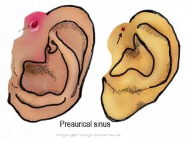

Preauricular Sinus   

### Preauricular Sinus

  
_JoVanna Eisenbarth MS, CRNA, Mason General Hospital, Shelton, WA_

**Short summary of Anesthetic Plan**

Preauricular sinuses are the result of a congenital malformation, creating a sinus located in front of the pinna. These sinuses can be simple, but can also be complex with multiple branches. They could be unilateral or bilateral, and the patient could be completely asymptomatic or the sinus can produce a discharge or infection. I would expect the patient to be free from active infection before I would proceed with the anesthesia and surgery and the patient may be on some prophylactic antibiotics.

The surgeon will often use a probe to help identify the sinus. Some resources say they could inject methylene blue, although I’ve not seen this done. It is very important for the surgeon to extract the whole of the sinus and any underlying cyst, or else recurrence is even more common than the normal. Surgeons may choose to use facial nerve monitoring, especially as dissection becomes more complex.

These surgeries could be scheduled for a child or adult of any age, but they are most often performed on kids in their mid to late childhood.

**Indications for Procedure:** Occasionally the patient may suffer from repeated infections of this sinus, but in other cases it is performed for cosmetic and quality of life reasons

**Preoperative Evaluation and Questions:** Perform a standard preop, not expecting any associated difficulties. However, be mindful of the frequency and severity of previous infections to the sinus (as a gauge for difficulty of procedure).

**Pre-op room set up-and what to prepare:** As always, I wouldn’t recommend putting any child to sleep without emergency drugs at the ready, including Atropine, Succs, Lidocaine and a stick of Propofol. Remember to have all appropriate drug doses at the tip of your tongue/brain and at hand, especially the smaller/younger your patient is (i.e., don’t have a 20ml stick of propofol for a 20kg kid).

**Possible Airway issues?** No issues anticipated related to the surgical pathology. Remember the standard positioning for a child with a shoulder roll appropriate for their age/size.

**Anesthetic:** General/ETT or LMA

**Induction:**  
A standard mask inhalation induction with endotracheal intubation is often indicated. Although there isn’t a need for muscle paralysis, I lean towards an ETT and away from an LMA due to positioning. Consider an oral rae.

Initiate induction with 70/30 Nitrous to Oxygen. After a few spontaneous breaths by the patient, and hopefully with a little stunned look in the eyes, slowly advance your Sevofluorane up to an ET of around 5% while maintaining spontaneous ventilation (turn dial on to 0.5, allow a few breaths, turn up a percent and allow a few breaths, etc). At this point the Nitrous can come off, the O2 should be increased, and high Sevo ET maintained until after PIV established. At this point, take over ventilations and consider administering a little Fentanyl and possibly Propofol to smooth intubation.

**Intraoperative Goals and Events:  
**Your job in this case is to provide the surgeon with a hospitable patient for them to complete the surgery. They need time and they need a non-moving patient.

**Nitrous:** I’m not a big fan of nitrous other than for induction. I think there are so many other great multimodal options out there and if I can do anything to reduce the incidence of post-op nausea (and possibly delayed discharge), I’m a fan.

**Muscle Relaxation:** Avoid relaxation. It should not be necessary and could be detrimental to surgical identification of nerves.

**IV Access:** A small or regular bore IV is indicated, usually a 22g. You are not expecting fluid shifts or blood loss.

**Position:**  
The bed is often rotated 180-degrees for surgeon preference. Anticipate bed position and make sure you’ve got your circuit extension ready before the case. You will also need a head donut for head positioning.

**Age Range:** Usually 5-10 years.

**Hydration:** Again, you are not expecting to need to give a lot of fluid. Replace the deficit and estimate a minimally invasive insensible fluid loss of 0-2cc/kg/hr. Use the 4:2:1 rule to dictate your replacement. LR is commonly the fluid of choice. Should you encounter hypotension, a 10-20ml/kg bolus can be given.  
**(below is just a common reference)**

Albumin dose for mild hypotension: 10cc/kg is recommended (<10kg wt)  
Albumin-more effective with its oncotic pull than crystalloids (<10kg wt)  
Crystalloid Bolus dose for mild hypotension: 5-10cc/kg (<10kg wt)  
Crystalloid Bolus dose for mild hypotension: 20cc/kg (>10kg wt)  
Crystalloid Bolus (emergency) for severe hypotension (20-50cc)

**Replacement of Insensible Fluid Loss (reference):**  
Minimally invasive (inguinal, laparoscopic) 0-2 cc/kg/hr  
Mildly invasive (ureteral reimplantation) 2-4 cc/kg/hr  
Moderately invasive (simple bowel cases) 4-8 cc/kg/hr  
Significantly invasive (NEC) >10 cc/kg/hr  
**3rd Spacing:** 10mL/kg/h is standard for 3rd space fluid loss  
with an open belly case.

**EBV (reference)  
Premature:** 90-100cc/kg**Newborn:** 80-90cc/kg**3mo-1 year:** 70-80cc/kg**1-4 years:** 70cc/kg  
**Adult:** 55-60cc/kg

**Duration:** As is often the case, the duration of surgery is directly correlated to the complexity of the sinus, as well as surgeon speed and skill. Discussion with the surgeon pre-op as to what they are expecting intra-op can be useful, but they too may be surprised by the sinus. I usually estimate 1-2 hours door-to-door for many surgeries.  
  

**EBL:** Minimal

**Extubation Criteria:** When not contraindicated (difficult tube placement, comorbitities, etc), deep extubation is great for kids. However some would argue that awake extubation is safer.For an awake extubation, extubation criteria include crying (must be visualized, cannot be heard when ETT in place), eyes opening, and grasping for the tube.

**Transport:** Recovery room for immediate postop with extubation of discharge home.

**Post-Operative Concerns  
**Standard post op concerns. This is a pretty easy age group for anesthetics, and as we are not anticipating any associated diseases or syndromes this is usually a pretty cut and dry anesthetic and recovery.

It is unlikely that you will have any airway compromise secondary to surgery but abnormal facial swelling could indicate bleeding.

**Quick Basic Drug References  
****Propofol:** 2.5-3.5mg/kg IV  
**Succinylcholine:** <1 year: 3.0mg/kg  
\>1 year: 1.0-2.0mg/kg  
IM: 4-6mg/kg  
**Rocuronium:** <1 year: 0.25-0.5mg/kg  
1 year: 0.5-1.2mg/kg  
\>1 year: 0.5-1.3mg/kg  
**Vecuronium:** <1 year :0.05-0.1mg/kg  
\>1 year: 0.1mg/kg  
**Neostigmine:** 0.05-0.07mg/kg  
**Robinul:** 0.01mg/kg  
**Fentanyl:** 1-2mcg/kg  
**Morphine:** 0.05-0.15 mg/kg/dose IV q2-4h prn**Ofirmev:** \>2 years: 15mg/kg  
**Not FDA approved for < 2 years, but many still administer at 15mg/kg  
Toradol:** \>2 years: 0.5mg/kg  
**Precedex** (Emergence)**:** Slow push 0.5mcg/kg  
**Zofran:** 100mcg/kg (max 4mg)  
**Decadron:** 0.2-0.5mg/kg  
**Ancef:** 25mg/kg Q6h  
**Ampicillin:** 25-100mg/kg (max per day 100-400mg/kg)  
**Gentamycin:** 2-2.5 mg/kg/dose q8h (Max dose 80 mg)  
**Ceftriaxone (rocephin):** 50-75mg/kg  
**Clindamycin (cleocin):** 15-25mg/kg  
**Invanz** (ertapenem): (3 month -12 years): 15mg/kg  
**Vancomycin:** 10mg/kg slow IV

Spitz, Lewis and Coran, Arnold; Operative Pediatric Surgery, 7th ed; 2013.