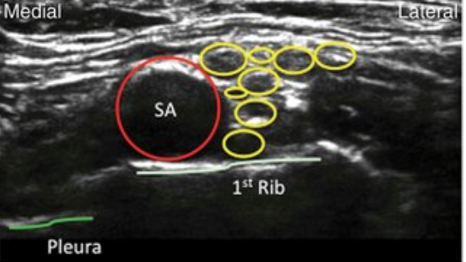
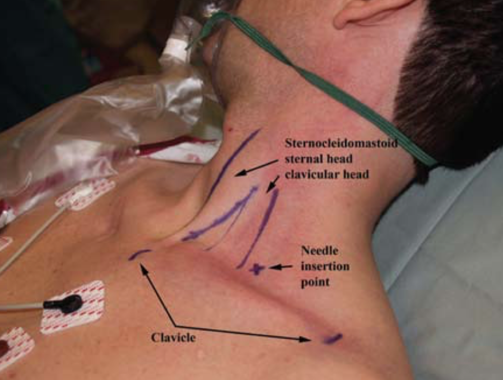
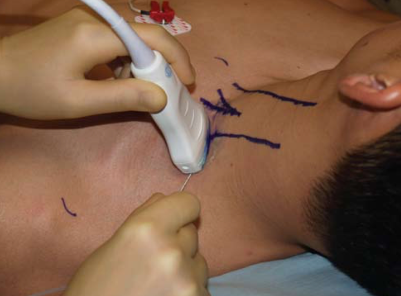

Supraclavicular Nerve Block    body {font-family: 'Open Sans', sans-serif;}

### Supraclavicular Nerve Block

Also known as the “spinal of the arm.”

  
\- The supraclavicular block provides anesthesia and analgesia to the upper extremity below the shoulder (mid-humerus down to the hand).  
\- It is an excellent choice for elbow, forearm, and hand surgery.  
\- It covers the entire upper extremity from the level of the mid-humerus down to the hand.  
\- It is one of several block procedures used to anesthetize the brachial plexus.  
\- It has a lower incidence of phrenic nerve blockade and Horner’s syndrome than the interscalene block (largely dependent on volume injected).  
**Advantage of the supraclavicular block:** The nerves are tightly packed and shallow, providing easy access.  
**  
The medial aspect of the upper arm may need a local injection.  
**\- The image above and below demonstrates the upper arm's medial area that is not blocked covered because the intercostobrachial nerve that innervates the skin to that area is not blocked with this procedure.  
\- The intercostobrachial nerve is not part of the brachial plexus.  
\- To block this nerve, perform a 10 mL subcutaneous injection with the local anesthetic along the medial aspect of the upper arm.  
\- This extra injection is obviously not required for hand and forearm procedures.

****

**Nerve distribution with local anesthetic:** Divisions of the superior, middle, and inferior trunks of brachial plexus  
**Motor or sensory block:** Both  
**Sympathetic innervation block:** Yes  
**Onset:** Rapid  
  
**Surgical indications:**  
Arm  
Elbow  
Forearm (AV graft procedure)  
Hand surgery  
  
**This peripheral nerve block is not optimal for shoulder surgery.  
**The supraclavicular nerve, which provides sensory innervation to the superior shoulder, may not be reliably blocked.  
However, the suprascapular nerve can be blocked with this procedure, but it only supplies 70% of the shoulder.  
A rescue intermediate cervical plexus block must also be performed for shoulder surgery to block the supraclavicular nerve.  
  
**Using the ultrasound:  
**The ultrasound is utilized to identify the brachial plexus, guide the needle into the plexus sheath and evaluate the spread of local anesthetic while visually observing other vital structures.  
  
**Ultrasound anatomy:  
**

****

  
The image below is from the patient’s left side, as the brachial plexus is always lateral to the subclavian artery with this view.

****

**Brachial plexus anatomy:  
Refer to:** “Interscalene Nerve Block (ISNB) Brachial Plexus Anatomy.”**Position:** Supine with the arm placed by their side with their head turned away from the arm to be blocked.

****

**US probe position:  
**\- Place the probe in the supraclavicular fossa (midpoint)  
\- Tilt the transducer inferior.  
\- Identify the subclavian artery, which usually passes under the clavicle at its midpoint.  
\- The nerves usually appear superior and lateral to the artery enclosed in a sheath.  
\- You are too medial if you see the carotid artery and the IJ.  
\- **Use the color Doppler to differentiate vascular structures to avoid the possible neighboring arteries (anatomy varies):**  
\- Subclavian artery  
\- Dorsal scapular artery (often cross the brachial plexus at this level)  
\- Suprascapular artery (can be in the vicinity)  
\- Transverse cervical artery (can be in the vicinity)  
  
**Needle insertion:** From lateral to medial  
\- Shallow insertion of the needle and ALWAYS stay above the first rib and pleura to decrease the risk of pneumothorax.  
\- Due to the close proximity of the brachial plexus to the lung at the supraclavicular level,  
\- NEVER advance the needle tip unless it is within view of the ultrasound image.

****

  
**Equipment:  
**\- Standard ASA monitors (3-5 lead EKG, NIBP, and pulse oximetry)\- Nasal cannula-oxygen**\- Sedation:** Midazolam and/or fentanyl  
**\- US Probe:** High frequency (5-12 MHz), linear, and gel  
**\- Needle:** 25 G, 3.8 cm needle for local anesthesia  
\- 22 G, 5 cm insulated simulating needle, if desired sterile gown, gloves, cap, mask  
\- 2% chlorhexidine skin preps  
\- Local anesthetic (usually Ropivacaine or Bupivacaine)  
\- Lipid emulsion and resuscitation equipment must be available.  
  
**Note:** To decrease the likelihood of inadvertent pleural puncture causing a pneumothorax, a small 5 cm blocking needle is commonly used.  
**Popular optional local anesthetics:  
**0.5 % Ropivacaine is preferred due to less cardiac effects, but sometimes not available due to costs.  
0.5 % Bupivacaine is usually the 2 nd choice  
1.5 % Mepivacaine  
  
**Volume of local anesthetic:  
**\- Twenty to 30 mLs of local anesthetic is common  
\- Volume depends on the patient’s ideal body weight  
\- Inject small aliquots (5 mLs) and observe the local anesthetic spread  
  
**Onset:** 5-20 minutes  
  
**Duration:**  
12-16 hours, sometimes 16-20 hours (with an adjuvant like dexmedetomidine)  
**Supraclavicular Nerve Block- Continuous Infusion:** Rare  
**Note:** A continuous infusion is fairly rare with this block because it is difficult for the catheter to cover all areas.Refer to “ **Supraclavicular Nerve Block- Continuous Infusion”  
**  
**Dexmedetomidine (Precedex) as an adjuvant and neuroprotector:  
**Adding 20-30 mcg to the local anesthetic is common.  
**Absolute contraindications:** (as with other regional blocks)  
Patient refusal  
Inflammation or infection over the injection site.  
Allergy to local anesthetics  
Contralateral phrenic nerve dysfunction  
Severe chronic obstructive pulmonary disease  
Lack of skilled assistance  
Lack of resuscitation equipment, including 20% lipid emulsion (Intralipid).  
  
**Possible complications/side effects associated with the supraclavicular block:  
Pneumothorax** (rare when using ultrasound)  
Remember that the apex of the lung is just medial and posterior to the brachial plexus and below the first rib.  
Signs and symptoms of a large pneumothorax include sudden cough and shortness of breath.  
If the needle tip is maintained above the first rib and pleura level, the risk of pneumothorax is decreased.  
However, anatomy varies as the copula of the lungs may come up over the first rib.  
**  
Diaphragmatic hemiparesis:**  
This block's occurrence rate is 50-60 % because the phrenic nerve (C3-C5) lies close to the brachial plexus.  
Patients who cannot tolerate reduced pulmonary function should not receive this block.  
Even healthy patients may need reassurance that their feeling of dyspnea is transient.  
  
**Hematoma:  
**Avoid multiple needle insertions and apply firm pressure after removing the needle. Consider risk/benefit in coagulopathic patients.  
  
**Nerve injury:** It is always a possibility with nerve blocks.  
Stop when a "pop" is felt entering the nerve sheath.  
Do not inject if high pressure is felt.  
Do not inject if the patient experiences pain.  
Readjust the needle if any of the above occurs.  
Inject slowly and avoid high pressures while injecting.  
  
**Local anesthetic toxicity:**  
To prevent this, aspirate every 3–5 mLs.  
  
**Phrenic nerve palsy -** lower incident compared to the interscalene block.  
**Horner syndrome** \- lower incident compared to the interscalene block.  
**Infection**  
**Hoarseness  
Subclavian artery puncture  
Block failure  
****Epidural or subarachnoid injection  
Allergic reaction to local anesthetic  
Neuropathy  
  
Absolute contraindications:** (as with other regional blocks)  
Patient refusal  
Inflammation or infection over the injection site.  
Allergy to local anesthetics  
Contralateral phrenic nerve dysfunction  
Severe chronic obstructive pulmonary disease  
Lack of skilled assistance  
Lack of resuscitation equipment, including 20% lipid emulsion (Intralipid).  
Malignancy at the needle entry site  
  
**Billing/CPT Code:**  
**Single injection:** 64415  
**Continuous infusion:** 64416  
  

Ultrasound-Guided Supraclavicular Brachial Plexus Nerve Block  
NYSORA (accessed 03/2023)Thomas F. Bendtsen, Ana M. Lopez, and Catherine Vandepitte  
https://tinyurl.com/4hy3amxu  
  
Supraclavicular Nerve Block  
Medscape (accessed 03/2023)  
Alma N Juels, MD  
https://emedicine.medscape.com/article/2000865-overview  
  
Supraclavicular Block  
dvcipm.org (accessed 03/2023)  
https://www.dvcipm.org/site/assets/files/1083/chapt8.pdf  
  
Supraclavicular Block  
USRA (Ultrasound Guided Regional Anesthesia) accessed 03/2023  
https://tinyurl.com/4w943wt7  
  
Ultrasound-Guided Supraclavicular Brachial Plexus Block  
WFSA (World Federation of Societies of Anesthesiologists) accessed 03/2023  
Sandeep Kusre 1 , Andrew McEwen 2 , Geena Matthew 3  
https://tinyurl.com/2tvf5ybw  
  
Supraclavicular Block  
StatPearls (accessed 03/2023)  
Ryan S. D'Souza; Rebecca L. Johnson.  
https://www.ncbi.nlm.nih.gov/books/NBK519056/  
Effects of Intraneural Injection of Dexmedetomidine in Combination With Ropivacaine in Rat Sciatic Nerve Block  
Regional Anesthesia and Acute Pain 2018:43: 378-384  
Bum-soo Kim, MD, PhD,\* Joon-hyuk Choi, MD, PhD,† Suk-hwan Baek, MD, PhD,‡ and Deok-hee Lee, MD, PhD