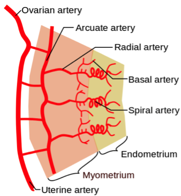

Preeclampsia    body {font-family: 'Open Sans', sans-serif;}

### Preeclampsia

**Preeclampsia is defined as the new onset of hypertension and proteinuria after 20 weeks of gestation.**  
However, the absence of proteinuria does not preclude diagnosis of preeclampsia.  
The definition is often controversial with regard to proteinuria.  
  
_Preeclampsia with a seizure is considered eclampsia.  
_  
**Preeclampsia results from:  
**Failure of remodeling maternal spiral arteries  
Hypoperfused placental releasing compounds resulting in vascular endothelial dysfunction.If the hypertension becomes severe (as in severe preeclampsia) it may result in serious fetal and maternal complications.  
_The fetal/neonatal burden of preeclampsia results from placental hypoperfusion and the frequent need for preterm delivery.  
_  
Early management is very important in preventing mild preeclampsia from progressing to severe preeclampsia and/or HELPP syndrome.  
Unfortunately, severe preeclampsia accounts for approximately 25% of all cases of preeclampsia.  
  
**Preeclampsia is one of the hypertensive pregnancy disorders listed below:  
**Gestational hypertension  
Preeclampsia  
Eclampsia (Preeclampsia + seizure)  
HELLP Syndrome  
Postpartum hypertension  
**Gestational hypertension vs** **preeclampsia:** Gestational hypertension is hypertension without proteinuria.  
One fourth of women with gestational hypertension develop proteinuria and thus progress to preeclampsia.  
  
**Associated conditions:  
**Abruptio placentae  
Placental insufficiency  
Intrauterine growth restriction  
Preterm delivery  
Fetal demise  
Maternal seizures (eclampsia)  
Maternal pulmonary edema  
Maternal liver/kidney failure  
Maternal death  
  
**Statistics and facts regarding preeclampsia:  
**Occurs in 5–8% of all pregnancies.  
Preeclamptic parturients > 40 years of age have a 4 times higher risk for seizures than parturients in their twenties.If preeclampsia occurs after 20 weeks’ gestation and up to 6 weeks gestation.  
10-20% of women with severe preeclampsia develop HELLP syndrome.  
It is almost always cured within days to weeks after delivery of the placenta.  
Patient who are preeclamptic are 6 times LESS likely to develop HYPOtension as compared to a healthy non-preeclamptic patient.  
Women who develop preeclampsia are also at increased risk of developing cardiovascular disease later in life.  
  
**Risk factors for preeclampsia:  
**Primiparous (first pregnancy) 3:1  
Age older than 40 years (3:1)  
Black race (1.5:1)  
Family history (5:1)  
In vitro fertilization: 2.5:1  
Chronic renal disease (20:1)  
Chronic hypertension (10:1)  
Antiphospholipid syndrome (10:1)  
Diabetes mellitus (2:1)  
Twin gestation unaffected by zygosity) (4:1)  
High body mass index (3:1)  
Homozygosity for angiotensinogen gene T235 (20:1)  
Heterozygosity for angiotensinogen gene T235 (4:1)  
  
**Parturients who present with new-onset hypertension should have the following tests:  
**CBC  
LFTs (ALT and AST)  
BMP- Serum creatinine  
Coags (PT/PTT)  
Uric acid  
24-hour urine collection for protein and creatinine (criterion standard) or urine dipstick analysis  
  
**Labs to rule out HELLP syndrome  
**Peripheral blood smear  
Serum lactate dehydrogenase (LDH) level  
Indirect bilirubin  
**Note:** Serum amylase and lipase (increased with acute fatty liver pregnancy)  
  
**CT scan of the head to assess** **intracranial hemorrhage when** **there are:**  
Sudden severe headaches  
Focal neurologic deficits  
Seizures with a prolonged postictal state  
Atypical presentation for eclampsia  
  
**Diagnosis of preeclampsia:  
American College of Obstetricians and Gynecologists (ACOG) diagnostic criteria for  
preeclampsia:  
**Systolic blood pressure ≥140 mmHg or diastolic blood pressure ≥90 mmHg on at least 2 occasions at least 4 hours apart.It must occur after 20 weeks of gestation in a previously normotensive patient AND  
**the new onset of 1 or more of the following:** table.tableizer-table { font-size: 12px; border: 1px solid #CCC; font-family: Arial, Helvetica, sans-serif; } .tableizer-table td { padding: 4px; margin: 3px; border: 1px solid #CCC; } .tableizer-table th { background-color: #104E8B; color: #FFF; font-weight: bold; }

|  |
| --- |
| Proteinuria ≥0.3 g in a 24-hour urine specimen or  
Protein/creatinine ratio ≥0.3 (mg/mg) (30 mg/mmol) in a random urine specimen or  
Urine dipstick ≥2+ if a quantitative measurement is unavailable |
| Platelet count <100,000/microL |
| Serum creatinine >1.1 mg/dL or doubling of the creatinine concentration without renal disease. |
| Increases in ALT and AST (liver transaminases) at least twice the upper limit of the normal lab concentrations |
| New-onset and persistent headache not responding to usual doses of analgesics |
| Pulmonary edema |
| Visual symptoms (e.g., blurred vision, flashing lights or sparks, scotomata) |

Adapted from the ACOG _Practice Bulletin No. 222: Gestational Hypertension and Preeclampsia. Obstetric Gynecology 2020; 135:e237._  
  
**A way to predict preeclampsia:** sFlt-1/PIGF (placental growth factor) ratio**sFLT-1 ratio < 38** : Rule-out preeclampsia for a week  
**sFLT-1 ratio** **≥ 38:** Rule: Rule-in. (Positive predictive power is lower than negative).  
  
**EARLY positive and negative predictor (gestational week 20-33)** table.tableizer-table { font-size: 12px; border: 1px solid #CCC; font-family: Arial, Helvetica, sans-serif; } .tableizer-table td { padding: 4px; margin: 3px; border: 1px solid #CCC; } .tableizer-table th { background-color: #104E8B; color: #FFF; font-weight: bold; }

|  |   |   |
| --- | --- | --- |
| sFlt-1/PIGF  
≥ 85 | Diagnosis | 99.5% specificity the woman has preeclampsia. |
| sFlt-1/PIGF  
< 85  
≥ 38 | Prediction  
rule-in next 4 weeks. | 38.6% PPV the woman is at  
high risk to develop preeclampsia within 4 weeks. |
| sFlt-1/PIGF  
< 38 | Prediction  
rule-out for the next 1 week. | 99.1% NPV the woman will  
NOT develop preeclampsia for the next 1 week. |

PPV- positive predictive values  
NPV-negative predictive values  
**Late-onset preeclampsia (gestational week 34 to end of pregnancy)** table.tableizer-table { font-size: 12px; border: 1px solid #CCC; font-family: Arial, Helvetica, sans-serif; } .tableizer-table td { padding: 4px; margin: 3px; border: 1px solid #CCC; } .tableizer-table th { background-color: #104E8B; color: #FFF; font-weight: bold; }

|  |   |   |
| --- | --- | --- |
| sFlt-1/PIGF  
≥ 110 | Diagnosis | 99.5% specificity the woman has preeclampsia |
| sFlt-1/PIGF  
< 110  
≥ 38 | Prediction  
rule-in within next 4 weeks. | 38.6% PPV the woman is at  
high risk to develop preeclampsia within 4 weeks. |
| sFlt-1/PIGF  
< 38 | Prediction rule-out  
for the next 1 week | 99.1% NPV the woman will  
NOT develop preeclampsia for the next 1 week. |

**Possible clinical presentation of MILD preeclampsia:** May be insidious  
Some women may be asymptomatic at the time of diagnosis.  
Systolic BP > is 140 systolic or 90 diastolicPregnancy > 20 weeks  
Mild proteinuria; 0.3g of protein is collected in a 24-hour urine sample or persistent 1+ protein measurement on urine dipstick.  
Some are unaware until diagnosed.  
**Possible clinical presentation of SEVERE preeclampsia:  
Increases in ALT and AST** (liver transaminases) at least twice the upper limit of the normal lab concentrations.  
**Upper quadrant or epigastric pain:** Severe and persistent, that does not respond to medication and cannot be accounted for by alternative diagnoses.  
**Thrombocytopenia** (platelets <100,000/μL)  
**Proteinuria** \> 5g of in a 24-hour sample  
**Renal failureCNS signs:** Severe headache, blurry vision, altered mental status  
**Blindness:** May be cortical or retinal  
**Severe fetal growth restriction**  
**Signs of liver problems** (nausea and/or vomiting with abdominal pain)  
**Signs of respiratory problems** (pulmonary edema, bluish tint of the skin)  
**Hypertension:** Systolic BP > 160 mmHg and diastolic or diastolic BP > 110 mmHg  
**Oliguria** < 500 mL of urine in 24 hours  
**CVA  
****Weakness or malaise:** May be evidence of hemolytic anemia  
**Clonus:** May indicate an increased risk of convulsions  
DIC  
  
**Pathophysiology of preeclampsia is twofold:  
**1) An abnormal development of the terminal branches of the uterine artery (spiral arteries) that supply blood to the developing fetus/placenta results in placental hypoperfusion, ischemia and variables of fetal hypoxia.  
  
2) The relative placental hypoperfusion causes the release of antiangiogenic factors into the maternal circulation resulting in maternal hypertension.  
**  
The released antiangiogenic factors affect the following maternal systems:**  
Hematologic  
Neurologic  
Pulmonary  
Renal  
Hepatic  
Optic  
  
**Etiology:** The trigger for abnormal placental development and the subsequent cascade of events is not fully understood  
  
**Fetal cells (trophoblasts) migrate through the implantation site of the uterus and invade the decidua tunica media of maternal spiral arteries for remodeling.  
**During a healthy pregnancy, different types of fetal cells called trophoblasts take on different roles in the placenta, interacting with maternal cells.  
Some of these cells will help alter the mother’s immune system to tolerate a foreign being growing inside her uterus.  
Other trophoblasts migrate through the implantation site of the uterus.  
and invade decidua tunica media of maternal spiral arteries and replace its endothelium in a process called remodeling and enlarging the blood vessels (also called pseudovascularization).  
**The spiral arteries:  
**The spiral arteries are the terminal arterioles of the ovarian and uterine artery.They are remodeled for uteroplacental blood flow during pregnancy, involving the loss of smooth muscle & elastic lamina from the tunica media.

****

**Remodeling of the spiral artery:**  
As a result of the remodeling of the maternal spiral arteries, they undergo transformation from small, muscular arterioles to large capacitance, low-resistance vessels.  
Remodeling results in a 5- 10-fold dilation at the mouth of the vessel.  
This allows increased blood flow to the maternal-fetal interface.  
The remodeling probably begins in the first trimester and ends by 18-20 weeks' gestation.  
  
**Trophoblasts and molecule expression with remodeling:**  
Invading trophoblasts alter their adhesion molecule expression from those that are characteristic of epithelial cells: (integrins alpha 6/beta 1, alpha V/beta 5, E-cadherin) to those of endothelial cells (integrins alpha 1/beta 1, alpha V/beta 3, and VE-cadherin).  
As a result of these changes, the maternal spiral arteries undergo transformation.  
  
**Failure of remodeling the spiral** **arteries in preeclampsia:  
**The upregulation of matrix metalloproteinase-9 (MMP-9) and HLA-G, 2 molecules noted in normally invading trophoblasts, DOES NOT occur.  
They are found to be present with normal remodeling.  
This leaves the tunica media intact  
They become fibrous causing vessel narrowing  
Leaves the arterioles the capability to vasoconstrict  
_The above results in a hypoperfused placenta resulting in intrauterine growth restriction (IGR) and pre-eclampsia._  
  
**The hypoperfused placenta releases proinflammatory proteins.  
**The placenta releases proinflammatory proteins into the parturient’s circulation.  
  
**These proteins will cause the endothelial cells that line the wall of maternal vessels to become dysfunctional and cause hypertension by:  
**Vasoconstriction  
Causing kidneys to retain salt  
  
The **proinflammatory proteins** may also cause local vasospasms of local vessels throughout the body **affecting** organs, especially the kidneys.  
  
When the hypertension becomes severe hemorrhagic stroke and placental abruption may result.  
  
**Endothelial function is based on a balance between angiogenesis and antiangiogenesis compounds:**  
The VEGF family is responsible for angiogenesis and proper function of endothelial function.  
  
**The VEGF family** **consists of:  
**VEGFR-1  
VEGFR -2  
VEGFR-3  
PIGF  
VEGF (-A)  
VEGF (-B)  
VEGF (-C)  
VEGF (-D)  
**One of the antiangiogenesis compounds (placental factor):  
**Soluble Flt-1 (sFlt-1) antagonizes vascular endothelial growth factor (VEGF) and PIGF  
In preeclampsia there is an excess of Flt-1Flt-1 binds circulating VEGF and PIGF and prevents their interaction with endothelial cell-surface receptors.**  
  
Endothelial dysfunction results in:  
**Decreased prostacyclin  
Decreased nitric oxide productionRelease of procoagulant proteins**Peripheral vasospasms may result in:  
**Abruption  
Seizures  
Oliguria  
Liver ischemia  
Hypertension**  
  
Capillary leaks result in:  
**Edema  
Proteinuria  
Hemoconcentration  
  
**Activation of coagulation:**  
Thrombocytopenia**  
  
Proteinuria:**  
Decreased blood flow to the kidneys may result in glomerulonephritis, proteinuria, and oliguria.  
Proteinuria can be a sign of glomerular damage.  
  
**Effect on vision:**  
**Decreased blood flow to the retinal may result in:  
**Blurred vision  
Flashing lights  
Scotoma (blurry spot within the visual field)  
  
**Effects om the liver:**  
Reduced blood flow to the liver can cause severe liver injury and swelling.  
  
**Liver injury may cause:**  
Elevated liver enzymes  
Liver capsule stretching resulting in right upper quadrant pain (epigastric).  
  
**Thrombocytopenia:  
**Endothelial cell injury leads to the formation of a large number of tiny thrombi in the microvasculature.  
This process uses up a massive number of platelets, resulting in thrombocytopenia.  
**Hemolysis:  
**The massive number of small thrombi within the microvasculature damages RBCs as they are pass through the narrowed vasculature, resulting in hemolysis.  
  
Together these make up the HELLP syndrome.  
**H:** Hemolysis  
**E** : Elevated  
**L:** Liver enzymes**L:** Low**P:** PlateletsHELLP syndrome occurs in 10-20% of women with severe preeclampsia.  
  
**Generalized edema:**The proinflammatory proteins released from the hypoperfused placenta also causes endothelial damage that increases the permeability to water.  
Due to the decreased hydrostatic pressure owing to the loss of sodium and the increased permeability of the vessels, water is drawn from the intravascular space into the interstitial space, resulting in edema.  
Hemoconcentration may result in falsely elevated hematocrit.  
  
**Edema is often located in the:**  
Face  
Hands  
Legs  
Lungs: Pulmonary edema with cough and SOB.Brain: Cerebral edema, causing headaches, confusion and **seizures.**  
  
**Management of non-severe preeclampsia:**  
Outpatient care  
Daily home BP monitoring  
Daily weight  
Weekly labs (CBC, creatinine, liver function test \[LFT\])  
**  
Fetal:  
**Patient-measured: daily “kick counts”  
NST/BPP/US images  
Delivery at 37 weeks (induction of labor)  
Steroids for gestation <37 weeks  
**Management of SEVERE Preeclampsia:** (similar to HELLP syndrome treatment)**  
Once confirmed with labs:  
Stabilize condition:  
**Fetal assessment: fetal heart tomes  
IV access  
Foley to monitor I & O  
  
**Management for SEVERE Preeclampsia (similar to HELLP treatment):  
Seizure prophylaxis:**  
MgSO 4 continuous infusion of 4 to 5 grams administered over 5 minutes, followed by 1 gram per hour for 24 hours.  
Further boluses of magnesium may be given for recurrent convulsions, with the amount given based on the neurologic examination and patellar reflexes.  
**Contraindications:** Myasthenia gravis, renal failure, pulmonary edema  
**Mg serum levels of 4 to 7 mEq/L are considered therapeutic, but monitor clinical status:  
**Patellar reflexes are present.  
Respirations are not depressed.  
Urine output is ≥25 mL/hr.  
MgSO 4 may be given safely, even in the presence of renal insufficiency  
Fluid therapy  
Ringer lactated solution with 5% dextrose at 60 to 120 mL/hr, with careful attention to fluid volume status  
Calcium gluconate or chloride (1 g, administered slowly IV) may reverse magnesium-induced respiratory depression  
  
**Severe preeclampsia:**  
Severe preeclampsia may become HELLP syndrome.  
Fibrin degradation products and d-dimer, markers of subclinical DIC, have been used to help predict which patients with preeclampsia are at higher risk of developing the HELLP syndrome.  
_(Padden, MO, HELLP Syndrome, recognition and perinatal management, American Family Physician, 60(3):829-36, 839).  
_  
**Medications:**  
**Antihypertensives** (hydralazine or labetalol)  
**BP goal:** 130-140 mmHg systolic and 90-100 mmHg diastolic)  
**Seizure prophylaxis:** Magnesium sulfate  
**Liver/platelet counts:** Dexamethasone  
Dexamethasone is protective of the liver and also matures the fetal lungs  
  
**Periodically recheck CBC and LFTP:  
**If there is a worsening of LFTs, obtain abdominal CT to look for subscapular hematoma.  
**Antihypertensive meds:  
**Most of these patients are being treated for hypertension.  
Intracranial hemorrhage is better prevented by controlling systolic hypertension than by controlling diastolic pressure.  
Be cautious with **beta blockers** because they will affect the fetus/newborn’s heart rate.  
  
**Treatment of preeclampsia:  
**Since all the problems arise from the hyperfused placenta, the ultimate treatment to deliver the fetus and placenta.**  
  
Decision of inducing delivery depends on:  
**Gestational age of the fetus  
Severity of disease  
  
**Delivery:  
**If the parturient becomes unstable, consider an emergency c-section.  
_Delivery is the only cure for HELLP syndrome.  
_Surgical and anesthesia teams must be made aware of patient coagulation status.  
  
**If parturient is ≥ 34 weeks and stable:** Administer dexamethasone and deliver after 24-48 hours.  
**If parturient is < 34 weeks and stable:** Administer dexamethasone and evaluate for delivery. Delay delivery as long as safely possible to allow fetal lung maturation.  
**  
Preeclampsia anesthesia and surgical concerns:  
**A multidisciplinary approach is needed for effective, safe perioperativemanagement.  
C-Section is preferred if platelets are > 75k.  
If platelet count and PT/PTT are normal, spinal is safe.  
Anesthesia and obstetric providers should consider whether to discontinue an existing MgSO 4 infusion.  
  
**Monitor closely for:  
**Hemorrhagic complications  
DICEclampsia  
  
**Preoperative risks increased by preeclampsia:  
**High maternal and fetal morbidity and mortality.  
Has an increased rate of cesarian sections.  
Increased risk of intraoperative hemorrhage.  
  
**Pre-op labs:** (similar to HELLP)CBC with smear  
PT/PTTFibrinogen  
LFTs  
BMP  
TEG is an option.  
Consider ABG if an arterial line is used.  
  
**Airway assessment:** Assess for airway edema (dyspnea or voice change)  
**Assess for acute renal failure:** Oliguria  
Consider a central line and CVP monitoring if oliguria is present (rare).  
**Spinal and C-section:  
**If general anesthesia is required, diminish the hemodynamic consequences of direct laryngoscopy.  
This decreases the risk of intracranial hemorrhage.  
Moderate thrombocytopenia is present and not progressively worsening, c-section under spinal anesthesia is the preferable approach.  
  
**Serious complications associated with severe preeclampsia:**  
Abruptio placentaeAcute renal failure  
Subscapular liver hematoma (rare)  
ARDS  
Cerebral hemorrhage  
DIC  
Eclampsia  
Postpartum hemorrhage  
Pulmonary edema  
Retinal detachment  
Hepatic rupture  
**  
Postpartum consults:  
**Hematology for platelet count  
Nephrology for assessment of renal function.  
General surgery if subcapsular hematoma is present  
  
Dexamethasone is usually administered postpartum.**  
  
Prognosis:**  
**Severe preeclampsia and fetal outcome:  
**Maternal and fetal complications are more severe in severe preeclampsia than in mild preeclampsia.  
  
If a baby weighs at least 2 pounds (over 1000 grams) at birth, he or she has the same survival rate and health outcome of a nonpreeclamptic baby of the same size.  
Babies under 2 pounds at delivery don't do well.  
These babies will need longer hospital stays and have more frequent need for ventilator care.  
Most of the fetal deaths are attributed to abruption of the placenta, placental failure with intrauterine asphyxia and extreme prematurity.  
  
**Maternal mortality** ranges from 1%-3%, with a perinatal mortality rate of 35%.  
**Infant morbidity and mortality:** 10-60%  
  

Preeclampsia and Eclampsia (Toxemia of Pregnancy)  
5-Minute Clinical Consult (accessed 02/2021)  
https://im.unboundmedicine.com/medicine/view/5-Minute-Clinical-Consult/1688029/all/Preeclampsia%20and%20Eclampsia%20(Toxemia%20of%20Pregnancy)  
  
Chestnut, David.(2014) Chestnut’s Obstetric Anesthesia Principles and Practice. Ch. 2.  
  
Santos, Alan., Epstein, Jonathan.,(2015) Chaudhuri, Kallol Obstetric Anesthesia ; 2015.  
  
Wong C; Analgesia and anesthesia for labor and delivery. Gynecology and Obstetrics 2004. CD-ROM. Chapter 90,  
Vol. 3.  
  
American College of Obstetricians and Gynecologist  
Hypertension and pregnancy  
ACOG Technical Bulletin No 219  
Washington DC: 1968  
  
Placenta previa: Foundation  
AMBOSS (accessed 02/2021)  
https://www.osmosis.org/learn/Placenta\_previa:\_Foundations  
Preeclampsia & eclampsia: Foundations  
Osmosis.org (accessed 02/2021)  
https://www.osmosis.org/learn/Preeclampsia\_&\_eclampsia:\_Foundations  
  
Preeclampsia  
Medscape (accessed 02/2021)  
Kee-Hak Lim, MD; Chief Editor: Ronald M Ramus, MD  
https://emedicine.medscape.com/article/1476919-overview  
  
Pathogenesis of Pre-clampsia  
Slideshare (accessed 02/2021)  
https://www.slideshare.net/drsujnanendra/pathogenesis-of-pre-eclampsia