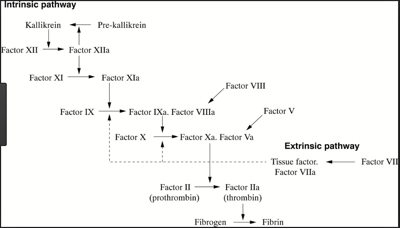

Prekallikrein    body {font-family: 'Open Sans', sans-serif;}

### Prekallikrein

Prekallikrein is clotting protein that activates the early phase of the intrinsic pathway and the complement system.  
Prekallikrein is activated to form kallikrein by factor XII cleavage of a bond homologous to the corresponding bond cleaved during factor XI activation.  

****

  
**Kaolin is added for the PTT Test**  
With the PTT testing, kaolin and Ca are added to the plasma to start the intrinsic pathway of the coagulation cascade. Kaolin serves to activate the contact-dependent Factor XII.  
If there is no activation, PTT results are prolonged.  
This can be corrected by the reconstitution of purified prekallikrein.  
  
PK is the precursor of plasma kallikrein, which activates kinins.  
PK is cleaved to produce kallikrein by activated Factor XII.  
Prekallikrein is homologous to factor XI.  
However, unlike factor XI, prekallikrein does not form dimers.  
  
**Some Facts**  
When decreased, PK and HMWK may prolong PTT but not PT.  
It is a precursor of plasma kallikrein, which activates kinins.  
Kinins are cofactors in coagulation.  
PK is cleaved to produce kallikrein by activated Factor XII (Hageman factor).  
It activates factor XII and prekallikrein; cleaves HMWK.  
A severe deficiency has shown to cause severe mucosal bleeding.  

Hooley E, McEwan PA, Emsley J (Dec 2007). "Molecular modeling of the prekallikrein structure provides insights into high-molecular-weight kininogen binding and zymogen activation". _Journal of Thrombosis and Haemostasis_ . (12): 2461–6.  
  
J Clin Invest. 1974 Feb; 53(2): 622–633.  
  
Fletcher factor deficiency. A diminished rate of Hageman factor activation caused by absence of prekallikrein with abnormalities of coagulation, fibrinolysis, chemotactic activity, and kinin generation.  
A S Weiss, J I Gallin, and A P Kaplan