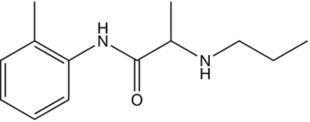

Prilocaine    body {font-family: 'Open Sans', sans-serif;}

### Prilocaine

**Prilocaine (Citanest, Prilocanium)**  
Amide-type local anesthetic  
**pKa:** 7.9  
  
**Nonionized:** 24% at pH 7.40 (76% ionized)  
  
**Relative Potency (CNS toxicity):** 1.2 out of 4  
  
Mostly used in dental for infiltration.  
Lidocaine and Prilocaine are mixed to create EMLA.  
Has a similar clinical profile to lidocaine and its use for infiltration, peripheral nerve blocks and spinal and epidural anesthesia is similar.  
Higher doses may result in methemoglobinemia-major deterrent.  
Has a high clearance with the lowest systemic toxicity rate of all the amide local anesthetics.  
Potentially useful for IV regional anesthesia.  
  
**Possible drug interactions:** Effects may be increased when the patient is on dapsone (anti-mycobacterial agent).  
  
**Prilocaine**

table.tableizer-table { font-size: 12px; border: 1px solid #CCC; font-family: Arial, Helvetica, sans-serif; } .tableizer-table td { padding: 4px; margin: 3px; border: 1px solid #CCC; } .tableizer-table th { background-color: #104E8B; color: #FFF; font-weight: bold; }

| Route | Conc | Onset | Duration | Max Doses |
| --- | --- | --- | --- | --- |
| Infiltration | 0.5-2% | Fast | 1-2 hours | Plain: 6 mg/kg, never more than 600 mg  
with epi: 9 mg/kg, never more than 600 mg |
| Epidural | 1-3% | Fast | 1-3 hours | 600 mg (200-300 mg is average dose range) |
| Spinal | N/A | N/A | N/A | N/A |
| Peripheral Block | 1.5-2% | Fast | 1.5-3 hours | 600 mg |
| Topical | 2-4% |   |   | 3 mg/kg |

Pocket Anesthesia ; 3 rd ed. 2017. Pp 2D-22. R. Urman, J. Ehrenfeld

  
Epinephrine does not significantly affect the peak plasma levels of prilocaine or bupivacaine.  
  
**Adult Prilocaine Doses**

table.tableizer-table { font-size: 12px; border: 1px solid #CCC; font-family: Arial, Helvetica, sans-serif; } .tableizer-table td { padding: 4px; margin: 3px; border: 1px solid #CCC; } .tableizer-table th { background-color: #104E8B; color: #FFF; font-weight: bold; }

| Procedure | Conc | Doses |
| --- | --- | --- |
| Infiltration | 0\. 5-2 % | 0.5-6mg/kg |
| Peripheral nerve block | 0\. 5-2 % | 0.5-6mg/kg |
| Epidural | 1-3 % | 200-300 mg |
| Topical | 2-4% | 0.6-3mg/kg |

Pocket Anesthesia ; 3 rd ed. 2017. Pp 2D-22. R. Urman, J. Ehrenfeld  
_Nurse Anesthesia ;_ 5 th ed. 2014. pp 684. J. Nagelhout, Sass Elisha, Karen Plaus

  
  

****

**Methemoglobinemia and prilocaine**  
Higher doses of > 500-600 mg or (8mg/kg) may result in methemoglobinemia but does not have significant consequences in healthy patients.  
Treat methemoglobinemia with 1-2mg/kg of methylene blue over 5 minutes.  
The risk of methemoglobinemia limits FDA approval for wider use.  
An effect of metabolism of the aromatic ring to o-toluidine increases its propensity to cause methemoglobinemia.  
  
**Symptoms of methemoglobinemia  
**Patient exhibits a cyanotic appearance that does not respond to the administration of 100% oxygen.  
When methemoglobin levels are low, cyanosis can become apparent, but symptoms of nausea, sedation, seizures, and even coma may result when levels are very high (Wilburn-Goo, 1999).  
The clinical sign of cyanosis is observed as blood concentrations of methemoglobin reach 10% to 20%, whereas dyspnea and tachycardia emerge as methemoglobinemia concentrations reach 35% to 40%.  
Most reports of methemoglobinemia with prilocaine and benzocaine are associated with excessive doses (Moore, 1999).  
  
**Metabolism:** Liver  
**Protein bound** : 50%  
**Renal excretion:** < 3%  
**Plasma half-life:** 1-2 hours  
  
**Contraindications:  
**Hypersensitivity  
Methemoglobinemia  
AnemiaPrilocaine is rarely used in peripheral nerve blocks.  

NYSORA: Local Anesthetics: Clinical Pharmacology and Rational Selection  
_Author: Jeff Gadsden_  
http://www.nysora.com/regional-anesthesia/foundations-of-ra/3492-local-anesthetics-clinical-pharmacology-and-rational-selection.html  
  
Drug Information center  
http://www.druginfosys.com/drug.aspx?drugcode=599&type=1**_Nurse Anesthesia_** **_;_** **5 th ed; 2014. Pp 684.  
**By John J. Nagelhout, Sass Elisha, Karen Plaus