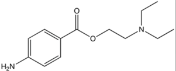

Procaine    body {font-family: 'Open Sans', sans-serif;}

### Procaine

**Procaine (Novocaine)**  
**Ester** \-type local anesthetic  
  
**pKa:** 8.9  
  
**Nonionized:** 3% at 7.40 (97% ionized)  
  
**Relative potency (CNS toxicity):** 1.4 out of 4  
Mainly used as a local anesthetic primarily in oral surgery  
Fast onset and short duration.  
Rarely used by anesthesia providers.  
  
**Possible drug interactions:** Procaine metabolite p-amino benzoic acid may transiently reduce  
sulfonamide antibiotic efficacy.  
  
Procaine is a vasodilator, thus is often co-administered with epinephrine for the purpose of vasoconstriction and prolonging the block.  
  
**Procaine**

table.tableizer-table { font-size: 12px; border: 1px solid #CCC; font-family: Arial, Helvetica, sans-serif; } .tableizer-table td { padding: 4px; margin: 3px; border: 1px solid #CCC; } .tableizer-table th { background-color: #104E8B; color: #FFF; font-weight: bold; }

| Route | Conc | Onset | Duration | Max Doses |
| --- | --- | --- | --- | --- |
| Spinal | 10% | Fast | 30-60 minutes | Plain: 7mg/kg  
With epi: 10mg/kg, never more than 1,000mg |

Pocket Anesthesia ; 3 rd ed. 2017. Pp 2D-22. R. Urman, J. Ehrenfeld

  
  
**Common Adult Procaine Doses**

table.tableizer-table { font-size: 12px; border: 1px solid #CCC; font-family: Arial, Helvetica, sans-serif; } .tableizer-table td { padding: 4px; margin: 3px; border: 1px solid #CCC; } .tableizer-table th { background-color: #104E8B; color: #FFF; font-weight: bold; }

| Procedure | Conc | Doses |
| --- | --- | --- |
| Infiltration | 0.5-2% | < 500 mg |
| Epidural | 1-2% | < 500 mg |
| Spinal | 10% with 5% glucose | 50-200 mg |

_Nurse Anesthesia ;_ 5 th ed. 2014. pp 685. J. Nagelhout, Sass Elisha, Karen Plaus

  
  
**Rarely used for spinals anymore due to:  
**Increased block failure rate  
Increased association with nausea.  

****

  
Used to be used primarily for infiltration and spinal anesthesia years ago.  
Lower incident of transient neurological symptoms (TNS) than lidocaine.  
  
**Contraindicated:  
**Patients with hypersensitivity to para-aminobenzoic acid or parabens or ester-type local anesthetics.  
  
**Mechanism of action:** Like other local anesthetics, it binds to the intracellular portion of sodium channels and, by blocking sodium influx into nerve cells, prevents depolarization.  
  
**Onset:** 2-5 minutes**Duration:** 30-60 minutes. Epinephrine will increase duration  
  
**Plasma half- life:** 7.7 min.**Metabolized:** Liver, metabolized in the plasma by the enzyme pseudocholinesterase through hydrolysis into para-aminobenzoic acid (PABA).  
(rapidly hydrolyzed by plasma cholinesterase to aminobenzoic acid and diethylaminoethanol)  
  
**Excreted:** Kidneys  
Procaine has also been shown to bind or antagonize the function of N-methyl-D-aspartate (NMDA) receptors as well as nicotinic acetylcholine receptors and the serotonin receptor-ion channel complex.  
  
Like other esters, procaine can also cause allergic reactions causing individuals to have problems with breathing, rashes, and swelling. Allergic reactions to procaine are usually not in response to procaine itself, but to its metabolite PABA.  
  
**_Allergic_** **reactions:** Characterized by cutaneous lesions of delayed onset, or urticaria, edema, and other manifestations of allergy. Anaphylactoid reactions have occurred rarely.  

Sisk AL. Vasoconstrictors in local anesthesia for dentistry. Anesth Prog. 1992;39:187–93.  
Pocket Anesthesia ; 3 rd ed. 2017. Pp 2D-22. R. Urman, J. Ehrenfeld  
  
Drugs.com  
https://www.drugs.com/pro/novocain.html