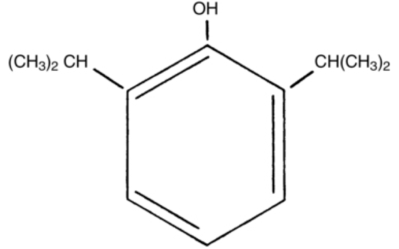
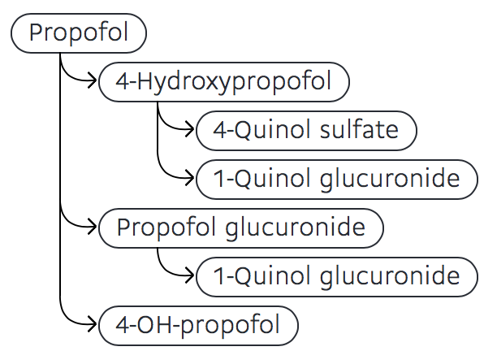

Propofol Pharmacokinetics and Chemistry    body {font-family: 'Open Sans', sans-serif; padding-left: 10px;}

### Propofol Pharmacokinetics and Chemistry

Propofol is slightly soluble in water and, thus, is formulated in a white, oil-in-water emulsion.

****

**Chemically described as** 2,6 diisopropylphenol  
**Structural formula:** C12H18O  
**Molecular weight:** 186.27  
**pKa:** 11  
**Isotonic:** Yes  
**pH:** 7 to 8.5  
**Concentration:** 10 mg/mL  
**Plasma concentrations of propofol and effects:  
2 to 6 mcg/mL:** Produces unconsciousness (depends on associated medications and the patient’s age).  
**1.0 to 1.5 mcg/mL:** Awakening typically occurs  
**The propofol formulation contains:**  
**Propofol:** Active component  
**Soybean oil:** 100mg/mL; it holds the propofol in a medium that can be stabilized and dispersed.  
**Egg lecithin:** 12 mg/mL serves as an emulsifier to stabilize the small propofol–soybean oil droplets in aqueous dispersion.  
**0.005% Disodium edetate (EDTA):** To inhibit the rate of growth of microorganisms  
for up to 12 hours in the event of accidental extrinsic contamination.  
**Sodium hydroxide:** To adjust pH.  
  
**Generic Propofol:**  
Generic propofol has sodium metabisulfite or benzyl alcohol and sodium benzoate to retard the  
growth of microorganisms in the event of accidental extrinsic contamination.  
  
**Absorption:**  
Rapid - time to onset of unconsciousness is 15-30 seconds due to rapid distribution from plasma to the CNS.  
Distribution is so rapid that peak plasma concentrations cannot be readily measured.  
  
**Anesthetic duration of a typical bolus:** 3-4 half-lives or 3-8 minutes  
**Protein binding:** 95-99% is primarily bound to albumin and erythrocytes.  
**Redistribution half-life:** 1-2 minutes  
**Distribution:** Rapidly and widely distributed  
**Protein Binding:** 95–99%  
  
**Half-life:** Propofol is bi-phasic, with its initial half-life being relatively quick, around 40 minutes.  
**Terminal half-life:** Usually being 4 to 7 hours.  
**Context-sensitive half-time:** May be up to 1 to 3 days after a 10-day infusion.  
The clinical effect of propofol is much shorter in duration.  
**Initial distribution phase:** t1/2a = 1.8-9.5 minutes  
**Second distribution phase:** t1/2B = 21-70 minutes  
**Terminal elimination phase:** t1/2y\= 1.5-31 hours  
**Volume of distribution (L/kg):** 3.5-4.5  
**Clearance (mL/kg/minute):** 25-50 mL/kg/min  
1.6-3.4 L/min (70 kg adult)  
  
**Blood-brain barrier:**  
Propofol readily crosses the blood-brain barrier (BBB) and causes rapid loss of consciousness (sometimes within the time it takes for a drug to pass through the circulation once.  
The speed of induction depends on the patient’s cardiac output and speed of infusion.  
  
**Pulmonary uptake with the initial administration of propofol.  
**Pulmonary uptake after the initial dose of propofol is significant and influences the initial availability of propofol.  
Although propofol can be transformed in the lungs to 2,6-diisopropyl-1,4-quiniol, most of the drug that undergoes pulmonary uptake during the first pass is released back into the circulation.  
  
**Metabolism of propofol:  
**The liver is the main site of propofol metabolism (60%)  
It is hepatically metabolized mainly by glucuronidation at the C1-hydroxyl. Hydroxylation of the benzene ring to 4-hydroxypropofol may also occur via CYP2B6 and 2C9 with subsequent conjugation to sulfuric and/or glucuronic acid.  
Hydroxypropofol has approximately 1/3 of the hypnotic activity of propofol.  
**  
Two main pathways for metabolism of propofol:**  
70 % is conjugated to propofol glucuronide by uridine 5′-diphosphate (UDP)  
29% is conjugated to Plucuronosyltransferase.  
  
Several different cytochrome P450 (CYP) P450 isoforms are involved in the above.  
CYP2B6  
CYP2C9  
Environmental and genetic influences on the CYP2B6 can, at least partially, explain the interindividual variability in the hydroxylation of propofol in liver microsomes.  
  
**Propofol metabolites:**  
The major metabolites have no hypnotic activity.  
Propofol metabolites are subsequently conjugated to form 4-(2,6-diisopropyl-1,4-quinol)-sulphate, 1-(2,6-diisopropyl-1,4-quinol)-glucuronide and 4-(2,6-diisopropyl-1,4-quinol)-glucuronide.

****

**Unbound plasma propofol vs. CSF:**  
Approximately 1% of total plasma propofol is unbound.  
The free fraction of propofol in the CSF is approximately 31%.  
Equilibrium between blood and brain concentrations is reached after 30 minutes, resulting in total blood to CSF propofol ratio of 0.01–0.02.  
  
**Propofol metabolism and elimination:  
**HepaticRenal  
Lungs  
  
**Hepatic:** CYP450/2B6 system  
Cytochrome P-450 isoforms 2A6, 2C19, 2D6, 2E1, 3A4, and 1A2 are also involved in the metabolism of propofol to a lesser extent.  
Only 1% is excreted unchanged.  
Hydroxylation occurs first, followed by glucuronidation.  
Glucuronidation is the major metabolic pathway for propofol.  
**  
Renal metabolism:**  
The kidneys account for up to one-third of total propofol metabolism.  
Renal dysfunction does not influence the clearance of propofol despite the observation that nearly three-fourths of propofol metabolites are eliminated in urine in the first 24 hours.  
  
**Lungs (extrahepatic metabolism):**  
Lungs are not a major site of extrahepatic metabolism of propofol in humans.  
However, pulmonary uptake of propofol is significant and influences the initial availability of propofol.  
Propofol can be transformed into 2,6-diisopropyl-1,4-quiniol; most of the drug that undergoes pulmonary uptake during the first pass is released back into the circulation.  
  
**Placenta transfer of propofol:  
**Propofol readily crosses the placenta but is rapidly cleared from the neonatal circulation.**Placenta transfer** is also fast and extensive, with venous blood concentration mother-to-fetus ratios ranging from 0.7 to 0.8; however, due to its clearance from the neonatal circulation, it has only minimal and short-lived clinical effects in unborn neonates and is thus safe for use during cesarean section.  
  
**Propofol and breast milk:**  
Propofol readily crosses the placenta and enters breast milk.  
However, oral propofol consumption results in a high first-pass effect with a high hepatic extraction rate of greater than ninety percent.  
  
The mean clearance of propofol is higher than the total liver blood flow.  
This clearly shows that metabolism is not solely occurring in the liver.**  
  
Total body clearance of propofol:**  
The total body clearance of propofol exceeds hepatic blood flow.  
This means that propofol has extrahepatic clearance (pulmonary uptake and first-pass elimination, renal excretion).  
  
**Renal clearance:** 80% of the administered dose is recovered in the urine in a metabolized state.  
Only 1% of propofol administered is excreted unchanged in the urine.  
Renal dysfunction does not influence the clearance of propofol despite the observation that nearly three-fourths of propofol metabolites are eliminated in urine in the first 24 hours.  
Central to peripheral redistribution is the primary process by which the pharmacodynamic anesthetic effect of propofol is terminated.  
  

Intravenous propofol during cesarean section: placental transfer, concentrations in breast milk, and neonatal effects. A preliminary study.   
Anesthesiology.1989;71:827–834.  
Dailland P, Cockshott ID, Lirzin JD, Jacquinot P, Jorrot JC, Devery J, et al.  
  
Disposition of propofol at caesarina section and in the postpartum period.   
British Journal J Anaesth.1991;67:49–53.   
Gin T, Yau G, Jong W, Tan P, Leung RKW, Chan K.  
Binding of propofol to blood components: implications for pharmacokinetics and for pharmacodynamics.   
British Journal of Clinical Pharmacology 1999;47:35–42.  
Mazoit JX, Samii K.  
  
Propofol  
Stoelting’s Pharmacology & Physiology in Anesthetic Practice 6 th Ed., 2022, pages 150-158  
Pamela Flood, James P. Rathmell, and Richard D. Urman  
  
Clinical Pharmacokinetics and Pharmacodynamics of Propofol  
Clinical Pharmacokinetics 2018; 57(12): 1539–1558.  
Marko M. Sahinovic, Michel M. R. F. Struys, and Anthony R. Absalom  
  
Propofol Insert (2017)  
https://www.accessdata.fda.gov/drugsatfda\_docs/label/2017/019627s066lbl.pdf  
  
Propofol  
Drug Bank (accessed 04/2020)  
https://www.drugbank.ca/drugs/DB00818  
Propofol  
PDR (accessed 04/2020)  
https://www.pdr.net/drug-summary/Diprivan-propofol-1719.3436  
  
Cytochrome P-450 2B6 is responsible for interindividual variability of propofol hydroxylation by human liver microsomes.   
Anesthesiology.2001;94:110–119.  
Court MH, Duan SX, Hesse LM, Venkatakrishnan K, Greenblatt DJ.