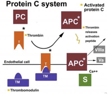

Protein C    body {font-family: 'Open Sans', sans-serif;}

### Protein C

**Also known as:** Autothrombin IIa or blood coagulation factor XIV.  
  
**In short:** Protein C exerts its anticoagulant effect by inactivating factor Va and VIIIa.  
Deficiency of Protein C may contribute to venous thrombosis.  
  
Protein C is a vitamin K-dependent glycoprotein synthesized in the liver.  
It circulates in the blood as an inactive zymogen.  
Protein C (PC) becomes activated (catalyzed) to protein C (APC) by thrombin when thrombin binds to the endothelial receptor: thrombomodulin: see below.  
  
The concentration of PC in plasma is ~4 μg/ml (~60 nM).

****

  
Activated protein C (aPC) exerts its anticoagulant activity by the inactivation of coagulation factors Va and VIIIa, which are required for factor X activation and thrombin generation.  
  
The catalytic activity of activated protein C (aPC) is greatly enhanced by the vitamin K-dependent cofactor protein S.  
  
aPC also plays an important role in regulating anticoagulation, inflammation, cell death, and maintaining the  permeability of blood vessel walls.  
  
A deficiency of activated protein C (aPC) disturbs the delicate balance between procoagulant and anticoagulant proteins and engenders a prothrombotic environment.  
  
The role of activated protein C (aPC) and other anticoagulant proteins in this balance appears to be especially important in the slow-flowing venous circulation, in which there is prolonged exposure of procoagulant proteins and platelet phospholipids to the vessel wall. This may explain, in part, why protein C deficiency appears to be associated primarily with venous thrombosis.  
  
**VTEs and Protein C and S**  
Many cases of VTEs have no clear precipitant and are defined as idiopathic VTE. A diagnostic work-up for these patients includes testing for inherited and acquired hypercoagulable conditions, usually including functional quantitative assays for proteins C and S, and antithrombin.  
  
It is commonly believed that proteins C and S levels are decreased during the initial phases of VTE, thus rendering them uninterpretable. The evidence that protein C and S levels are decreased during an acute VTE event is based on a study by D'Angelo et. al.  
However, one may still have normal proteins C and S levels in the presence of VTEs.  
  
**Inhibitor of Protein C**  
The primary inhibitor of APC activity in plasma is Protein C Inhibitor (PCI, also called Plasminogen Activator Inhibitor-3, PAI-3) and to a lesser extent by α1antitrypsin and α2macroglobulin. The inhibitory activity of PCI is stimulated approximately 10-fold by heparin.  

_Thrombosis Journal_ 2010 **8** :10  
Normal levels of protein C and protein S tested in the acute phase of a venous thromboembolic event are not falsely elevated  
Leonard Minuk, Alejandro Lazo-Langner, Judy Kovacs, Melinda Robbins, Bev Morrow and Michael Kovacs.  
  
Medscape: Protein C Deficiency  
Jul 18, 2017  
Adam Cuker, MD and Perumal Thiagarajan, MD  
http://emedicine.medscape.com/article/205470-overview?pa=HC%2FMNK%2FsmO83cx9iEFVfsjaUqd7OdiGIwP4qgDL0mbjc7NtlV2kOLLyKeW2aMxDTsdPj7FrE9sOIFXhHxNTUVA8xoioRp5Ityzv4cB5dHxs%3D#a5  
  
J Biol Chem. 1980 June 25. 255(12):5521-4.  
Walker FJ. Regulation of activation protein C by a new protein. A possible function for bovine protein S.  
  
D'Angelo A, Vigano-D'Angelo S, Esmon CT, Comp PC: Acquired deficiencies of protein S. Protein S activity during oral anticoagulation, in liver disease, and in disseminated intravascular coagulation. _J Clin Invest_ 1988, 81: 1445-1454.  
  
Broze GJ, Miletich JP; Biochemistry and Physiology of Protein C, Protein S and Thrombomodulin; in Hemostasis and Thrombosis, 3rd Edition, eds. RW Colman, J Hirsh, VJ Marder and EW Salzman, pp 259-276, J.B. Lippincott Co., Philadelphia PA, USA, 1994  
  
Heeb MJ, Mosher D, Griffin JH; Activation and Complexation of Protein C and Cleavage and Decrease of Protein S in Plasma of Patients With Intravascular Coagulation; Blood 73, pp 455-461, 1989  
  
The 5-minute Clinical Consult 2007, pp 1004  
By Marc Jeffery Kahn MD