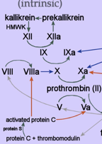

Protein S    body {font-family: 'Open Sans', sans-serif;}

### Protein S

Protein S is produced by the liver and a vitamin K-dependent anticoagulant.  
First discovered in Seattle, Washington in 1979 and arbitrarily named after the city of its discovery.  
  
**In the circulation,** _**Protein S**_ **exists in two forms:**  
A free form, unbound; only this free form has cofactor activity.  
A complex form bound to complement _**protein**_ C4b-binding _**protein**_ (C4BP).  
  
**Function of Protein S:** A cofactor to Protein C in the inactivation of Factors Va and VIIIa.  
Protein S is also able to directly inhibit factors Va, VIIa and Xa without activated Protein C.  
  
**Protein C:** Inactivates factor VIII and factor X. (red arrows indicates inactivations-below)  
**Protein S** functions as a cofactor to activated Protein C in the inactivation of Factors Va and VIIIa.  

****

  
Only the free form of protein S has cofactor activity.  

Medscape: Protein S Deficiency; Jan 27, 2016  
Mohammad Muhsin Chisti, MD and Perumal Thiagarajan, MD  
http://emedicine.medscape.com/article/205582-overview  
  
The 5-minute Clinical Consult 2007, pp 1006  
edited by Frank J. Domino.