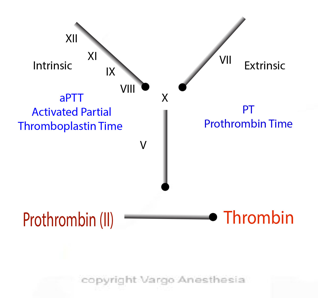

Prothrombin Time (PT, prothrombin time, or Pro Time) and INR (PT/INR)    body {font-family: 'Open Sans', sans-serif;}

### Prothrombin Time (PT, Prothrombin Time, or Pro Time) and INR (PT/INR)

Extrinsic pathway is evaluated by PT. It is a reported time in seconds and represents how long a plasma sample takes to clot after a mixture of thromboplastin (factor III) and CaCl is added. A time longer than 12-15 seconds indicates a deficiency in prothrombin (Factor II) or other factors that effect prothrombin.  
**  
Other explanation**  
Prothrombin (factor II), is one of several clotting factors produced by the liver.  
  
Used to assess **Extrinsic Pathway**  
PT measures the presence and activity of 5 different blood clotting factors (factors I, II, V, VII, and X).  
PT measures the clotting time from the activation of factor VII through the formation of the fibrin clot.  
****  
**PT Facts**  
**Normal range:** 12-15 seconds  
Must be used with INR for **coumadin (Warfarin) dosing** to “standardize test”  
  
**Warfarin is a vitamin K antagonist (VKA)  
**VKAs inhibit the production of the vitamin K-dependent coagulation factors II, VII, IX, and X and anticoagulant proteins C and S, decreased prothrombin levels, and decreases in the amount of thrombin generated and bound to fibrin. This results in decreased prothrombin levels and decreases in the amount of thrombin generated and bound to fibrin.  
_Factor VII is the first factor depleted, which is why the PT is affected before the aPTT._  
  
**Monitor:** PT and INR  
  
**Causes of prolonged PT**  
Warfarin  
Low levels of blood clotting factors.  
A change in the activity of any of the clotting factors.  
The absence of any of the clotting factors.  
Other substances, called inhibitors, that affect the clotting factors.  
An increase in the use of the clotting factors.  
Presents of newer anticoagulants (not linear or accurate).  
  
**INR (** international normalized ratio)  
**Normal range:** 0.8-1.2  
  
The INR is calculated from the PT and is intended to allow valid comparisons of results regardless of the type of PT reagent used among different laboratories.  
  
(INR = \[patient PT / mean normal PT\]).  
  
The INR can be used to adjust a person's Warfarin dosage to get the PT into the desired range.  
  
**Note:** Factor VII has the shortest half-life and is in the extrinsic pathway. Inhibition of factor VII does NOT provide effective anticoagulation despite causing early INR elevation (Managing Anticoagulated Patients in the Hospital. P134)  
  
**Elevated INR and Warfarin**  
**People taking Warfarin INR:** 2.0 to 3.0  
**High Risk patients INR:** about 2.5 to 3.5.  
  
**PT/aPTT**  
aPTT and PT are often done at the same time to check for bleeding problems or the chance for too much bleeding in surgery.  
  
**Causes of isolated elevated PT Time**  
Deficiency or inhibition of the extrinsic pathway (FVII)  
Mild factor X, V, and II deficiencies are also possible causes.  

**Prothrombin Time and INR  
http://www.webmd.com/a-to-z-guides/prothrombin-time#1**  
  
**Prothrombin Time and International Normalized Ratio  
**©2001 - 2017 by American Association for Clinical Chemistry  
https://labtestsonline.org/understanding/analytes/pt/tab/test/  
  
Medical Physiology-Principals of Clinical Medicine, 2013, p 185  
By Rodney A. Rhoades, David R. Bell