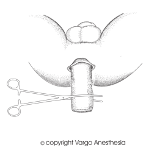
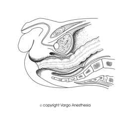

Pull-Through PSARP   

### Pull-Through PSARP

_Posterior Sagittal Anorectoplasty-PSARP  
Sacral Perineal Pull-through  
Abdominosacroperineal Pull-through  
Anorectovaginourethroplasty (PSARVUP)._

**_Edited by Anna Stone, CRNA and Heather J. Rankin, CRNA, DNP_**

As mentioned in the Imperforated Anus (Anal Atresia) Notes, this procedure is to repair the high malformations (supralevator lesions).  

  

  
The pull-through surgery technique provides greater surgical accuracy in repositioning the anus, minimizes damage to surrounding anatomical structures, reduces post-surgical pain and improves outcomes.

This procedure is usually the second stage performed in the patients that have already received an analplasty and colostomy. After the initial surgery, the child is given some time to grow before the second stage repair is done.

**Pre-op**  
Many of these kids will have a colostomy. The colostomy is for the kids who were born with rectal or anal agenesis without a fistula.  
If the patient already has a colostomy, you can check their anesthesia records as a reference.  
  
**Labs:** BMP, CBC and T & C.  
Check for directed/parental donor blood availability.  
You can premedicate with Versed: 0.5-0.7 mg/kg PO.  
If any VACTERL association is present, then there is around a 40-80% chance of a cardiac defect. Check for a cardiac consult report.  
**See VACTERL Link**

**Age of Infant:** 6-18 months (depends on growth and surgeon preference).**Anesthetic:** General/ETT**Induction:** Usually inhalation followed with IV insertion.  
**Nitrous-** Only for induction  
**Epidural:** Combined is common**Position:** Surgeon preference. Many times the surgeon will start out laparoscopically to look inside the abdominal cavity to mobilize the colon.  
**High Lithotomy**

When operating in the rectal area, high lithotomy with the baby’s legs taped up and almost back over their heads. It looks very uncomfortable.

Pad very well.

The patient may also be placed in prone position if the defect is very high, or the surgeon is not able to reach the child's rectum with this approach. This is usually done laparoscopically.

**Foley Catheter:** Yes  
**IV Access:** 20-22g x 2  
**Hydration: 4:2:1 (below is just a common reference)  
**Albumin dose for mild hypotension: 10cc/kg is recommended (<10kg wt)  
Albumin-more effective with its oncotic pull than crystalloids (<10kg wt)  
Crystalloid Bolus dose for mild hypotension: 5-10cc/kg (<10kg wt)  
Crystalloid Bolus dose for mild hypotension: 20cc/kg (>10kg wt)  
Crystalloid Bolus (emergency) for severe hypotension (20-50cc)

**Replacement of Insensible Fluid Loss (reference)**  
Minimally invasive (inguinal, laparoscopic) 0-2 cc/kg/hr  
Mildly invasive (ureteral reimplantation) 2-4 cc/kg/hr  
Moderately invasive (simple bowel cases) 4-8 cc/kg/hr  
Significantly invasive (NEC) >10 cc/kg/hr  
**3rd Spacing:** 10mL/kg/h is standard for 3rd space fluid loss  
with an open belly case.

**EBV (reference)  
Premature:** 90-100cc/kg**Newborn:** 80-90cc/kg**3mo-1 year:** 70-80cc/kg**1-4 years:** 70cc/kg  
**Adult:** 55-60cc/kg

**Laparoscopy:** Sometimes  
**Duration:** 3-6 hours  
**EBL:** 5-20 mL/kg  
**Arterial Line:** Rare, usually not, depends on present cardiac anomalies.**Blood loss:** Moderate and 3rd space fluid loss

**Emergence:** Usually extubated at the end of the case  
  
**Possible Complications:**  
Wound dehiscence  
Anal stenosis  
Mucosal prolapses  
Recurrent fistula  
Incorrect anal placements requiring redo surgery  
  
**Surgical procedure-Prone**  
The surgeon makes a midline posterior sagittal incision running from the middle portion of the sacrum to the anterior edge of the external sphincter.

The sphincter mechanism is divided in a midline incision. This preserves the nerve fibers and decreases the amount of postoperative pain. The back of the child's buttocks is opened like a book, and all internal structures are exposed.

The rectum is then carefully separated from the genitourinary tract, dissected, and freed enough to reach its normal site without tension. The fistula site is then closed.

Sometimes the surgeon may want to use a muscle stimulator to assess the

limits of the sphincter mechanism. Ask ahead of time about muscle relaxers.

If the child is known to have a very high defect or the surgeon is not able to reach the child's rectum with this approach, the abdomen must also be entered and is ideally approached using laparoscopy.

**Quick Basic Drug References  
****Propofol:** 2.5-3.5mg/kg IV  
**Succinylcholine:** <1 year: 3.0mg/kg  
\>1 year: 1.0-2.0mg/kg  
IM: 4-6mg/kg  
**Rocuronium:** <1 year: 0.25-0.5mg/kg  
1 year: 0.5-1.2mg/kg  
\>1 year: 0.5-1.3mg/kg  
**Vecuronium:** <1 year :0.05-0.1mg/kg  
\>1 year: 0.1mg/kg  
**Neostigmine:** 0.05-0.07mg/kg  
**Robinul:** 0.01mg/kg  
**Fentanyl:** 1-2mcg/kg  
**Morphine:** 0.05-0.15 mg/kg/dose IV q2-4h prn**Ofirmev:** \>2 years: 15mg/kg  
**Not FDA approved for < 2 years, but many still administer at 15mg/kg  
Toradol:** \>2 years: 0.5mg/kg  
**Precedex** (Emergence)**:** Slow push 0.5mcg/kg  
**Zofran:** 100mcg/kg (max 4mg)  
**Decadron:** 0.2-0.5mg/kg  
**Ancef:** 25mg/kg Q6h  
**Ampicillin:** 25-100mg/kg (max per day 100-400mg/kg)  
**Gentamycin:** 2-2.5 mg/kg/dose q8h (Max dose 80 mg)  
**Ceftriaxone (rocephin):** 50-75mg/kg  
**Clindamycin (cleocin):** 15-25mg/kg  
**Invanz** (ertapenem): (3 month -12 years): 15mg/kg  
**Vancomycin:** 10mg/kg slow IV

Berrocal T, Lamas M, Gutieérrez J et-al. Congenital anomalies of the small intestine, colon, and rectum.  
Radiographics. 19 (5): 1219-36

Fleisher,Lee Roizen,Michael; Essence of Anesthesia Practice; 2010  
  
Jaffe, Richard A. _Anesthesiologist's Manual of Surgical Procedures_. N.P.: n.p., 2012.