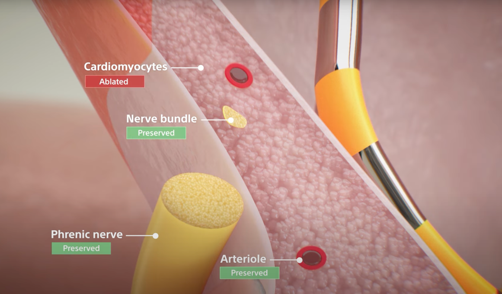
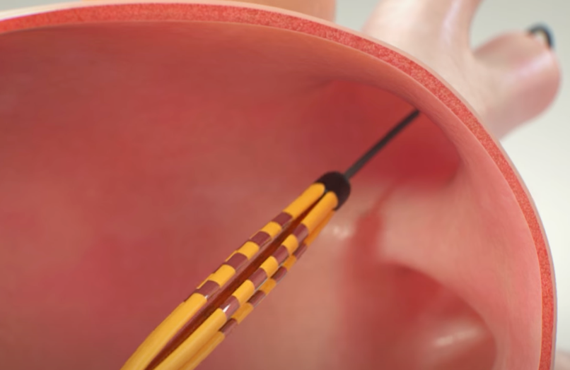
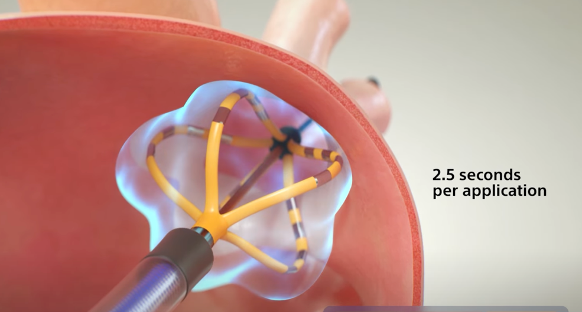
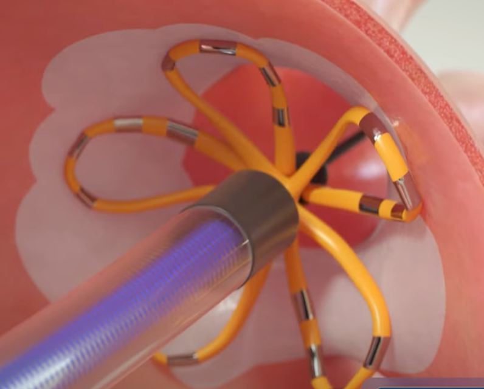
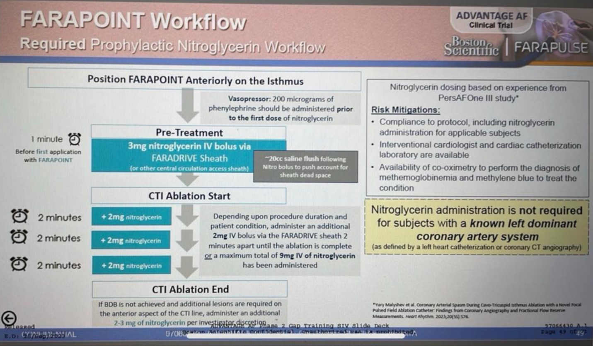

  Document section { margin-bottom: 20px; } h3, p { margin: 0px; padding: 0px; } .text-red { color: red; } img { width: 400px; height: auto; } .special-img { width: 200px !important; } .mb-10px { margin-bottom: 10px; } .reference-notes { font-size: 11px; }

### Pulsed Field Ablation (PFA) for Atrial Fibrillation

PFA is a nonthermal and tissue-selective approach to cardiac ablation to paroxysmal atrial fibrillation.

It is the new alternative to conventional thermal ablation. Unfortunately, traditional thermal ablation is less selective to cardiac tissue and may damage nearby nerves (including the phrenic nerve), blood vessels, and the esophagus. PFA spares extra damage by delivering very high voltage and low brief pulses to damage cardiac tissue selectively.

Communication with the EP cardiologist is imperative.

**Asystole when ablating the Left Superior Pulmonary Vein (LSPV):**

Asystole is possible with the first pulse ablation because most cardiologists start ablation at the LSPV, where the ganglionated plexi runs adjacent to it.

If the EP cardiologist ablates the pulmonary veins in a different order, you still need to know that asystole can occur once they get to the LSPV.

The EP cardiologist should warn you before ablating the LSPV.

**Pretreatment for asystole:**

Administer 0.4 mg of atropine or glycopyrrolate 0.2-0.4 mg for less HR response if already increased or in the presence of CAD before the first pulse ablation, as some patients have gone asystolic after the initial pulse.

Be aware that anticholinergics may cause urinary retention in older patients with BPH and delay postoperative micturition.

**Patients with permanent pacers:**

Patients with permanent pacers may not need their backup rate to ~ 40 BPM.

Some EP cardiologists insert a coronary sinus catheter to pace as needed.

**Coronary vasospasm:**

Ask the EP cardiologist if they will ablate the **cavo-tricuspid isthmus (CTI),** requiring coronary vasospasm prophylaxis.

Ablation to the CTI may cause vasospasm in the right coronary artery (RCA) and circumflex artery.

**If yes to ablating the CTI, consider initiating a continuous phenylephrine infusion.**

**Note:**

The CTI is between the tricuspid valve and the Inferior vena cava (IVC).

The RCA lies beneath it within the myocardium.

Thus, the ablation to the CTI is adjacent to the RCA and often causes vasospasm.

**Coronary vasospasm prophylaxis:**

\- To prevent coronary vasospasm, a very large dose (1-3 mg of nitroglycerine (NGT)) is to be administered just before ablating the CTI.

The EP team may administer the NTG via RA sheath.

Communicate with the EP cardiologist; this prophylaxis is unnecessary for every procedure.

**CAD patients:**

Caution needs to be used as the research of coronary vasospasm prophylaxis was performed on patients in the absence of CAD.

This may result in coronary steal situations.

**For patients without an arterial line:**

An arterial line is not routinely inserted unless the patient has a cardiac history (low EF).

Put the BP cuff on STAT mode just prior to the initial NTG dose.

**To prevent severe hypotension from the NTG bolus:**

If your patient is on a phenylephrine drip, double the dose, then administer 200 mcg of phenylephrine 1-2 min prior, and make sure it has taken effect before the NTG bolus.

It is well documented that some anesthesia providers administer a 300-500 mcg bolus of phenylephrine.

Equivalent doses of norepinephrine can be substituted.

Set the patient’s NIBP to STAT mode and continue to treat the hypotension while the cardiologist continues to ablate CTI.

Keep communication open as to when NTG redosing will occur.

Bolus phenylephrine with each additional NTG dose.

Once the last dose is given, return the phenylephrine infusion to the initial settings and change the cuff back to normal intervals.

Refer to the protocol at the bottom of this page.

Remain vigilant for drops in ETCO2 and ST Changes.

**What is currently common:**

Standard practice is to give 2 mg of nitroglycerin peripherally simultaneously with 300-400 mcg of phenylephrine and then another mg of nitroglycerin with phenylephrine as needed.

**Anesthesia management for PFA is the same as thermal cardiac ablation EXCEPT:**

No esophageal temperature probe is needed.

Changing to smaller tidal volumes for mapping is not needed.

There is no need to avoid muscle relaxation for phrenic nerve pacing.

**Note:** The cardiologist may request an IV fluid bolus to allow more room to move catheters around the Left Atrium (LA) and/or if LA pressure is low.

Refer to _“Atrial Ablation for Arial Fibrillation” for anesthesia management._

**Pre-op:**

Ask the EP cardiologist if they will need coronary vasospasm prophylaxis requiring NTG.

Remember that the plan often changes if a patient goes into an A-flutter during the case.

Patients with a compromised heart will require an arterial line.

**Procedure notes:**

Medtronic has its own system, PulseSelect, which was FDA-approved first.

I am unaware of any differences from an anesthesia standpoint; I just wanted to ensure both systems are mentioned.

This novel procedure uses a FARASTAR PFA Generator and catheter, which uses bipolar and biphasic waveforms to ablate only cardiomyocytes.

The FARASTAR catheter’s adaptable distal end changes shape and can expand to fill the shape of a range of pulmonary vein anatomy.

The catheter is first inserted through the ostium of a pulmonary vein (below).

It is expanded to fit the pulmonary vein ostium and ablated twice.

It is then rotated and repeated twice again.

The catheter is then expanded to a flower shape, rotated, and repeated as above.

  

This performed a total of eight applications per pulmonary vein.

**Possible complications/adverse effects:**

Ischemia from coronary vasospasm

Asystole

Aortic perforation

Cardiac tamponade–most commonly occurs at transeptal puncture or end of the case due to unrecognized slow venous bleed.

Air Embolus

Inadvertent puncture of the femoral artery

Hemolysis may occur with prolonged procedures over 70 applications–the cardiologist may request more IV fluid to flush out if appropriate.

  

**Atrial perforation:**

Early studies indicated catheter perforation, NOT over-burning of the atrium.

Catheters have been modified to be less stiff.

Rates are comparable to RFA.

Atrial perforation results in cardiac tamponade from over-burning the atrium.

This may require the chest to be opened.

Be prepared to transport the patient to an open-heart room if you are not already in one.

**Cardiac Tamponade:** If you see your arterial waveform dampen with a drop in BP, immediately troubleshoot the A-line (if the patient has one) while you notify the cardiologist.

Patients without an arterial line:

If there is an unexplained or continued drop in the pulse ox waveform and BP, the EP cardiologist should be immediately informed.

The EP cardiologist may quickly utilize an ICE catheter to assess for cardiac tamponade.

**Cardiac tamponade treatment:**

Don’t panic, and DON’T try to start additional IVs.

Just open your fluids wide open.

Treat the hypotension with your diluted ephedrine, epinephrine, or norepinephrine.

Neosynephrine should NOT be administered for cardiac tamponade.

The patient already has HUGE venous introducers in the two femoral veins (some are 8 Fr); they should be able to connect one and give volume as needed.

**Pericardiocentesis and Cardiac Tamponade:**

The cardiologist uses some large syringes and a stopcock with the pericardiocentesis kit and performs a pericardiocentesis.

The aspirated blood may be re-injected directly into the large femoral line by simply turning a stopcock.

You will be asked to give protamine to reverse the heparin, hoping the paper-thin perforated atrium will eventually clot.

If the atrium continues to bleed, the patient will immediately be transported to the operating room for a thoracic surgeon to open the chest and repair the atrium.

This occurs in less than 1-2% when expert cardiologists perform the procedure.

While the surgeon has full access to the heart, a Maze Procedure can also be performed to treat the A-fib.

The Maze procedure takes a few minutes.

Edited by Angela Geiser-Quader CRNA

Avoidance of Vagal Response During Circumferential Pulmonary Vein Isolation: Effect of Initiating Isolation From Right Anterior Ganglionated Plexi

Circulation: Arrhythmia and Electrophysiology, Vol 12, Number 12, 2019

Feng Hu, MD, Lihui Zheng, MD, PhD, Shangyu Liu, MD, Lishui Shen, MD, Erpeng Liang, MD, PhD, Ligang Ding, MD, PhD, Lingmin Wu, MD, PhD, Gang Chen, MD, Xiaohan Fan, MD, PhD, and Yan Yao, MD, PhD ianyao@263.net.cn

Coronary Arterial Spasm During Pulsed Field Ablation to Treat Atrial Fibrillation

Circulation, 2022 Dec 13;146(24):1808-1819.

Vivek Y Reddy, Jan Petru, Moritoshi Funasako , Karel Kopriva, Pavel Hala, Milan Chovanec, Marek Janotka , Stepan Kralovec, Petr Neuzil

Deep Dive into FARAPULSE™: PFA System Workflow Animation

Boston Scientific Cardiology

Youtube (accessed 03/2025)

https://www.youtube.com/watch?v=BjDfsH-kozo

Innovative Treatment for AFib: Pulsed Field Ablation

Breakthroughs for Physicians

Bradley P. Knight, MD, director of Cardiac Electrophysiology

YouTube (accessed 03/2025)

https://www.youtube.com/watch?v=\_ZPTDNZmrps

Handbook of Cardiac Electrophysiology: A Practical Guide to Invasive EP Studies and Catheter Ablation. London: ReMEDICA Pub., 2002.

Murgatroyd, Francis D., Andrew D. Krahn, Raymond Yee, and Allan Skanes.

Practical Clinical Electrophysiology. Philadelphia: Wolters Kluwer Health/Lippincott Williams & Wilkins, 2009.

Zimetbaum, Peter J., and Mark E. Josephson.