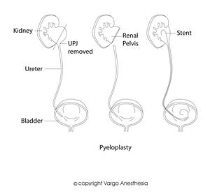

Pyeloplasty   

### Pyeloplasty

When a blockage occurs at the ureteropelvic junction (UPJ) where the renal pelvis connects with the ureter), the backflow (obstruction) of urine will dilate the kidney causing hydronephrosis. The surgeon’s goal is to correct the blockage or narrowing of the ureter where it leaves the kidney.

The ureter is surgically approached below the level of the obstruction and the abnormal section is removed. Then the ureter is repositioned and reattached to the healthy renal pelvic tissue above. Sometimes a Double J stent may be left 4-6 days to drain the ureter, or a nephrostomy tube may remain for 10 to 12 days. A Penrose drain may also be left in place under the incision.  
  
It is basically a long, easy, stable case in the lateral position with usually little or no blood loss.  
**Anesthetic:** General/ETT  
**Airway Issues:** none  
**Regional:** None  
**Nitrous:** OK to use  
**Muscle relaxation:** Usually  
**Duration** 2-5 hours  
**Position:** Lateral  
**IV Access:** 20G is acceptable  
**Hydration: 4:2:1** **(below is just a common reference)**Albumin dose for mild hypotension: 10cc/kg is recommended (<10kg wt)  
Albumin-more effective with its oncotic pull than crystalloids (<10kg wt)  
Crystalloid Bolus dose for mild hypotension: 5-10cc/kg (<10kg wt)  
Crystalloid Bolus dose for mild hypotension: 20cc/kg (>10kg wt)  
Crystalloid Bolus (emergency) for severe hypotension (20-50cc)

**Replacement of Insensible Fluid Loss (reference)**  
Minimally invasive (inguinal, laparoscopic) 0-2 cc/kg/hr  
Mildly invasive (ureteral reimplantation) 2-4 cc/kg/hr  
Moderately invasive (simple bowel cases) 4-8 cc/kg/hr  
Significantly invasive (NEC) >10 cc/kg/hr  
**3rd Spacing:** 10mL/kg/h is standard for 3rd space fluid loss  
with an open belly case.

**EBV (reference)  
Premature:** 90-100cc/kg**Newborn:** 80-90cc/kg**3mo-1 year:** 70-80cc/kg**1-4 years:** 70cc/kg  
**Adult:** 55-60cc/kg

**Arterial Line:** Not needed

**EBL: 20-100 mLs  
**

**Possible Complications  
**Bleeding  
Infection  
Hernia  
Damage to tissues or organs  
Persistent leakage of urine  
Blockage of the ureter

**More Notes**  
Obstruction of the UPJ can be caused by congenital abnormalities like horseshoe kidney, fibrous scarring due to a stone, a previous operation, or a stone that gets impacted in the upper part of ureter. This can cause damage to kidney tissue and eventually lead to pain, stones, infection, high blood pressure, and deterioration of kidney function and failure.

Over the past several years, robotic pyeloplasty was developed to give the same high success rate obtained with open pyeloplasty (>90%) while avoiding the large incision and associated pain and morbidity.

Although different types of pyeloplasty operations have been described, the ultimate goal is to remove the strictured portion of the UPJ, fashion the renal pelvis, and attach it to the ureter in a way to allow for easy drainage of urine down the ureter. There are different ways to approach the kidney to perform the operation. These include a flank incision, subcostal (under the rib) incision, trans-abdominal approach, or even sometimes through an incision in the back.

**  
  
Quick Basic Drug References  
****Propofol:** 2.5-3.5mg/kg IV  
**Succinylcholine:** <1 year: 3.0mg/kg  
\>1 year: 1.0-2.0mg/kg  
IM: 4-6mg/kg  
**Rocuronium:** <1 year: 0.25-0.5mg/kg  
1 year: 0.5-1.2mg/kg  
\>1 year: 0.5-1.3mg/kg  
**Vecuronium:** <1 year :0.05-0.1mg/kg  
\>1 year: 0.1mg/kg  
**Neostigmine:** 0.05-0.07mg/kg  
**Robinul:** 0.01mg/kg  
**Fentanyl:** 1-2mcg/kg  
**Morphine:** 0.05-0.15 mg/kg/dose IV q2-4h prn**Ofirmev:** \>2 years: 15mg/kg  
**Not FDA approved for < 2 years, but many still administer at 15mg/kg  
Toradol:** \>2 years: 0.5mg/kg  
**Precedex** (Emergence)**:** Slow push 0.5mcg/kg  
**Zofran:** 100mcg/kg (max 4mg)  
**Decadron:** 0.2-0.5mg/kg  
**Ancef:** 25mg/kg Q6h  
**Ampicillin:** 25-100mg/kg (max per day 100-400mg/kg)  
**Gentamycin:** 2-2.5 mg/kg/dose q8h (Max dose 80 mg)  
**Ceftriaxone (rocephin):** 50-75mg/kg  
**Clindamycin (cleocin):** 15-25mg/kg  
**Invanz** (ertapenem): (3 month -12 years): 15mg/kg  
**Vancomycin:** 10mg/kg slow IV

Jaffe, Richard A. _Anesthesiologist's Manual of Surgical Procedures_. Philadelphia, Pa.: Lippincott Williams & Wilkins, 2009.  
Kaplan, Steven A., Alan W. Partin, and Anthony Atala. _Minimally Invasive Procedures in Urology_. New  
York: Dekker, 2005.  
  
Macksey, Lynn Fitzgerald. _Surgical Procedures and Anesthetic Implications: A Handbook for Nursing  
Practice_ . Sudbury, MA: Jones & Bartlett Learning, 2011.  
McAninch, Jack W., Tom F. Lue, and Donald R. Smith. _Smith and Tanagho's General Urology / Editors, Jack W. McAninch, Thomas F. Lue_. New York: McGraw-Hill Professional, 2013.