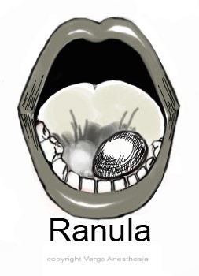

Ranula   

## Ranula

  
_Edited by Chris Baird CRNA, Charlotte, NC_  
  
**A Ranula looks like a round mass under the tongue**

****

**Ranula** is a mucocele arising in the floor of the mouth, which is secondary to an obstruction of the salivary ducts of the sublingual glands. A “simple” ranula is confined to the sublingual space as compared to a true cyst, which has an epithelial lining.

**“Plunging” ranulas** (looks like a neck mass) are masses within the submandibular triangle (aka submaxillary or digastric triangle), which is the region of the neck immediately beneath the body of the mandible. Simple ranulas may become plunging ranulas with attempted treatment. There a several components to ranulas, but the cervical component is a pseudocyst lined by granulation or connective tissue (not like true cysts which have epithelial linings). Ranulas may extend into the soft tissues or fasical planes of the neck. They can be congenital or acquired through trauma or iatrogenic injury.

**Etiology:**  
Ranulas arise from the sublingual glands (small glands at the floor of the mouth covered by mucosa). The sublingual glands produce saliva (more saliva is produced in response to eating). The amount of fluid in a ranula is related to the balance of saliva flow by the sublingual gland and the ability of macrophages to clear it, in response to inflammation and lymphatic drainage. With ranulas, the continued inflammation of the granulation tissue and fibrous tissue causes restriction and slow removal.

**Causes:**  
Genetics

Acquired: dental implants, frenulectomy or submandibular duct rerouting procedures

**Evaluation:**  
Imaging can be used to confirm, diagnose and to identify extent of ranula. CT scan is  
used mainly plunging ramulas although MRI may be used as well. Aspiration of amylase fluid will confirm diagnosis

**Sialoendoscopy** has been used to diagnose and treat ranula but also is know to cause ranula.

**Treatment:**  
Spontaneous regression has happened and the doctor may wait until the ranula has been present for 5 months.

**Goal of treatment:** To prevent recurrence of the ranula.

**Surgical Procedure**  
Simple incision and drainage is no longer advocated due to a low success rate and possible complication of simple to plunging ranula.

**Marsupialization** involves unroofing and then draining the cyst followed by suturing or cauterizing the cavity walls. Adding positive pressure may aid in marsupialization. Lasers have been used with marsupilization but the advantages may not outweigh the risk and expense.

**Plunging ranulas** may require a external approach - OK- 432 (Picibanil) is a sclerosing agent, which is injected into the cyst (under fluoroscopic guidance and after the cyst is drained), inciting an inflammatory response. Multiple treatments may be necessary.

Other options include intraoral excision with or without sublingual sialadenectomy and combined intaoral or cervical approaches.

**Complications:**  
\- Recurrence is the most common complication  
\- Malfunction of the submandibular or sublingual duct  
  
Surgical risks include: lingual nerve injury, hypoglossal nerve injury, marginal nerve injury, postoperative edema, hematoma and infection. OK-432 complications: fever, swelling and odynophagia.

Kalra, V., Mirza, K., & Malhotra, A. (2011). Neuroradiology: Plunging Ranula. _Journal of Radiology Case Reports,_ _5_(6), 18-24.

Bonet-Coloma, C., Minguez-Martinez, I., & Aloy-Prosper, A. (2011). Pediatric oral ranula: Clinical follow-up study of 57 cases. _Oral Medicine and Pathology,_ _16_(2), 158-62.

Operative Pediatric Surgery, Edited by Lewis Spitz and Arnold Coran, 2013, Seventh Edition.