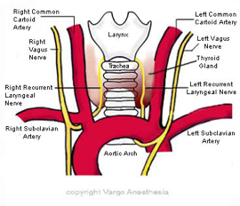

   body {font-family: 'Open Sans', sans-serif;}

## Recurrent Laryngeal Nerve (RLN)

On the right, leaves the vagus as it crosses the subclavian artery, passes under the artery, and ascends to reach the larynx—lying between the esophagus and trachea.  
On the left, leaves the vagus as it crosses the arch of the aorta, passes under the aorta and ascends as on the right. Provides sensory supply to the subglottis and motor supply to all intrinsic muscles of the larynx (except cricothyroid).

1.  **SLN** – External branch – may be damaged during thyroid surgery, as it lies with the superior thyroid vessels.  
      
    The SLN also innervates the cricothyroid muscle.  
    The cricothyroid muscle is the only tensor muscle of the larynx that aids with phonation.  
    Loss of cricothryoid innervation causes loss of vocal cord tension and hoarseness following unilateral damage.  
    This may be temporary as the opposite cricothyroid compensates.
2.  **RLN** – May be damaged during thyroid surgery, as it lies close to the inferior thyroid vessels. Due to the long thoracic course of the nerve, it can be damaged by aortic aneurysms, enlarged right atrium, lung and esophageal cancer and enlarged lymph nodes.

**Motor Response**

**The three main intrinsic laryngeal muscles that are supplied by the vagus nerve via the recurrent laryngeal nerve:**

1.  Lateral cricoaretenoids
2.  Thyroaretenoids (the glottic adductors)
3.  Cricoaretenoids (the vocal cord tensors)

Anatomy, Head and Neck, Larynx Recurrent Laryngeal Nerve  
National Library of Medicine (StatPearls) accessed 08/2022  
Evan Allen; Katrina Minutello; Benjamin W. Murcek.  
https://www.ncbi.nlm.nih.gov/books/NBK470179/  
  
Espinosa MC, Ongkasuwan J. Recurrent laryngeal nerve reinnervation: is this the standard of care for pediatric unilateral vocal cord paralysis? Curr Opin Otolaryngol Head Neck Surg. 2018 Dec;26(6):431-436.  
  
Sun H, Wu CW, Zhang D, Makay Ö, Zhao Y, Carcofaro P, Kim HY, Dionigi G, Pino A, Caruso E, Pontin A, Pappalardo V. New Paradigms for Neural Monitoring in Thyroid Surgery. Surg Technol Int. 2019 May 15;34:79-86