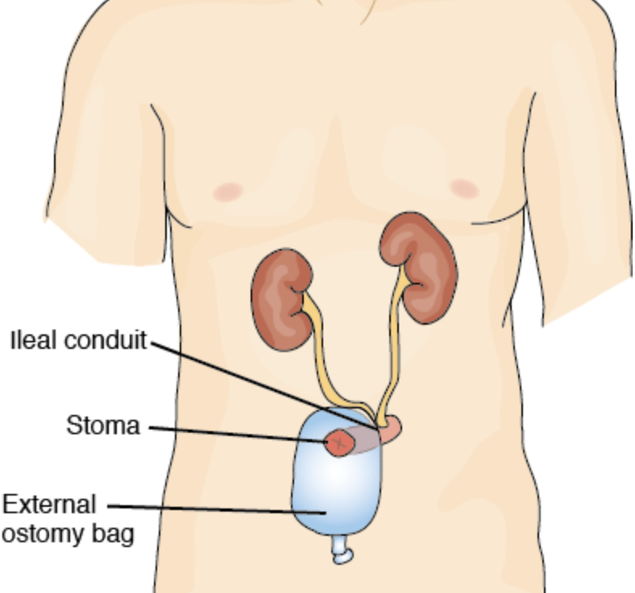

Robotic Cystectomy with Ileal Conduit    body {font-family: 'Open Sans', sans-serif;}

### Robotic Cystectomy with Ileal Conduit

**Urinary Diversion  
**Urinary diversion involves the re-routing of urinary drainage to the outside of the body - either as a temporary or permanent solution.  
It is required after the bladder has been removed (cystectomy) or is no longer functioning.  
**  
Ileal Conduit (Urostomy):  
**\- One end of a short segment of the small intestine (which has been removed from the rest of the intestine) is connected to a stoma that is created in the abdomen.  
Since a stoma does not contain any nerve endings, it is not painful.

****

\- The ureters, which normally carry urine from the kidneys to the bladder, are attached to the other end of the intestine segment.  
\- Urine travels from the ureters into the newly formed ileal conduit, through the stoma, and out of the body.  
\- An ostomy appliance is placed over the stoma.  
  
**Anesthesia:** Similar to a Robotic prostatectomy, but longer in duration.  
**General/ETT  
Duration:** 2-4 hours  
**IVs:** two (in case one fails as arms are tucked)  
**Position:** Lithotomy and steep Trendelenburg  
**OGT:** Consider it as the patient will be in steep Trendelenburg.  
**Face Protection:** Yes, a foam donut pillow or cradle is placed over the face. Some of the robotic equipment is placed on the drapes over the patient’s face.  
**Eye protection:** Always. Usually goggles.  
Eye goggles are standard in most facilities.  
Patients complain of eye irritation from post-op conjunctival swelling and tend to want to rub their eyes.  
  
**Conjunctival Swelling:** Yes, being in steep Trendelenburg for hours can cause this.  
It is common.  
**Ventilation Issues:** Yes, change to Pressure Control Ventilation.  
Once the patient is in steep Trendelenburg, the abdominal contents will shift against the diaphragm, thereby decreasing FRC, compliance, and lung volumes.  
It will immediately become difficult to volume ventilate due to the elevated peak pressures. This is especially exaggerated with obese patients with large bellies.  
  
**Possible Complications:**  
\- Bleeding  
\- Corneal Abrasions.  
\- Conjunctival Swelling-post op.  
\- High peak pressures during the procedure.  
\- Bowel obstruction  
\- Anastomotic leak (urinary)  
\- Ileus.  
  
**Protect Cerebral Perfusion Pressure (CPP)**  
MAP-ICP (or CVP) = CPP  
Normal CPP = 70-110mmHg  
In steep Trendelenburg, the CVP or ICP is drastically elevated.  
**It becomes obvious here not to permit a low MAP.**  
  
CPP < 50mmHg = slowing of the EEG  
CPP 25-40mmHg = flat EEG  
CPP < 25 mmHg = irreversible brain damage  

Ileal Conduit  
Stat Pearls (accessed 08/2024)  
Ravina J. Tanna; Jonathan Powell; Lewis A. Mambu.  
https://www.ncbi.nlm.nih.gov/books/NBK565859/  
  
Complications of Ileal Conduits after Radical Cystectomy: Interventional Radiologic Management  
RadioGraphics (accessed 08/2024)  
atsuhiro Kobayashi , Atin Goel, Marlon P. Coelho, Mariangeles Medina Perez, Matthew Klumpp, Sanjit O. Tewari, Tomas Appleton-Figueira, David J. Pinter, Oleg Shapiro, Mohammed Jawed