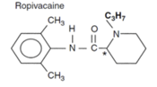

Ropivacaine (Naropin)    body {font-family: 'Open Sans', sans-serif;}

### Ropivacaine (Naropin)

**_Class:_** _Amide type local anesthetic, long acting._Ropivacaine and Bupivacaine are the main two long lasting local anesthetics utilized in OB Neuraxial Anesthesia.Ropivacaine is commonly used as a continuous epidural infusion in laboring women in OB.  
In OB, we do NOT use Ropivacaine intrathecally.  
  
**Common Labor Epidural Infusion of Ropivacaine:**  
8-10 mLs/hr of 0.15% or 0.2% and 1-2 mLs of a narcotic (fentanyl 2mcg/cc is common).  
**Labor Pain:** 20-40mg (10-20mL) then 12-28mg/hr  
**Post Op Pain:** 12-20mg/hr (6-10mL)  
**Duration:** 120-360 mins  
**Epidural/Caudal 0.5-1%**  
**Onset:** Moderate  
**Duration:** 120-360 mins (less lipid soluble and cleared by the liver more rapidly than  
bupivacaine giving it a shorter duration.  
**Max Dose:** 200mg  
  
**Ropivacaine for a spinal is rare (especially in OB)  
**Ropivacaine is presently off-label for spinals.  
Ropivacaine still has a long track record of intrathecal use.  
It can be used in the same dose proportion as bupivacaine in the CSE, and has the benefit of less motor block.  
  
**Why Ropivacaine has become in epidurals more popular in OB  
**Similar to Bupivacaine, just a little less shorter in duration.Ropivacaine is a MUCH LESS cardiac toxicity risk than Bupivicaine.  
Better motor preservation than Bupivacaine. Mom can still push will delivery.

****

**Remember the 2 ways you can tell the local anesthetic is an amide?  
**2 “I”s in the word.Note the “NH” next the aromatic ring on the left = amide.  
  
**Structure and pharmacokinetics:** similar to bupivacaine except that-  
Ropivacaine has a linked S-isomer.  
Bupivacaine has an “R”-isomer.  
  
**Ropivacaine is not preferred for spinals in OB** Hyperbaric Bupivacaine is the most commonly used. Ropivacaine is packaged as isobaric, must add dextrose to make it hyperbaric.  
Shows no advantages over intrathecal Bupivacaine. Ropivacaine is not preferred for longer procedures-shorter in duration.  
Epinephrine is not added to Ropivacaine to prolong duration because it is already a mild vasoconstrictor.  
  
**Metabolized:  
**Ropivacaine is an amide, so it is metabolized in the liver.  
In detail, it is metabolized to 2, 6-pipecoloxylidide (PPX) and 3-hydroxyropivicaine by hepatic cytochrome P-450 enzymes.  
The metabolites are weak compared to Bupivacaine.  
With normal liver function, only 1% of Ropivacaine is excreted unchanged in the urine. With liver patients, PPX may accumulate and produce toxic effects.  
**Peripheral Nerve Block:** Onset: 15 minutes/ Duration: 5-8 hours  
**Epidural: Onset:** 10 minutes/Duration: 2-6 hours  
**Intrathecal** (not used in OB) Onset: 5 minutes  
  
**Allergic Reactions:** Amides, very rarely cause allergic phenomena. For these  
reasons amides are now more commonly used than esters.  
  
**Mechanism of Action:** Like other local anesthetics, it binds to the intracellular portion of sodium channels  
and blocks sodium influx into nerve cells, which prevents depolarization.  
  
**CNS and Cardiac manifestations to watch for:**  
Euphoria  
Dizziness  
Tinnitus  
Twitching  
Tremors  
Convulsions  
Hypotension  
Cardiac Arrest  
  
**Cardiac Toxicity of Ropivacaine is MUCH less than** Bupivacaine. Ropivacaine “S” isomers do not strongly attach to cardiac Na channels. Bupivacaine “R” isomer can bind strongly to the cardiac Na channels which increases the possibility of cardiac toxicity from an accidental intravascular injection.  
  
**Example** With Ropivacaine, a 20 mg dose in a laboring patient is less than 0.33 mg/kg.  
This is safe and effective dose.  
If 20 mg of Ropivacaine was administered accidentally IV, it would be much safer than Bupivacaine, and depending on the rate of delivery, may NOT cause any cardiac symptoms.  
If an epidural dose was accidentally given intrathecally, it is still an acceptable dose for spinal Ropivacaine. (Anesth Analg 2003;96:1473).**Note:** Don’t count out Bupivacaine. It is still very popular and safe, especially at lower concentrations (0.125%).  
  
**Ropivacaine - sensory vs motor** Ropivacaine affects sensory nerve fibers to larger extent than motor.  
(Blocks smaller sensory C fibers > larger motor myelinated A fibers)  
Ropivacaine has a better sensory-motor differential block at low concentrations than Bupivacaine. This results in better motor preservation without limiting the mom’s ability to push during the second stage of labor. This means a less motor block than that of Bupivacaine.  
  
**Ropivacaine is not as strong as Bupivacaine**  
Ropivacaine is 60% (literature varies) as potent as bupivacaine when administered per epidural with laboring patients.  
  
**Don’t mix Epinephrine with Ropivacaine  
**Epinephrine with Ropivacaine has no effect on onset, duration or systemic absorption.  
  
**Long Acting Local Anesthetics  
**Bupivacaine (Marcaine, Sensorcaine)  
Ropivacaine (Naropin)  
Etidocaine (Duranest)  
Levobupivacaine  
  
**Ropivacaine is better for hemodynamics****According to studies,** only 15% patients receiving ropivacaine will develop hypotension in contrast to 70% receiving Bupivacaine.Intrathecal ropivacaine produces less hemodynamic side-effects than intrathecal bupivacaine. As already mentioned above, we DO NOT use intrathecal Ropivacaine in OB.

**Chestnut’s Obstetric Anesthesia Principles and Practice.**  
Chestnut, David.(2014) pp 564.  
**  
DrugBAnk**  
http://www.drugbank.ca/drugs/DB00813.  
  
**Pharmacology of local anesthetic agents.  
**Update in Anesthesia 1994; 19-24  
www.world-anaesthesia.org  
  
**Principles and Practice of Pharmacology for Anesthetists:** Calvey and Williams  
  
**Pharmacology for Anesthesia and Intensive Care:** Peck, Hill and Williams  
  
**Review of local anesthetic agents.**  
Current Anesthesia & Critical Care 2004 15: 247-254  
Lagan G, McClure HA.  
  
**Handbook of Local Anesthesia.**  
Malamed, Stanley. 5 th Edition. 2004  
www.mhaus.org  
  
**Ropivacaine.**  
Br J Anesth 1996; 76:300–7  
McClure JH  
  
**Metabolism and excretion of ropivacaine in humans.  
**Drug Metab Dispos 1996; 24:962–8  
Halldin MM, Bredberg E, Angelin B, Arvidsson T, Askemark Y, Elofsson S, Widman M:  
  
**Intrathecal ropivacaine for ambulatory surgery.  
**Intrathecal ropivacaine for ambulatory surgery.Gautier PE, De Kock M, Van Steenberge A, Poth N, Lahaye-Goffart B, Fanard L, _et al._