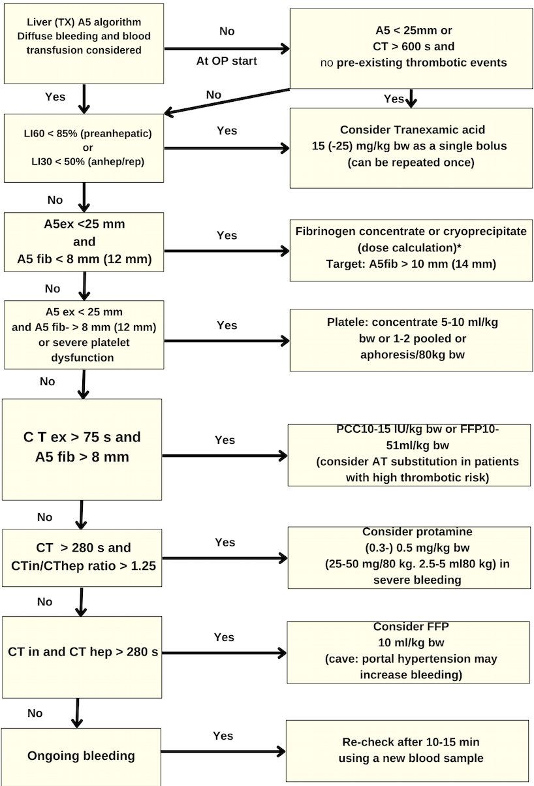

ROTEM® Liver Transplant Algorithm    body {font-family: 'Open Sans', sans-serif;}

### ROTEM® Liver Transplant Algorithm

****

THE ROLE OF EVIDENCE-BASED ALGORITHMS FOR ROTATIONAL THROMBOELASTOMETRY-GUIDED BLEEDING MANAGEMENT  
Korean Journal of Anesthesiology August, 2019; Vol 72, Issue 4  
Klaus Görlinger, Antonio Pérez-Ferrer, Daniel Dirkmann, Fuat Saner, Marc Maegele, Ángel Augusto Pérez Calatayud, Tae-Yop Kim  
  
Dötsch TM, Dirkmann D, Bezinover D, Hartmann M, Treckmann JW, Paul A, et al. Assessment of standard laboratory tests and rotational thromboelastometry for the prediction of postoperative bleeding in liver transplantation. Br J Anaesth 2017; 119: 402-10.  
  
Blasi A, Beltran J, Pereira A, Martinez-Palli G, Torrents A, Balust J, et al. An assessment of thromboelastometry to monitor blood coagulation and guide transfusion support in liver transplantation. Transfusion 2012; 52: 1989-98.  
  
Fayed N, Mourad W, Yassen K, Görlinger K. Preoperative thromboelastometry as a predictor of transfusion requirements during adult living donor liver transplantation. Transfus Med Hemother 2015; 42: 99-108.