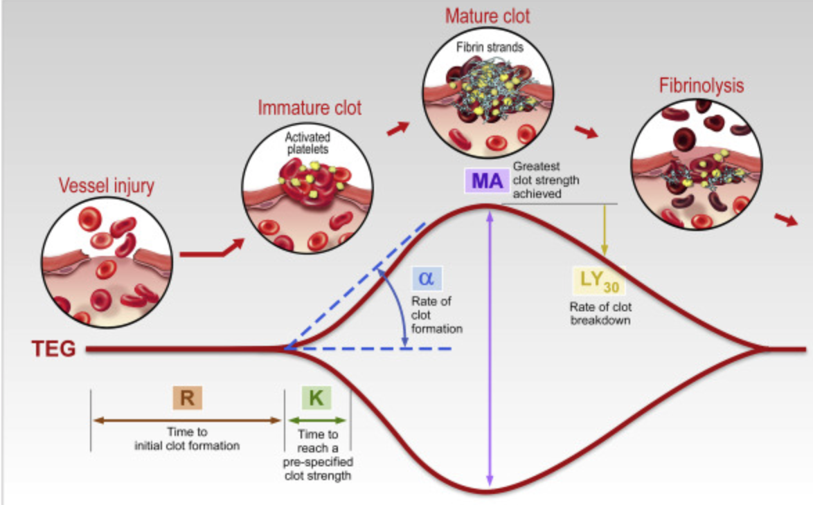
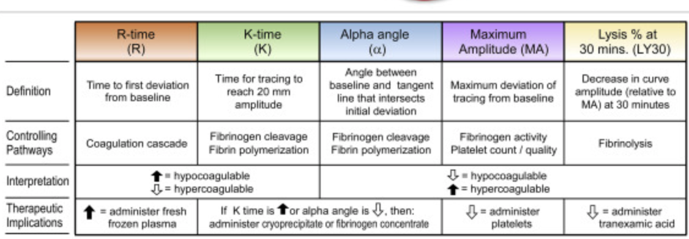
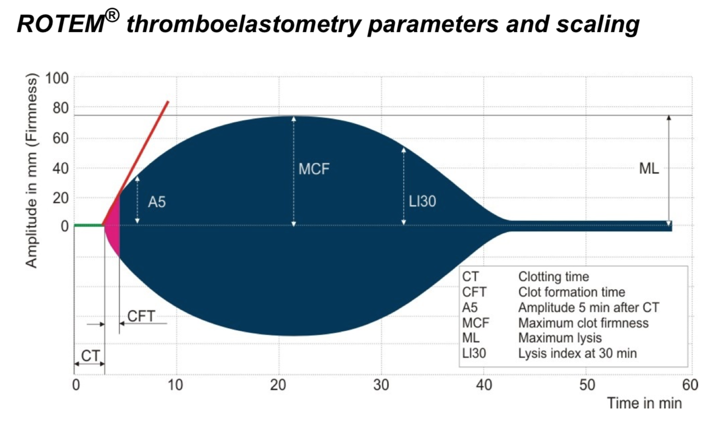
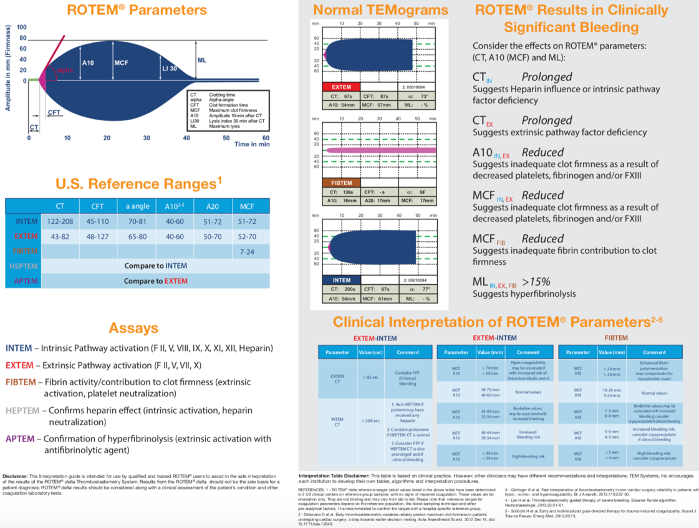
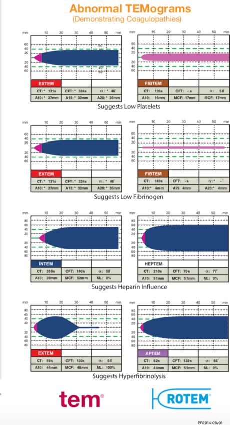
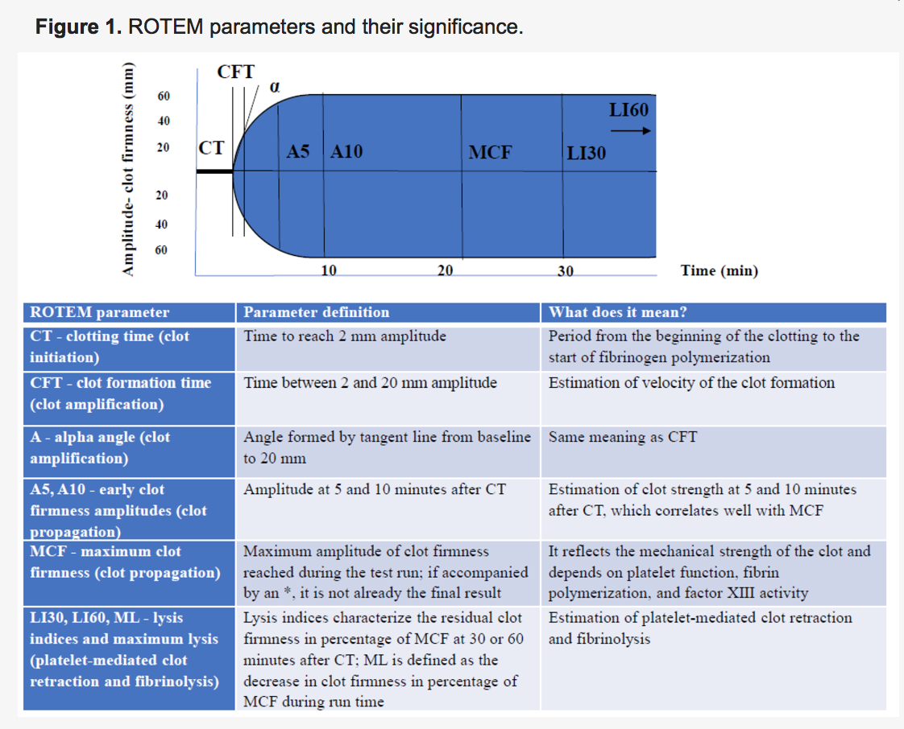
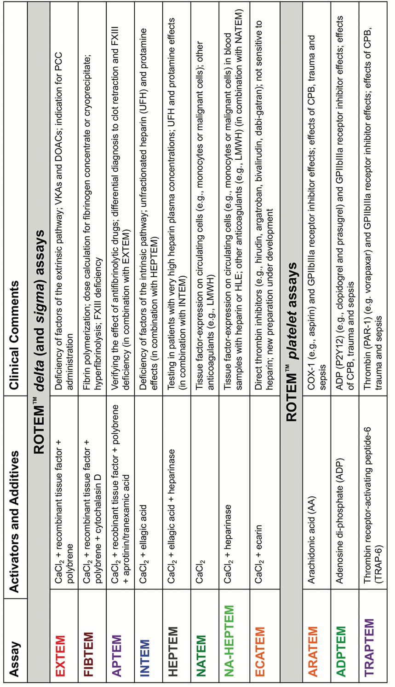
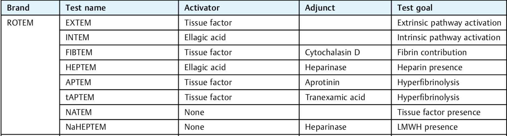
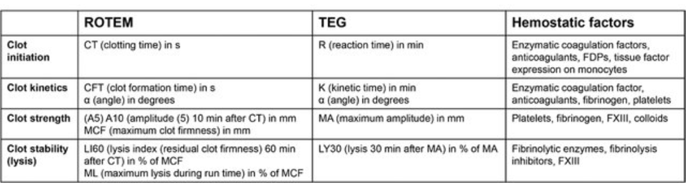

TEG/ROTEM - Notes and History    body {font-family: 'Open Sans', sans-serif; padding-left: 10px;}

### TEG/ROTEM - Notes and History

The ROTEM® system is an enhancement of TEG and was developed during 1995-1997 in Munich.

****

****

The ROTEM® analysis covers the whole process of whole blood coagulation, from the formation of the first fibrin strands over the maximum firmness of the clot until its lysis.  
  
The instrument includes four measurement channels for simultaneous analysis of whole blood coagulation, from the formation of the first fibrin strands over the maximum firmness of the clot until its lysis.  
The assessment of the ROTEM® analysis is carried out along the time axis (from left to right).  
A disturbed activation of coagulation is indicated by a prolonged clotting time.  
  
**We can’t always rely on PT, PTT, and platelet count.**  
During such complex hemostasis disorders, the clinical significance of the routine parameters PT, aPTT, and platelet count is relatively weak.  
This leads to the interest in laboratory methods, which better reflect hemostasis during these complex processes.  
  
**INTEM and HEPEM:**  
As causes, a factor deficiency or a heparin effect has to be considered.  
The comparison of INTEM and HEPTEM allows for specific detection of a heparin effect.  
  
**ROTEM-guided bleeding management algorithms are effective in reducing:**  
Transfusion requirements  
Health care costs  
Complication rates  
Perioperative morbidity and mortality  
  
**Rotem associated abbreviations:**  
CT: Coagulation time  
A5: Amplitude of clot firmness 5 min after CT  
A10: Amplitude of clot firmness 10 min after CT  
MCF: Maximum clot firmness,  
ML: Maximum lysis during runtime  
LI60: Lysis index 60 min after CT  
TXA: Tranexamic acid (or other antifibrinolytic drug)  
FXIII: Coagulation factor XIII  
GPIIbIIIa-R: GPIIbIIIa-receptor  
CFT: Cot formation time  
CPB: Cardiopulmonary bypass  
HLE: Heparin-like effect  
OLT: Orthotopic liver transplantation  
4F-PCC: four-factor prothrombin complex concentrate  
EX: EXTEM  
FIB: FIBTEM  
HEP: HEPTEM  
IN: INTEM.  
Courtesy of Klaus Görlinger, Germany  
  
**An abnormal clot formation is indicated by:**  
Prolonged clot formation time (CFT) and/or  
Reduced clot firmness (A10/MCF)

****

****

****

****

****

****

**CFT (clot formation time):** The time from initiation of clotting until a clot firmness of 20 mm is detected- fibrin polymerization, clot stabilization with thrombocytes, and FXIII.  
The CFT is thereby influenced stronger by a clot polymerization disorder than the MCF.  
A prolonged CFT with, at the same time, normal A10/MCF indicates, therefore, a polymerization disorder.  
A reduced A10/MCF with a normal CFT indicates a clottable substrate deficiency (fibrinogen and/or platelets).  
  
**CT (clotting time):** Time from the start of the measurement until initiation of clotting thrombin formation and the beginning of clot polymerization.  
  
**MCF (maximum clot firmness):** The firmness of the clot - increasing stabilization of the clot by the polymerized fibrin, thrombocytes, as FXIII.  
  
**ML (maximum lysis):** The reduction of clot firmness after MCF in relation to MCF- stability of the clot (ML< 15%) or fibrinolysis (ML > 15% within one h)  
**  
Fibrinolysis:  
**\- Fibrinolysis is detected by the lysis of the clot (ML > 15%) or by the finding of a better clot formation (shorter CFT, greater MCF) in APTEM (S,C ) as compared to EXTEM (S,C).  
\- If in APTEM (S, C), with the occurrence of the typical pattern of a hyperfibrinolysis (spindle-shaped, total lysis of the clot firmness) in EXTEM (S, C) (as in INTEM (S, C), FIBTEM (S, C), HEPTEM (S, C)), the hyperfibrinolysis is not present, then hyperfibrinolysis is confirmed.  
  
**Limitations of ROTEM®:** (especially platelet inhibitors)  
No detection of Aspirin  
No detection of clopidogrel/Plavix  
No detection of von Willebrand syndromePoor sensitivity to oral anticoagulants:  
Reopro and other oral anticoagulants (coumarins: Warfarin, etc.)  
Poor sensitivity to low molecular weight heparin  
  
**ROTEM®vs TEG

****

**

ROREM Analysis  
Targeted Treatment of Acute Haemostatic Disorders  
Department for haemostatsis and transfusion medicine  
University hospital of Munich, Ludwig-Maximilians-University Munich  
Accessed 08/2023  
https://www.ttuhsc.edu/medicine/odessa/internal/documents/ttim-manual/ROTEM\_Analysis.pdf  
ROTEM Thromboelastometry System  
A Basic Guide to Assays and Clinical Interpretation  
Accessed 08/2023  
https://tinyurl.com/5bvrzpv8  
Instrumentation Laboratory (accessed 09/2023)  
www.intrumentationlabarotry.com