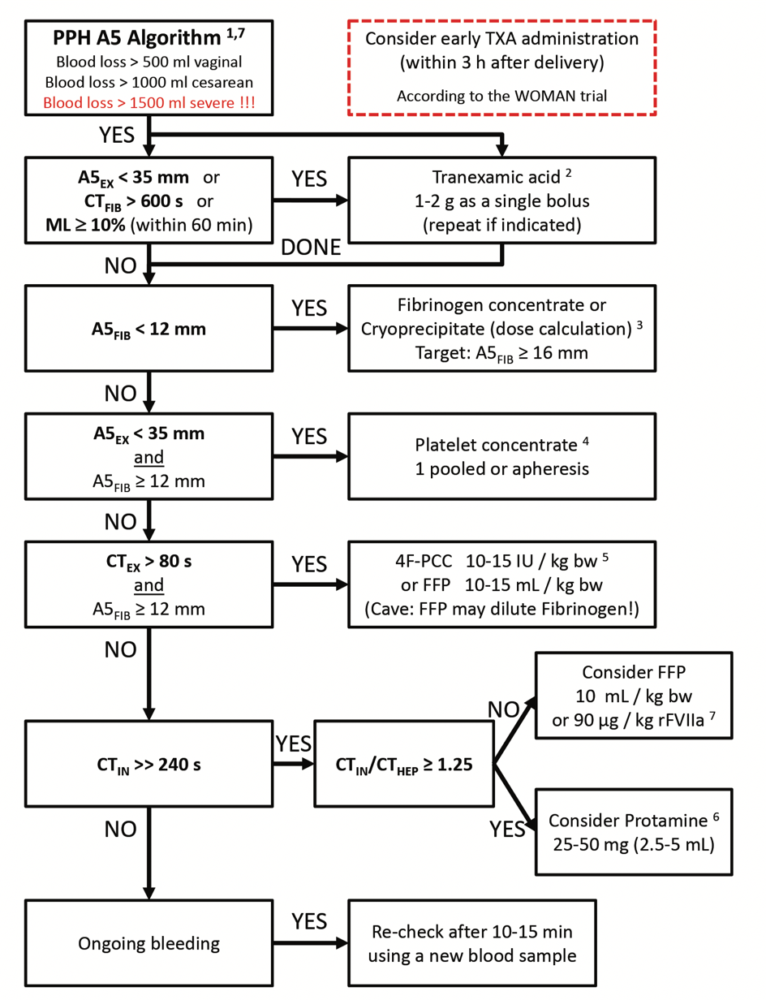

ROTEM® Post-Partum Hemorrhage Algorithm    body {font-family: 'Open Sans', sans-serif;}

### ROTEM® Post-Partum Hemorrhage Algorithm

****

  

THE ROLE OF EVIDENCE-BASED ALGORITHMS FOR ROTATIONAL THROMBOELASTOMETRY-GUIDED BLEEDING MANAGEMENT  
Korean Journal of Anesthesiology August, 2019; Vol 72, Issue 4  
Klaus Görlinger, Antonio Pérez-Ferrer, Daniel Dirkmann, Fuat Saner, Marc Maegele, Ángel Augusto Pérez Calatayud, Tae-Yop Kim  
  
Fibrin-based clot formation as an early and rapid biomarker for progression of postpartum hemorrhage: a prospective study.  
Blood 2014; 124: 1727-36.  
Collins PW, Lilley G, Bruynseels D, Laurent DB, Cannings-John R, Precious E, et al.  
  
Peri-partum reference ranges for ROTEM(R) thromboelastometry.  
British Journal of Anaesthesioly 2014; 112: 852-9.  
de Lange NM, van Rheenen-Flach LE, Lancé MD, Mooyman L, Woiski M, van Pampus EC, et al.