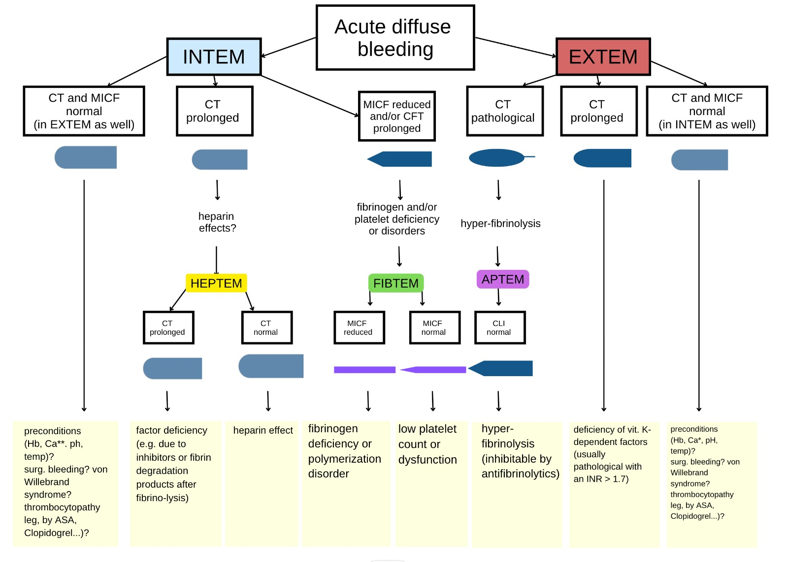
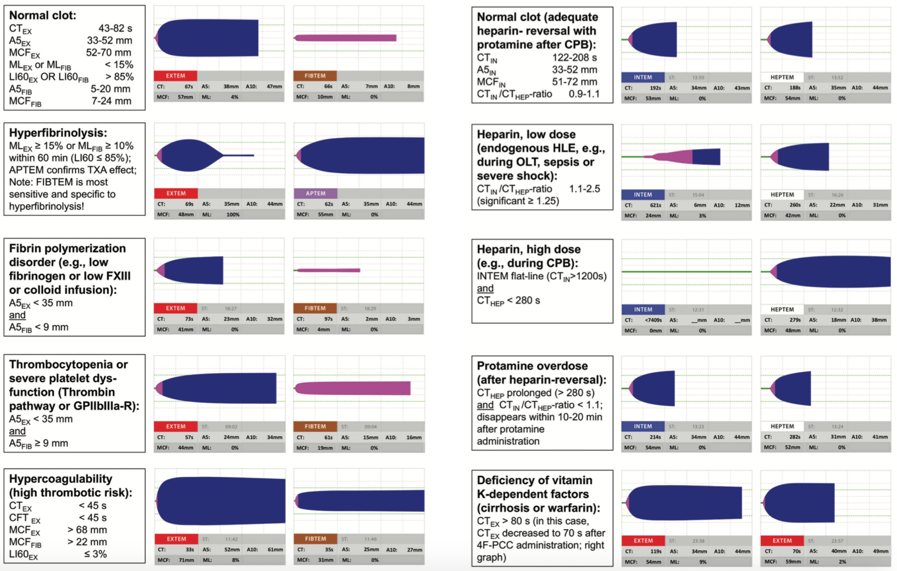
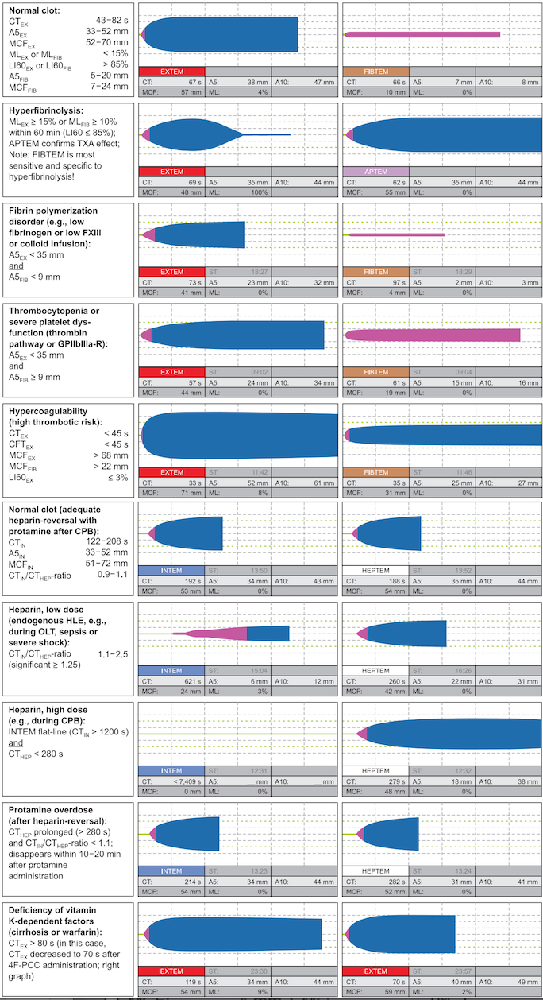
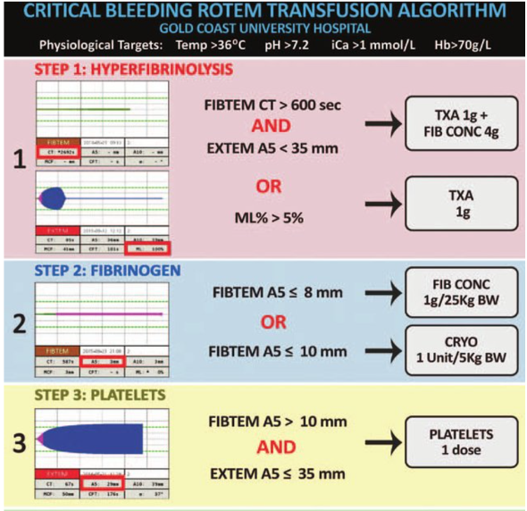
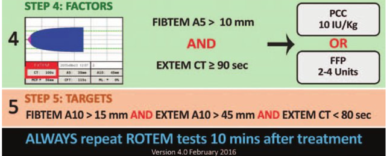

ROTEM® Algorithms    body {font-family: 'Open Sans', sans-serif;}

### ROTEM® Algorithms

Below are some publicly posted algorithms from various medical institutions.  
These should only be used as a reference as you should only use your department’s or institution’s protocols concerning ROTEM results.

****

****

****

****

****

  

Thromboelastometry guided therapy of severe bleeding Essener Runde algorithm  
Hamostaseologie 2013;33(1):51-61.H Lier 1 , M Vorweg, A Hanke, K Görlinger  
THE ROLE OF EVIDENCE-BASED ALGORITHMS FOR ROTATIONAL THROMBOELASTOMETRY-GUIDED BLEEDING MANAGEMENT  
Klaus Görlinger, Antonio Pérez-Ferrer, Daniel Dirkmann, Fuat Saner, Marc Maegele, Ángel Augusto Pérez Calatayud, Tae-Yop Kim  
The Korean Society of Anesthesiologists, 2019  
THE ROLE OF EVIDENCE-BASED ALGORITHMS FOR ROTATIONAL THROMBOELASTOMETRY-GUIDED BLEEDING MANAGEMENT  
Korean Journal of Anesthesiology August, 2019; Vol 72, Issue 4  
Klaus Görlinger, Antonio Pérez-Ferrer, Daniel Dirkmann, Fuat Saner, Marc Maegele, Ángel Augusto Pérez Calatayud, Tae-Yop Kim  
  
Implementation of point-of-care ROTEM® into a trauma major haemorrhage protocol: A before and after study  
Emergency Medicine Australia 2020 Sep 29.  
Don Campbell 1 2 3 , Elizabeth Wake 1 3 , Kerin Walters 4 , Debbie Ho 5 , Gerben Keijzers 2 3 6 , Martin Wullschleger 1 3 , James Winearls 4 7 8