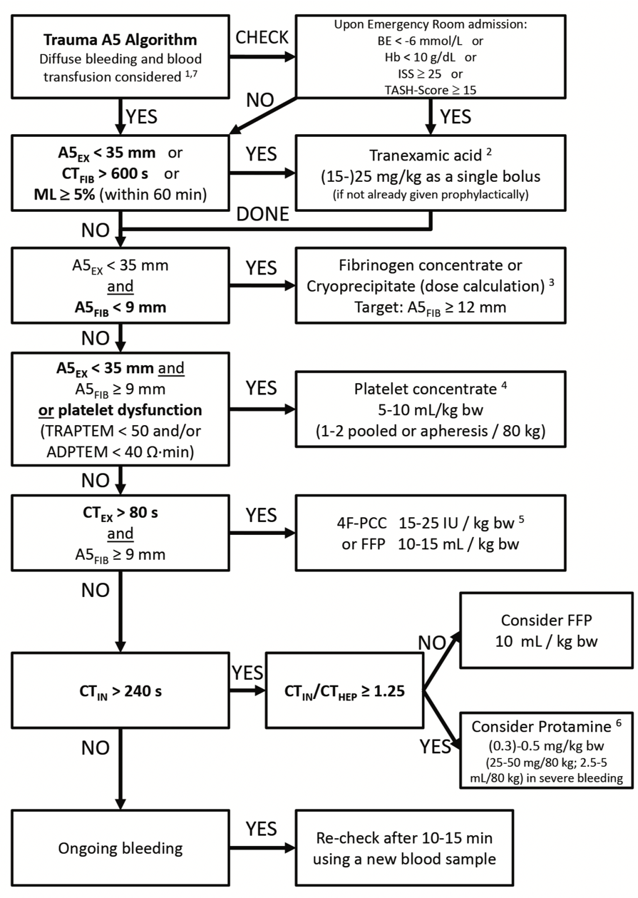

ROTEM® Trauma Algorithm    body {font-family: 'Open Sans', sans-serif;}

### ROTEM® Trauma Algorithm

****

  

THE ROLE OF EVIDENCE-BASED ALGORITHMS FOR ROTATIONAL THROMBOELASTOMETRY-GUIDED BLEEDING MANAGEMENT  
Korean Journal of Anesthesiology August, 2019; Vol 72, Issue 4  
  
Klaus Görlinger, Antonio Pérez-Ferrer, Daniel Dirkmann, Fuat Saner, Marc Maegele, Ángel Augusto Pérez Calatayud, Tae-Yop Kim