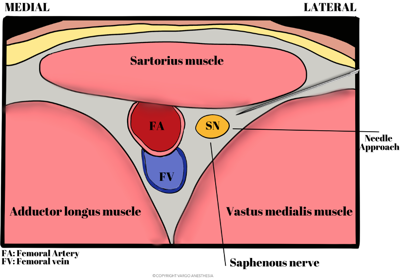

Saphenous Block Extra Notes    body {font-family: 'Open Sans', sans-serif;}

### Saphenous Block Extra Notes

Also called the “Adductor Canal” block  
**  
Indications of saphenous nerve block:**  
**To provide analgesia to:**  
Anteromedial knee  
Medial aspect of the lower leg  
Medial malleolus (ankle)  
The medial portion of the foot  
  
\- First choice block for most total knee arthroplasties because it usually results in less quadriceps muscle weakness than the conventional femoral block.  
\- However, a small percentage of saphenous blocks may result in quadriceps muscle weakness, even with low-volume doses.  
  
**Saphenous nerve block surgical indications  
**_(may be used in combination with other regional blocks for optimal coverage):_Total and partial knee arthroplasty + iPACK block  
Ligamentous knee reconstruction (ACL repair) + iPACK block  
Rescue block for minor arthroscopy knee surgery  
Pain after partial meniscectomy  
Saphenous vein stripping  
Saphenous vein harvesting  
Lacerations and abscesses drainage of the medial leg  
Foreign body removal to the medial leg  
Medial foot and ankle surgery + sciatic block**  
  
This block is useful for postoperative analgesia after:**  
Knee arthroscopy  
Anterior cruciate ligament repair  
  
**About the adductor canal:  
**Also called Hunter’s canal or sub-sartorial canal.  
It is a narrow fascial tunnel in the anterior medial of the middle one-third of the thigh, which allows the passageway for structures moving between the anterior thigh and posterior leg.  
  
**Length:** About 15cm long  
It is just inferior to the sartorius muscle.  
It is roughly triangular in cross-section and is bounded by three muscles.

****

**The adductor canal travels between the three muscles:  
**Sartorius: the roof (superior to the canal)  
Vastus medialis  
Adductor longus  
**Femoral triangle:  
**The femoral triangle is an anatomical space in the anterior upper thigh that contains several palpable structures.  
Literature often mentions it as a landmark when performing femoral and saphenous nerve blocks.  
In this case, the saphenous nerve block is performed distal to it.

****

**The adductor canal components:**  
Superficial femoral artery  
Superficial femoral vein  
Saphenous nerve  
Saphenous branch of descending genicular artery  
Genicular branch of obturator nerve  
Sometimes the Medial femoral cutaneous nerve  
Sometimes the Anterior cutaneous branch of the obturator nerve  
Sometimes the medial genicular nerve from the vastus medialis nerve  
**  
Local anesthetic systemic toxicity is a concern due to the following:**  
Large blood vessels and possible perforation in the adductor canal  
This block is often used with an additional block.  
  
**Note:** Because the saphenous nerve block is usually done with an additional nerve block, the total expected dose of LA between both blocks should be calculated as the risk for local systemic toxicity is greater.  
  

Michael MacKinnon DNP, FNP-C, CRNA, FAANA  
National University Associate Professor Doctor of Anesthesiology Program  
Edited by Dr. Michael Kaminsky, Regional Anesthesiologist  
  
Ultrasound-Guided Saphenous (Adductor Canal) Nerve Block  
NYSORA (Accessed 11/2021)  
https://tinyurl.com/bddu5ayc/  
Adductor canal and femoral triangle: Two different rooms with the same door  
Saudi Journal of Anesthesia 2019, Vol: 13, Issue:3 pp: 276-77Giuseppe Pascarella, Fabio Costa, Romualdo Del Buono, Felice Eugenio Agrò  
  
How I Do It: Saphenous Nerve Block  
ASRA (accessed 11/2021)  
Ashley Matthews Shilling, MD, and Paul DeMarco, MD  
https://tinyurl.com/mr3x98tk  
  
Ultrasound Guided Adductor Canal Block (Saphenous Nerve Block)  
World Federation of Societies of Anesthesiologists (accessed 11/2021)  
Dr Daniel Quemby and Dr Andrew McEwen  
https://tinyurl.com/3pk5262k  
  
Structure & Components of the Adductor Canal  
Catalyst University (accessed 11/2021)  
https://www.youtube.com/watch?v=53kX2GUzuvA  
  
The adductor canal block  
vidRASCI (accessed 11/2021)  
https://www.youtube.com/watch?v=aiW\_rQRKpnw  
  
Feasibility and efficacy of ultrasound-guided block of the saphenous nerve in the adductor canal.  
Regional Anesthesia and Pain Medicine. 2009;34: 578-580  
Manickam B et al.