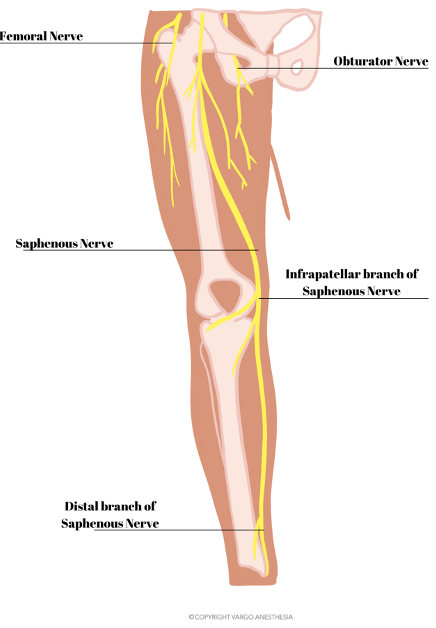
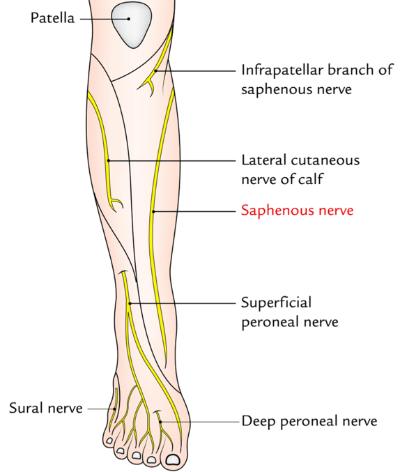

Saphenous Nerve Anatomy for Saphenous Nerve Block    body {font-family: 'Open Sans', sans-serif; padding-left: 10px;}

### Saphenous Nerve Anatomy for Saphenous Nerve Block

**Saphenous nerve (SN):  
**The SN is just a continuation of the posterior division of the femoral nerve.  
It descends the medial side of the tibia.  
It is the largest cutaneous branch of the femoral nerve.

****

It is a pure SENSORY cutaneous nerve (having no motor properties) that descends into the quadriceps muscle within the sub-sartorial adductor canal adjacent to the superficial femoral artery.  
It also sends infrapatellar branches to the knee joint and may cover analgesia in the patella region.The nerve emerges from the adductor canal by piercing a fascial layer 10 cm above the knee, giving off branches for the skin of the knee.  
It descends the medial side of the tibia.  
  
**Saphenous nerve function is to supply cutaneous sensation via:**  
The skin of the anteromedial element of the knee  
Medial calf  
Medial malleolus  
Part of the medial arch of the foot, close to the saphenous vein  
  
**Sensory nerve innervation of the saphenous nerve:  
**Patella and subsartorial plexus  
Anterior inferior knee capsule  
Skin of the anteromedial portion of the lower leg and ankle  
  
**Infrapatellar branch of the saphenous nerve:  
**Among the larger branches of the saphenous nerve, the infrapatellar branch intercrosses medially to laterally throughout the anterior element of the leg near the level of the inferior pole of the patella.This branch is also blocked with a saphenous nerve block.

****

  
  

Adductor canal block procedure guide  
UpToDate (accessed 11/2021)  
Adam W Amundson, MD and Rebecca L Johnson, MD  
https://tinyurl.com/4du4enpk  
Adductor canal and femoral triangle: Two different rooms with the same door  
Saudi Journal of Anesthesia 2019, Vol: 13, Issue:3 pp: 276-77Giuseppe Pascarella, Fabio Costa, Romualdo Del Buono, Felice Eugenio Agrò  
  
Structure & Components of the Adductor Canal  
Catalyst University (accessed 11/2021)  
https://www.youtube.com/watch?v=53kX2GUzuvA  
  
Adductor Canal (preview) - Location & Content - Human Anatomy  
Kenhub Anatomy Review(accessed 11/2021)  
https://www.youtube.com/watch?v=WudEIS6YJOg  
  
Femoral Nerve Anatomy: Origin, Course, Branches and Clinical application  
Dr.G Bhanu Prakash Animated Medical Videos (accessed 11/2021)  
https://www.youtube.com/watch?v=ZOYcSias5bM