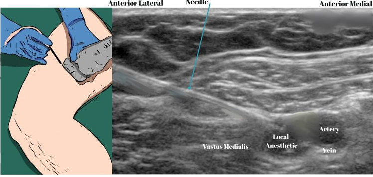
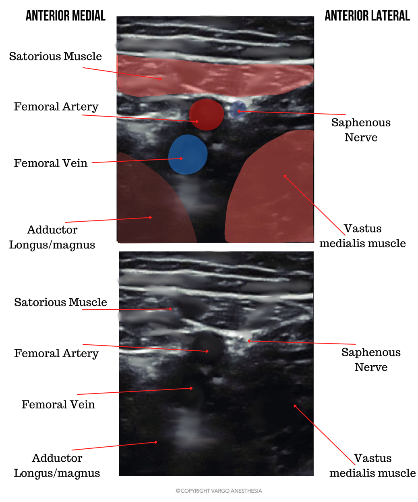

Saphenous Nerve Block (Needle Placement) Ultrasound Images    body {font-family: 'Open Sans', sans-serif; padding-left: 10px;}

### Saphenous Nerve Block (Needle Placement) Ultrasound Images

**Follow the femoral artery distally:** From the inguinal crease until the sartorius is seen superficial to it, thus forming the adductor canal.  
Identify the femoral artery on the far side of your imagery.

****

****

**Technique:**  
Insert the needle in an in-plane, lateral to medial orientation.  
Advance needle just anterior to the femoral artery, deep to sartorius muscle but above the vastus medialis.  
Deposit 5-10 into the fascial plane between the muscles, around the identified saphenous nerve next to the femoral artery.  
  

​Michael MacKinnon DNP, FNP-C, CRNA, FAANA  
National University Associate Professor Doctor of Anesthesiology Program  
Edited by Dr. Michael Kaminsky, Regional Anesthesiologist