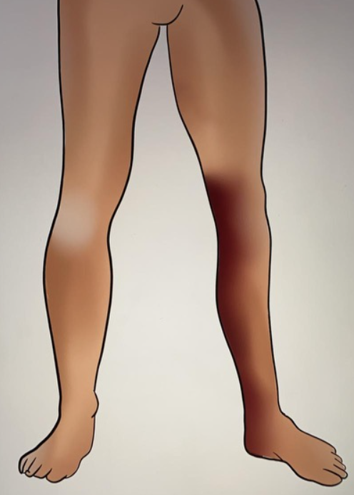
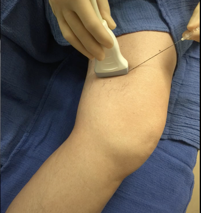
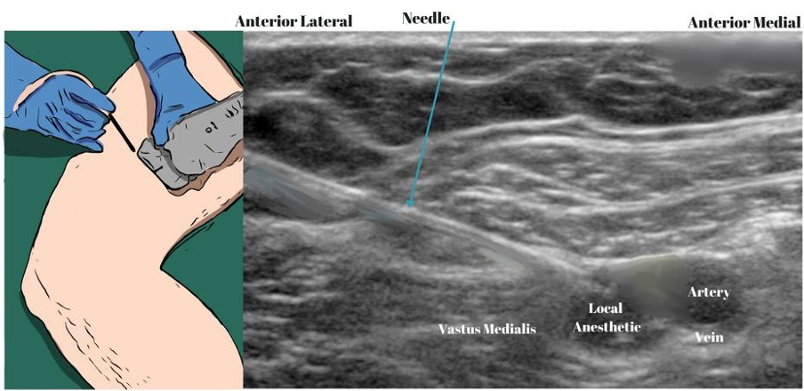
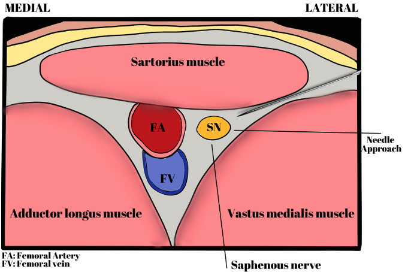

Saphenous Nerve Block (SNB)    body {font-family: 'Open Sans', sans-serif; padding-left: 10px;}

### Saphenous Nerve Block (SNB)

Also called an “Adductor canal block.”  
  
The SNB is a sensory (no motor nerve involvement) lower limb block that blocks the saphenous nerve traveling through the adductor canal.  
It provides analgesia to the knee’s anterior (patellar) and medial aspect and down to the medial malleolus.

****

****

**The SNB has become an optimal block for total knee arthroplasties (TKA):**  
The SNB has become the first-choice nerve block for most TKAs because it results in less quadriceps weakness than the conventional **femoral nerve block** resulting in earlier postoperative ambulation and rehabilitation.  
  
**SNB surgical indications:  
**_(may be used in combination with other regional blocks for optimal coverage)_Total and partial knee arthroplasty + IPACK block  
Ligamentous knee reconstruction (ACL repair) + IPACK block.  
Rescue block for minor arthroscopy knee surgery  
Pain after partial meniscectomy  
Saphenous vein stripping  
Saphenous vein harvesting  
Lacerations and abscesses drainage of the medial leg  
Foreign body removal to the medial leg  
Medial foot and ankle surgery + sciatic block**  
  
Infra-patellar nerve:**  
The SNB also blocks the infra-patellar nerve, which may be helpful for postoperative analgesia after knee arthroscopy or anterior cruciate ligament repair.  
  
**Possible motor block:**  
\- Sometimes, the femoral nerve branch to the vastus medialis is contained in the adductor canal and may be blocked by the injection of a large volume of local anesthetic into the subsartorial space resulting in a motor block.  
\- High volume (>15 ml) is not required in SNB, and doing so may affect motor branches of the femoral nerve causing quadricep weakness.  
\- Patients should be warned on initially attempting unsupported ambulation after this block.  
\- However, some practitioners reported that quadricep weakness does not correlate with the volume injected (range 5 to 20 mL) and proximal spread to the femoral triangle or motor block.  
  
**Absolute contraindications:** (as with other regional blocks)  
Patient refusal  
Inflammation or infection over the injection site.  
Allergy to local anesthetics  
  
**Relative contraindications** (as with other regional blocks):  
Anticoagulation or bleeding disorders  
Patient uncooperativeness (Pediatric or elderly patients may need sedation).  
Pre-existing peripheral neuropathies  
Concern for compartment syndrome  
Anticoagulation and antithrombotic medication  
**  
Equipment:**  
High-frequency linear transducer (8-14 MHz, with ultrasound depth set to about 4 cm.  
Ultrasound transducer sterile cover  
Sterile gloves  
5-10 ml syringe containing a local anesthetic (LA)  
80 mm 22-25 gauge needle  
Cleansing solution  
Peripheral nerve stimulator

****

**Ultrasound/landmarks for adductor canal approach:  
**This approach is distal to the femoral triangle.  
  
**Ultrasound approach:** In-plane, inserting the needle lateral to medial.  
  
**Various approaches to saphenous nerve block (from cephalad to caudal):  
**Subsartorial approach at the adductor canal (image below-most popular)  
Subsartorial approach at the femoral triangle  
Perifemoral approach  
Paravenous approach  
  
**Position for subsartorial approach at the adductor canal:**

****

Supine, with thigh abducted and externally rotated to expose the medial aspect (“frog leg” position”).  
This allows access to the medial thigh.  
  
Place the transducer in the transverse plane (as in the image above) along the medial aspect of the thigh, approximately 10 mm above the medial femoral condyle.  
The saphenous nerve is lateral to the femoral artery/vein and deep to the sartorius muscle.  
Slide transducer medial and posterior, and the sartorius muscle will meet with vastus medialis muscle.

****

**Ultrasound troubleshooting:**  
When there is difficulty identifying the femoral artery, check the depth of your survey to see if it’s adequate.  
Then, move the probe circumferentially around the thigh until the femoral artery is identified.  
Use the color flow Doppler mode as it may help to identify the artery.  
If the difficulty persists, follow the femoral artery distally from the inguinal crease until the sartorius muscle is seen as superficial, thus forming the adductor canal.  
  
This block should be performed most distal level to decrease the likelihood of quadricep weakness.

****

****

**  
SNB Dosing:  
**1-2 ml of 1% lidocaine for skin infiltration in awake patients.  
**Low volume block:** 5-10mls of long-acting local anesthetic (LA)  
**High volume block:** 20-30mls of long-acting LA  
**Note:** _High volume (>15 ml) is not required; doing so may affect the femoral nerve's motor branches, causing quadricep weakness._  
  
**Common local anesthetic for this block:**  
10 to 15 mL of 0.2% ropivacaine or  
10 to 15 mL of 0.25% bupivacaine  
**Note:** In studies of saphenous blocks, 0.5% bupivacaine or 0.75% ropivacaine has been used.  
**Duration:** Between 6 to 18 hours  
**Quadricep weakness:** Unpredictable and has occurred after blocks using much lower volumes of LA.  
  
**Technique:**  
Insert the needle in an in-plane, lateral to medial orientation.  
Advance the needle anteriorly to the femoral artery, deep to the sartorius muscle, but above the vastus medialis.  
Deposit 5-10 mLs of LA into the fascial plane between the muscles, around the identified saphenous nerve next to the femoral artery.  
After negative aspiration, inject 5 to 20 mLs of LA in 5 mL increments, with gentle aspiration between injections, while visualizing the spread of LA around the artery.  
  
**Note:** Because the saphenous nerve block is usually done with an additional nerve block, the total expected dose of LA between both blocks should be calculated as the risk for local systemic toxicity is greater.  
  
**When the saphenous nerve cannot be identified:  
**Visualize in the distal thigh; the LA may be injected into the fascial plane between the vastus medialis and sartorius muscles.  
Injection of an additional 5-10 mL deep into the sartorius muscle is also recommended.  
  
**Continuous saphenous infusion technique** (Not common):Used with ultrasound guidance as described for single injection block  
**Needle:** Touhy needle  
**Catheter:** 19 or 20 gauge  
**Catheter depth:** Insert catheter through the Touhy needle 4 to 6 cm into the adductor canal  
**Bolus:** 10 to 15 mL of LA just as a single injection saphenous nerve block.  
**Postoperative continuous infusion rate:** Start infusion at 5 to 10 mL per hour or programmed intermittent bolus, 8 mL every hour to 15 mL every three hours.  
**Postoperative infusion local anesthetic:** 0.1 to 0.2% bupivacaine or ropivacaine.  
  
**Why the continuous saphenous infusion is uncommon:**  
The catheter exit site and dressing may be too close to the surgical site when inserted prior to a TKA.  
Also, the catheter exit site may be under the thigh tourniquet.  
This may increase the risk of double crush syndrome.  
  
**Caution:**  
Use caution when advancing the needle toward the adductor canal to avoid injuring the nerve to the vastus medialis muscle.  
Consider using a nerve stimulator to identify the nerve.  
  
**Goal:**  
If injected correctly, hydrodissection (separation) of the fascia layer will occur; and LA will bathe and envelope the saphenous nerve.  
  
**Post-procedure:  
**Continue monitoring and observe for signs of local anesthetic toxicity.  
  
**Documentation for regional nerve blocks:**  
Whether performed awake or after GA or spinal  
Side and site of injection  
Needle used  
Volume and name of local anesthetic  
  
All patients should be personally seen or contacted postoperatively to ensure that the block has properly worn off or without issues.  
  
**Possible complications: (as with other regional blocks)  
**Local anesthetic toxicity  
Nerve injury  
Bleeding/Bruising  
Skin infection at the site of injection  
Systemic bacteremia or sepsis  
Concern for compartment syndrome  
**  
Local anesthetic systemic toxicity:  
LA toxicity is more of a concern with a saphenous nerve block because:  
**Presence of large blood vessels and perforating arteries in the adductor canal  
SNB is often used in conjunction with another nerve block.  
Local infiltration analgesia of two nerve block.  
The anesthesia provider should always inject the LA in increments, with aspiration between injections.  
Calculate the total combined doses of LA of both blocks.  
  

Michael MacKinnon DNP, FNP-C, CRNA, FAANA  
National University Associate Professor Doctor of Anesthesiology Program  
Edited by Dr. Michael Kaminsky, Regional Anesthesiologist  
  
Adductor Canal Block (Saphenous Nerve) // Ultrasound-Guided Demonstration  
Practical Anesthesia Techniques (accessed 11/22)**  
https://www.youtube.com/watch?v=\_lp1rKuqzsk**  
  
Ultrasound-Guided Saphenous (Adductor Canal) Nerve Block  
NYSORA (Accessed 11/2021)  
https://tinyurl.com/bddu5ayc  
  
Adductor canal block procedure guide  
UpToDate (accessed 11/2021)  
Adam W Amundson, MD and Rebecca L Johnson, MD  
https://tinyurl.com/4du4enpk  
Adductor canal and femoral triangle: Two different rooms with the same door  
Saudi Journal of Anesthesia 2019, Vol: 13, Issue:3 pp: 276-77Giuseppe Pascarella, Fabio Costa, Romualdo Del Buono, Felice Eugenio Agrò  
  
How I Do It: Saphenous Nerve Block  
ASRA (accessed 11/2021)  
Ashley Matthews Shilling, MD, and Paul DeMarco, MD  
  
Ultrasound Guided Adductor Canal Block (Saphenous Nerve Block)  
World Federation of Societies of Anesthesiologists (accessed 11/2021)  
Dr Daniel Quemby and Dr Andrew McEwen  
https://tinyurl.com/3pk5262k  
  
Structure & Components of the Adductor Canal  
Catalyst University (accessed 11/2021)  
https://www.youtube.com/watch?v=53kX2GUzuvA  
  
The adductor canal block  
vidRASCI (accessed 11/2021)  
https://www.youtube.com/watch?v=aiW\_rQRKpnw  
  
Feasibility and efficacy of ultrasound-guided block of the saphenous nerve in the adductor canal.  
Regional Anesthesia and Pain Medicine. 2009;34: 578-580  
Manickam B et al.  
  
Adductor canal block procedure guide  
UpToDate (accessed 11/2021)  
Adam W Amundson, MD and Rebecca L Johnson, MD  
Continuous adductor-canal-blockade for adjuvant post-operative analgesia after major knee surgery: preliminary results.  
Acta Anaesthesiologica **Scandinavica** 2011; 55:14.  
Lund J, Jenstrup MT, Jaeger P, et al.  
  
Saphenous Nerve Block  
Medscape (accessed 11/2021)  
https://emedicine.medscape.com/article/83237-overview#a3  
  
Saphenous Nerve Block  
Advancing the Science of Ultrasound Guided Regional Anesthesia and Pain Medicine  
BK Medical (accessed 11/2021)  
  
Saphenous Nerve Video  
KenHub Anatomy (accessed 11/2021)|  
Roberto Grujičić MD and Gordana Sendic  
https://www.kenhub.com/en/library/anatomy/saphenous-nerve  
  
Saphenous Nerve Block-Practical Conduct Series Video  
Forever Learning (accessed 11/2021)  
https://www.youtube.com/watch?v=mS0LQBIRex0  
  
Adductor Canal (preview) - Location & Content - Human Anatomy  
Kenhub Anatomy Review(accessed 11/2021)  
https://www.youtube.com/watch?v=WudEIS6YJOg  
  
Femoral Nerve Anatomy: Origin, Course, Branches and Clinical application  
Dr.G Bhanu Prakash Animated Medical Videos (accessed 11/2021)  
https://www.youtube.com/watch?v=ZOYcSias5bM