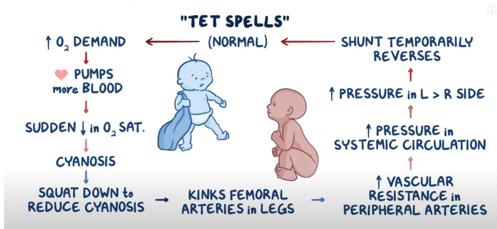

  Qp/Qs Shunt Ratio section { margin-bottom: 20px; } table { border-collapse: collapse; } table, tr, th, td { border: 1px solid black; } th, td { padding: 0px 8px 0px 8px; text-align: left; vertical-align: top; } h3, p, ol.custom-counter, li { margin: 0px; padding: 0px; } .text-red { color: red; } .text-black { color: black; } ul.custom-dash { list-style: none; padding-left: 0; margin: 0; } ul.custom-dash > li { display: flex; align-items: flex-start; } ul.custom-dash > li::before { content: "–"; margin-right: 0.5em; flex-shrink: 0; line-height: 1; } ul.custom-dash > li > \*:not(::before) { flex: 1; } ul.custom-dash > li.no-dash::before { content: ""; width: 1em; margin-right: 0.5em; flex-shrink: 0; } /\* Change the ol style \*/ ol.custom-counter { list-style: none; padding-left: 0; counter-reset: custom calc(var(--start, 1) - 1); } ol.custom-counter li { counter-increment: custom; margin-bottom: 5px; } ol.custom-counter li::before { content: counter(custom) ") "; } /\* This is just for this file \*/ ul.custom-bullet-arrow { list-style: none; padding-left: 0; margin: 0; } ul.custom-bullet-arrow > li { display: flex; align-items: flex-start; } ul.custom-bullet-arrow > li::before { content: "↑"; margin-right: 0.5em; flex-shrink: 0; } ul.custom-bullet-arrow > li.no-arrow::before { content: ""; width: 0.5em; margin-right: 0.5em; flex-shrink: 0; } ul.custom-bullet\_arrow ul { list-style-type: disc; padding-left: 1.5em; margin-top: 0.5em; } img.resized-200 { width: 200px; height: auto; } img.resized-400 { width: 400px; height: auto; } img.resized-600 { width: 600px; height: auto; } .mb-10px { margin-bottom: 10px; } .mb-20px { margin-bottom: 20px; } .mt-10px { margin-top: 10px; } .mt-20px { margin-top: 20px; } .reference-notes { font-size: 11px; } .text-indent-45px { text-indent: 45px; } .text-bold { font-weight: bold; } .text-italic { font-style: italic; } .text-center { text-align: center; }

### Qp/Qs Shunt Ratio

A measure of the amount of blood that is shunted from one side of the heart to the other without going through the lungs.

It is calculated by dividing the pulmonary blood flow (QP) by the systemic blood flow (QS)

**Left-to-Right Shunt:** Qp/Qs > 1:1

When oxygenated blood flows from the left (systemic) to the right (pulmonary) circulation.

**Small Shunt:** Qp/Qs of 1.0 < x < 1.5

The cardiac chambers are not significantly enlarged, and the pulmonary vasculature is typically normal.

**Moderate Shunt:** Qp/Qs of 1.5 ≤ x < 2.0

Leads to volume overload and elevated right ventricular pressures.

**Large Shunt:** Qp/Qs ≥ 2.0

Results in severe left atrial and ventricular volume overload, leading to pulmonary hypertension and increased pulmonary vascular resistance.

Eisenmenger Syndrome:

If a large left-to-right shunt remains untreated, chronic volume overload can lead to irreversible pulmonary vascular damage and pulmonary hypertension.

This causes the shunt to reverse, with deoxygenated blood flowing from the right to the left side of the heart, a condition known as Eisenmenger syndrome.

Left-to-Right Shunts

Atrial Septal Defect (ASD):

An opening in the wall separating the right and left atria.

Ventricular Septal Defect (VSD):

An opening in the wall separating the right and left ventricles.

Patent Ductus Arteriosus (PDA):

A persistent connection between the aorta and the pulmonary artery that should close after birth.

Atrioventricular Canal (AV) Defect:

A complex defect involving the walls and valves between the atria and ventricles.

Partial Anomalous Pulmonary Venous Return (PAPVR):

Some pulmonary veins drain into the right side of the heart instead of the left atrium.

Right-to-Left Shunts (Qp/Qs < 1:1)

Tetralogy of Fallot:

VSD

PV stenosis

Overriding aorta- blood from both ventricles

RV hypertrophy

Pulmonary Atresia with Ventricular Septal Defect:

The pulmonary valve is completely blocked, requiring blood to bypass the lungs via a right-to-left shunt.

Tricuspid Atresia:

The tricuspid valve is absent or underdeveloped, preventing blood from flowing from the right atrium to the right ventricle.

Pathophysiology of Congenital Heart Disease in the Adult: Part I: Shunt Lesions

Circulation Volume 117, Number 8

Robert J. Sommer, MD, Ziyad M. Hijazi, MD, MPH, and John F. Rhodes, Jr, MD