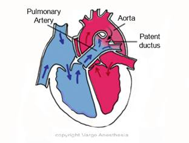

Shunts-Simple and Complex   

### Shunts-Simple and Complex

**Simple Shunt:  
**The basic shunts we first learn about. These shunts are not associated with obstructed outflow lesions and are much easier to understand than the complex shunts.  
**The flow of blood through the SIMPLE shunts are simply determined by one variable:** The pressure gradient between the systemic vascular resistance (SVR) on the left side and pulmonary vascular resistance (PVR) on the right side.  
Normally the SVR is greater than the PVR, so blood travels the path of least resistance and will flow from the left (systemic) to the right (pulmonary) side.  
  
**Simple Shunts**  
Atrial Septal Defect (ASD)  
Ventricular Septal Defect (VSD)  
Patent Ductus Arteriosus (PDA)

  
**An example of a simple shunt is a PDA**  
Patent Ductus Arteriosus is a communication between the main pulmonary artery and the posterior descending thoracic aorta.

  
Now look where the patent ductus is above. If the SVR is greater than the PVR, the flow of blood (just some of the blood) will shunt from the aorta (left –systemic side and fully oxygenated) through the PDA to the pulmonary artery (right-pulmonary side). The fully oxygenated left sided blood is mixing with the unoxygenated blood in the pulmonary artery BEFORE it flows to the lungs. This can create volume overload in the pulmonary arteries and pulmonary hypertension

**Complex Shunt**  
A complex shunt is more difficult to understand due to the multiple variables that determine the flow of blood.

With Complex Shunts, there is a simple shunt (s) along with a fixed outflow obstruction. It could be a ventricular outflow, subvalvular outflow or supravalvular level, or in major vessels like the pulmonary artery or aorta.

The flow of blood through the complex shunts are not just determined by a pressure gradient between the SVR and PVR. There is much more involved.

In Tetralogy of Fallot, there is pulmonary stenosis and right ventricular outflow tract obstruction. This usually limits blood flow to the lungs. When blood flow to the lungs is restricted, the combination of the ventricular septal defect and overriding aorta allows unoxygenated blood returning to the right atrium and right ventricle (right side) to be pumped out the aorta (systemic-left side) to the body. This is a right-left shunt, which can result in cyanosis.  
Right-to left shuts are “Cyanotic”  
Left-to-right shunts are “Acyanotic”

The extent of the right-to-left shunting (cyanosis) is dependent on the amount of narrowing of the pulmonary valve and right ventricular outflow tract. A narrower outflow tract from the right ventricle is more restrictive to blood flow to the lungs, which in turn lowers the arterial oxygen level since more oxygen-poor blood is shunted from the right ventricle to the aorta. Now this was just one example.

With the outflow obstruction, there is shunting away from the obstructed side (back flow).

When the outflow obstruction is added to the outflow resistance of the downstream vascular bed, the SVR or PVR may impact the shunt.

Many times the SVR or PVR (distal to a fixed outflow obstruction) in a complex shunt is of little importance with a fixed outflow obstruction.

Gregory and Andropoulus; Gregory’s Pediatric Anesthesia; Fifth Edition; 2012.  
  
Houck, Hach’e and Sun; Handbook of Pediatric Anesthesia; 2015.  
  
Litman; Basics of Pediatric Anesthesia; 2013.  
  
Davis, Cladis and Motoyama; Smith's Anesthesia for Infants and Children, 8th Edition; 2011.